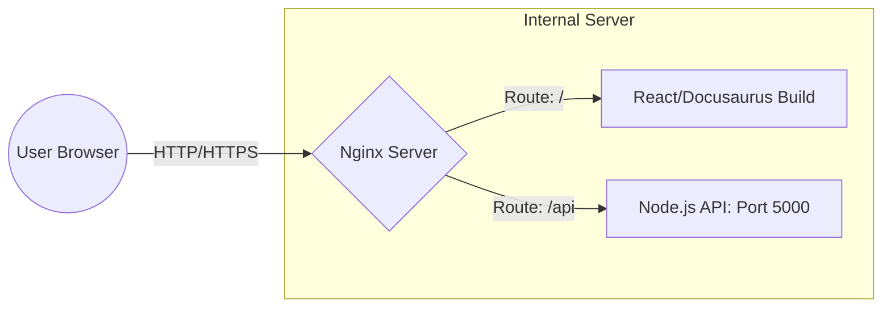

In your journey as a **Full-Stack Developer** at **CodeHarborHub**, you have likely been running your React app on port `5173` and your Express API on port `5000`. But in the "Industrial World," we never point users directly to these ports. 

Instead, we use **Nginx**. 

**Nginx** (pronounced "Engine-X") is a high-performance open-source software for web serving, reverse proxying, caching, load balancing, and media streaming. It is the "Front Door" to your server.

:::info Why is it called Nginx?
The name "Nginx" is a play on the word "Engine" and the letter "X" to represent the unknown. It was created by Igor Sysoev in 2004 to solve the C10k problem, which is the challenge of handling 10,000 concurrent connections efficiently.
:::

## The "Security Guard" Analogy

Think of your server like a **High-Security Building**:

* **Your Node.js App:** The office inside where the work happens.
* **The Internet:** The public street outside.
* **Nginx:** The **Security Guard** at the front desk.

When a visitor (User) arrives, they don't go straight to your office. They talk to the Security Guard (Nginx). Nginx checks if they are allowed in, handles their request, and passes the message to your office (Node.js).

## Why do we need Nginx?

While Node.js is great at logic, it isn't built to handle raw internet traffic at scale. Nginx adds these "Industrial Level" capabilities:

| Feature | What it does | Benefit |
| :--- | :--- | :--- |
| **Reverse Proxy** | Hides your backend server's true identity and port. | **Security:** Hackers can't attack your API directly. |
| **Static Hosting** | Serves HTML, CSS, and Images directly from the disk. | **Speed:** Much faster than letting Node.js serve files. |
| **SSL Termination** | Handles HTTPS encryption for you. | **Simplicity:** Your app code doesn't have to manage certificates. |
| **Load Balancing** | Splits traffic across multiple servers. | **Uptime:** If one server crashes, the site stays online. |

## The Request Flow in a MERN App

At **CodeHarborHub**, we typically set up Nginx to handle both our Docusaurus frontend and our backend API simultaneously.

## Performance: Event-Driven vs Process-Based

Why is Nginx faster than older servers like Apache?

  * **Apache (Process-Based):** Like a restaurant that hires a new waiter for *every single customer*. If 1,000 customers come in, the restaurant gets crowded and slow.
  * **Nginx (Event-Driven):** Like a single, super-fast waiter who takes orders from 1,000 tables at once. They don't stand at the table waiting; they take an order and move to the next one immediately.

## Common Use Cases at CodeHarborHub

1.  **Hosting Docusaurus:** Nginx serves the static HTML files generated by `npm run build`.
2.  **API Gateway:** Nginx receives requests at `api.codeharborhub.com` and forwards them to a local Node.js process.
3.  **Custom Error Pages:** Showing a professional "Maintenance" or "404 Not Found" page instead of a raw browser error.

:::info It's Lightweight and Fast
Nginx is incredibly lightweight. It can handle **10,000+ concurrent connections** while using only a few megabytes of RAM. This makes it perfect for low-cost VPS hosting (like a $5 DigitalOcean or AWS Lightsail instance).
:::

## Learning Challenge

Open your browser and visit a few of your favorite websites (like GitHub, Netflix, or Airbnb). Almost all of them use Nginx (or a similar tool) to manage their traffic. You can often see this by checking the "Server" header in the **Network Tab** of your Browser Developer Tools!