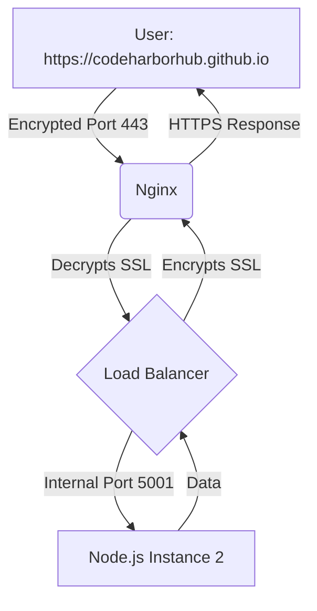

To reach "Industrial Level" status at **CodeHarborHub**, your application must be able to handle thousands of users simultaneously and protect their data with encryption. In this final module, we will turn Nginx into a **Traffic Controller** and a **Security Shield**.

## 1. Load Balancing (Scaling Out)

Imagine your **CodeHarborHub** project becomes viral. A single Node.js process on port `5000` might crash under the pressure. The solution? Run multiple instances of your app and let Nginx distribute the "load."

### The `upstream` Configuration
We define a group of servers using the `upstream` block. Nginx will then act as a single entry point for all of them.

```nginx title="Nginx Load Balancing Config"
# Define the cluster of Node.js servers
upstream mern_backend {
    server 127.0.0.1:5000;
    server 127.0.0.1:5001;
    server 127.0.0.1:5002;
}

server {
    listen 80;
    server_name api.codeharborhub.github.io;

    location / {
        proxy_pass http://mern_backend; # Points to the upstream group
        proxy_set_header Host $host;
    }
}
```

### Load Balancing Methods

| Method | Description | Best For... |
| :--- | :--- | :--- |
| **Round Robin** | (Default) Passes requests to each server in order. | Equal server power. |
| **Least Connections** | Sends the next request to the server with the fewest active users. | Long-running tasks. |
| **IP Hash** | Ensures a specific user always goes to the same server. | Handling User Sessions. |

## 2. SSL Termination (HTTPS)

Security is not optional. Using **SSL (Secure Sockets Layer)** ensures that data traveling between the user and your server is encrypted.

At **CodeHarborHub**, we use **Certbot** by Let's Encrypt. It is free, automated, and the industry standard for open-source projects.

### Step-by-Step SSL Setup:

1.  **Install Certbot:**

    ```bash
    sudo apt install certbot python3-certbot-nginx
    ```

2.  **Run the Automation:**
    Certbot will read your Nginx config, talk to Let's Encrypt, and update your file automatically.

    ```bash
    sudo certbot --nginx -d codeharborhub.github.io -d https://codeharborhub.github.io
    ```

3.  **The Result:**
    Your config file will now have a new section listening on **Port 443** (HTTPS):

```nginx title="Nginx SSL Config"
server {
    listen 443 ssl; # Secure Port
    server_name codeharborhub.github.io;

    ssl_certificate /etc/letsencrypt/live/https://codeharborhub.github.io/fullchain.pem;
    ssl_certificate_key /etc/letsencrypt/live/https://codeharborhub.github.io/privkey.pem;

    # ... rest of your config
}
```

## The "Production-Ready" Workflow

When a request hits your server now, it follows this professional path:



## Industrial Level Best Practices

| Rule | Why? |
| :--- | :--- |
| **HTTP to HTTPS Redirect** | Always redirect port 80 to 443 so users are never on an insecure connection. |
| **Health Checks** | Nginx can automatically stop sending traffic to a server if it crashes. |
| **Auto-Renewal** | SSL certificates expire every 90 days. Always test your auto-renewal: `sudo certbot renew --dry-run`. |

## Final Graduation Challenge

1.  Launch your MERN app on two different ports (e.g., 5000 and 5001).
2.  Configure Nginx to load balance between them.
3.  Stop one of the Node.js processes.
4.  Refresh your browser. Notice how Nginx automatically sends you to the working one without you even noticing! **This is High Availability.**
5.  Set up SSL with Certbot and ensure your site is secure with HTTPS.

Congratulations! You've now mastered the art of scaling and securing your MERN application with Nginx. Your project is truly "Industrial Level" and ready to handle real-world traffic with confidence.