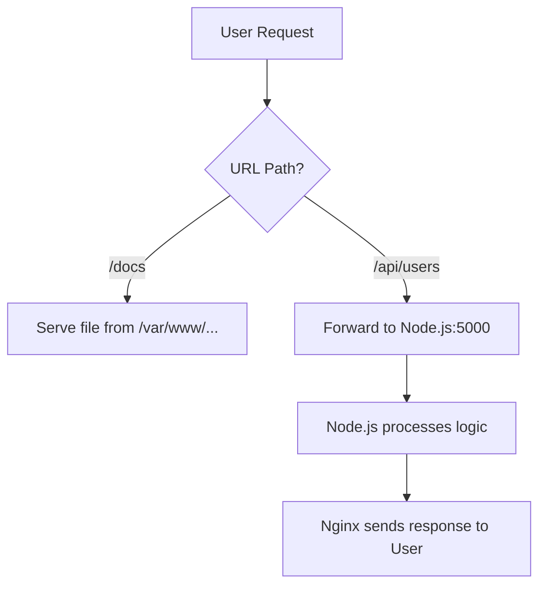

In your local **CodeHarborHub** environment, you probably access your backend at `http://localhost:5000`. However, in a professional production environment, we never expose our Node.js port directly to the internet. 

Instead, we use **Nginx** as a **Reverse Proxy**.

:::info Why not expose Node.js directly?
1.  **Security:** Exposing your backend directly can lead to vulnerabilities and attacks.
2.  **Performance:** Nginx can serve static files and handle SSL, reducing the load on your Node.js server.
3.  **Scalability:** Nginx can easily route traffic to multiple backend servers if needed.
:::

## What is a Reverse Proxy?

A **Reverse Proxy** is a server that sits in front of your web servers and forwards client (e.g., web browser) requests to those backend servers. It acts as an intermediary for requests from clients seeking resources from your backend servers.

In the context of a MERN application, Nginx can serve your React frontend and proxy API requests to your Node.js backend seamlessly. This allows you to have a single domain (e.g., `codeharborhub.com`) that serves both your frontend and backend without exposing internal ports.

### Why use a Reverse Proxy for MERN?
1.  **Security:** Your Node.js server stays "hidden" in a private network. Only Nginx is exposed to the public.
2.  **SSL Termination:** Nginx handles the heavy encryption (HTTPS), so your Node.js code can stay lightweight.
3.  **Static Serving:** Nginx serves the React/Docusaurus files instantly, while Node.js only handles the API logic.

## The "Industrial" MERN Configuration

At **CodeHarborHub**, we recommend a "Unified" configuration where Nginx manages both the Frontend and the Backend API through different URL paths. This way, you can have a clean URL structure and a single point of entry for all your traffic.

### Example Config: `/etc/nginx/sites-available/mern-app`

```nginx title="Nginx Config for MERN App"
server {
    listen 80;
    server_name codeharborhub.com;

    # 1. FRONTEND: Serve React/Docusaurus Build
    location / {
        root /var/www/mern-app/frontend/dist;
        index index.html;
        try_files $uri /index.html;
    }

    # 2. BACKEND: Proxy requests to Node.js (Port 5000)
    location /api/ {
        proxy_pass http://localhost:5000; # The local Node.js process
        proxy_http_version 1.1;
        proxy_set_header Upgrade $http_upgrade;
        proxy_set_header Connection 'upgrade';
        proxy_set_header Host $host;
        proxy_cache_bypass $http_upgrade;
        
        # Pass the real IP of the user to Node.js
        proxy_set_header X-Real-IP $remote_addr;
        proxy_set_header X-Forwarded-For $proxy_add_x_forwarded_for;
    }
}
```

## The Logic Flow

When a user interacts with your **CodeHarborHub** project, Nginx makes a split-second decision based on the URL:



If the user requests `http://codeharborhub.com/docs`, Nginx serves the static files directly. If they request `http://codeharborhub.com/api/users`, Nginx forwards that request to your Node.js backend, which processes it and sends the response back through Nginx.

## Essential Proxy Directives

To act as a professional proxy, Nginx uses these specific headers:

| Directive | Purpose |
| :--- | :--- |
| **`proxy_pass`** | The most important\! It tells Nginx where the backend lives. |
| **`proxy_set_header Host`** | Tells Node.js exactly which domain name the user requested. |
| **`X-Real-IP`** | Without this, Node.js thinks *every* user is `127.0.0.1` (Nginx). |
| **`proxy_http_version`** | Necessary for modern features like WebSockets. |
| **`proxy_cache_bypass`** | Ensures API requests aren't cached, keeping data fresh. |

## Troubleshooting the Connection

If you get a **502 Bad Gateway** error, it usually means Nginx is working, but it can't find your Node.js app.

<Tabs>
<TabItem value="check-node" label="1. Check Node" default>

Ensure your Node.js app is actually running:

```bash
pm2 list  # Or: ps aux | grep node
```

</TabItem>
<TabItem value="check-port" label="2. Check Port">

Ensure your app is listening on the same port defined in `proxy_pass`:

```bash
netstat -tulpn | grep 5000
```

</TabItem>
<TabItem value="check-logs" label="3. Check Logs">

Check the Nginx error logs for specific details:

```bash
sudo tail -f /var/log/nginx/error.log
```

</TabItem>
</Tabs>

## Pro Tip: Clean URLs

By using a Reverse Proxy, you no longer need to include the port in your frontend API calls.

  * **Old way:** `fetch('http://my-ip:5000/api/data')`
  * **Industrial way:** `fetch('/api/data')`
    *Nginx will see `/api/` and automatically route it to the correct port internally!*