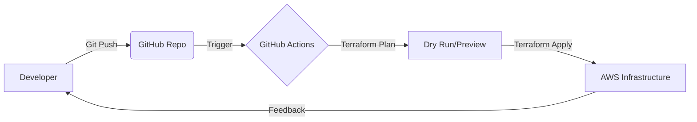
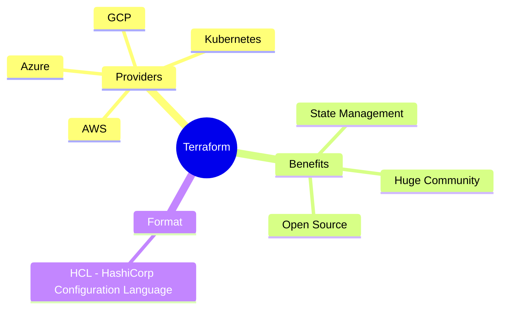

In the early days of the web, if a developer at **CodeHarborHub** needed a new server, they had to manually buy hardware, rack it, and cable it. In the Cloud era, we used the **AWS Console** to click buttons. 

**Infrastructure as Code (IaC)** is the next evolution. It allows you to manage and provision your entire technology stack through **machine-readable definition files**, rather than physical hardware configuration or interactive configuration tools.

:::info The "Industrial Level" Standard
At **CodeHarborHub**, we don't just want you to know how to click buttons. We want you to understand how to **automate** and **scale** your infrastructure using code. This is the "Industrial Level" standard for modern DevOps.
:::

## The Problem: "ClickOps" vs. "Code"

Before IaC, we practiced "ClickOps" (manually clicking in the AWS UI). While easy for beginners, it fails at scale.

### Why ClickOps Fails in Production:
* **Human Error:** It’s easy to forget to check a box or misspell a database name.
* **Lack of History:** Who changed the Security Group settings at 2 AM? You can't "Undo" a click.
* **Configuration Drift:** Over time, your "Staging" environment becomes different from "Production" because of manual tweaks.
* **Slow Scaling:** Try manually creating 50 VPCs across 10 regions. It's impossible.

## The 4 Pillars of IaC

To build "Industrial Level" infrastructure, we follow these four principles:

| Pillar | Description |
| :--- | :--- |
| **Declarative** | You define the *Desired State* (e.g., "I want 3 servers"). Terraform handles the *How*. |
| **Idempotency** | Running the same code 100 times results in the exact same infrastructure every time. |
| **Version Controlled** | Your infrastructure lives in GitHub. You can see history, branches, and PRs. |
| **Reproducibility** | You can destroy your entire environment and rebuild it from scratch in minutes. |

## How IaC Fits into the Lifecycle

IaC sits right in the middle of your **CI/CD pipeline**. When you push code to GitHub, your infrastructure updates automatically alongside your application code.



In this lifecycle:
1.  You push code to GitHub, which includes both application and infrastructure code.
2.  GitHub Actions runs a Terraform Plan to show you what changes will be made.
3.  If you approve, Terraform Apply executes the changes in AWS.
4.  Your infrastructure updates, and you get feedback on the deployment status.

## Declarative vs. Imperative

Understanding this distinction is the "Aha!" moment for DevOps beginners.

<Tabs>
<TabItem value="declarative" label="Declarative (The Terraform Way)" default>

**"I need a house with 3 bedrooms."**
You describe the destination. You don't care how the contractor builds it, as long as the end result matches your blueprint.

```hcl
resource "aws_instance" "web" {
  count         = 3
  ami           = "ami-xyz"
  instance_type = "t2.micro"
}
```

</TabItem>
<TabItem value="imperative" label="Imperative (The Scripting Way)">

**"Buy bricks, lay foundation, build wall 1, build wall 2..."**
You define every single step. If one step fails, the whole process breaks, and you might end up with half a house.

```bash
# AWS CLI (Imperative)
aws ec2 run-instances --image-id ami-xyz --count 3 --instance-type t2.micro ...
```

</TabItem>
</Tabs>

## Why we chose Terraform for CodeHarborHub?

While AWS has **CloudFormation**, we prefer **Terraform** for our learners because it is **Cloud Agnostic**.



Terraform allows you to manage infrastructure across multiple cloud providers with a single tool and language. This flexibility is crucial for modern DevOps engineers who need to work in multi-cloud environments.

:::tip Key Takeaway
Infrastructure as Code isn't just a tool; it's a **mindset**. It treats your servers, networks, and databases with the same respect and rigor as your React or Node.js code.
:::

## Learning Challenge

Take a look at your AWS account. If you had to delete everything and rebuild it right now, how long would it take you manually? If the answer is "more than 5 minutes," you need **IaC**.