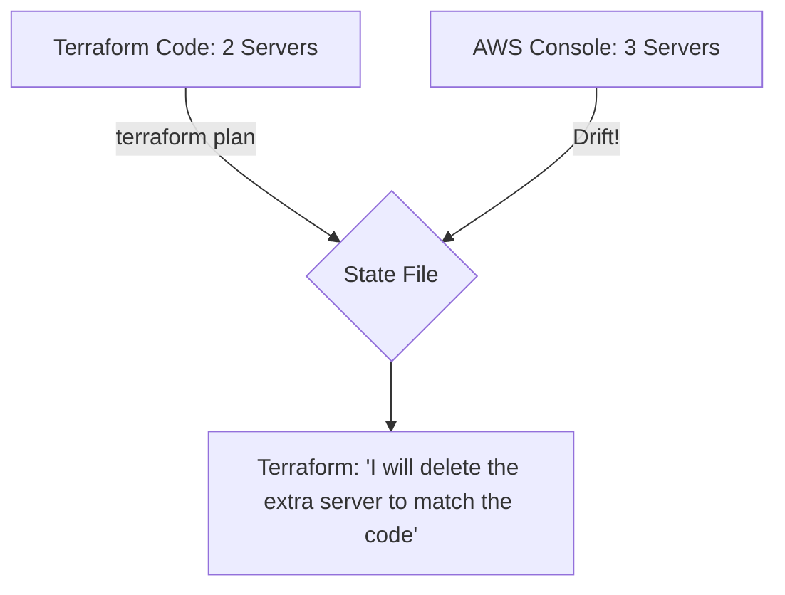

When you run `terraform apply`, how does Terraform know which resources already exist in AWS and which ones need to be created? It doesn't ask AWS every time—instead, it consults the **State File**.

At **CodeHarborHub**, we treat the State File as the **"Single Source of Truth."** If you lose this file, you lose control over your infrastructure.

## What is the State File?

The `terraform.tfstate` is a JSON file that maps your HCL code to real-world resources. For example, if you have a resource block like this:

```hcl title="main.tf"
resource "aws_s3_bucket" "my_learning_assets" {
  bucket = "codeharborhub-assets-2026"
}
```

### Why do we need it?
1. **Mapping:** Your code says `resource "aws_instance" "web"`. The state file remembers that this specific resource corresponds to ID `i-0123456789abcdef0` in AWS.
2. **Metadata:** It stores complex dependencies that aren't always visible in your code.
3. **Performance:** For large infrastructures, querying the AWS API for thousands of resources is slow. The state file acts as a local cache.

## Drift Detection: Code vs. Reality

**Drift** occurs when someone manually changes a resource in the AWS Console without updating the Terraform code.



When you run `terraform plan`, Terraform compares the state file with the actual AWS resources. If it detects a difference (like an extra server), it will show you a plan to fix that drift.

:::info
Always run `terraform plan` before `apply`. It will alert you to any "Drift" so you can decide whether to update your code or let Terraform revert the manual changes.
:::

## Local vs. Remote State

In a professional environment, keeping the state file on your laptop is dangerous.

<Tabs>
<TabItem value="local" label="Local State (Beginner)" default>

* **Stored in:** `terraform.tfstate` on your disk.
* **Risk:** If your laptop breaks or you delete the folder, your infrastructure is "orphaned."
* **Collaboration:** Impossible. Two developers can't work on the same project safely.

</TabItem>
<TabItem value="remote" label="Remote State (Industrial Level)">

* **Stored in:** AWS S3, HashiCorp Cloud, or Azure Blob.
* **Benefit:** Centralized, backed up, and supports **State Locking**.
* **Collaboration:** Multiple team members can run Terraform safely.

</TabItem>

</Tabs>

## Implementing a Remote Backend (S3)

To move to an "Industrial Level" setup at **CodeHarborHub**, add a `backend` block to your `main.tf`:

```hcl title="main.tf"
terraform {
  backend "s3" {
    bucket         = "my-codeharborhub-terraform-state"
    key            = "dev/frontend-app.tfstate"
    region         = "ap-south-1"
    dynamodb_table = "terraform-lock-table" # For State Locking
    encrypt        = true
  }
}
```

### Why use DynamoDB with S3?

**State Locking:** If Developer A is running `terraform apply`, DynamoDB "locks" the state file. If Developer B tries to run it at the same time, Terraform will block them until A is finished. This prevents **State Corruption**.

## The "Golden Rules" of State Security

1.  **NEVER Commit to Git:** The state file contains plain-text secrets (like database passwords). **Add `*.tfstate` to your `.gitignore` immediately.**
2.  **Enable Versioning:** If you use S3, enable **Bucket Versioning**. If a state file gets corrupted, you can roll back to a previous version.
3.  **Encrypted at Rest:** Always set `encrypt = true` in your backend configuration.

## Final Graduation Challenge

1.  Create a local Terraform project.
2.  Run `terraform init` and `apply` to create a simple resource (like an S3 bucket).
3.  Open the `terraform.tfstate` file in VS Code. **Read it.** Notice how it stores the ARN and IDs.
4.  Manually change a tag on that bucket in the **AWS Console**.
5.  Run `terraform plan` again. Observe how Terraform detects the **Drift**.
6.  Finally, run `terraform destroy` to clean up your cloud.