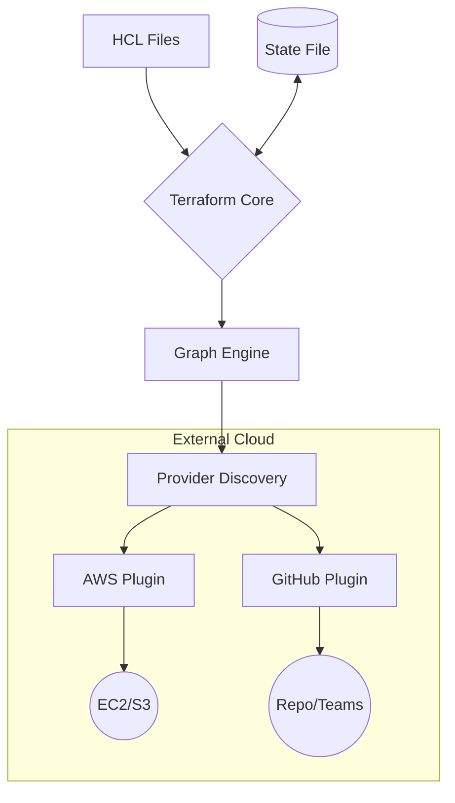

To become a professional DevOps engineer at **CodeHarborHub**, you must look "under the hood." Terraform isn't just a single program; it is a **Plugin-Based System** designed to handle any API on the planet.

:::info The "Industrial Level" Standard
At **CodeHarborHub**, we don't just want you to know how to write Terraform code. We want you to understand how Terraform works internally, so you can troubleshoot, optimize, and even extend it with custom providers. This deep understanding is what sets "Industrial Level" DevOps engineers apart.
:::

## The Two Main Components

Terraform's architecture is split into two distinct parts: **Terraform Core** and **Terraform Plugins (Providers)**.

### 1. Terraform Core
The Core is a statically linked binary written in **Go**. It is the "Brain" of the operation.
* **Responsibilities:**
    * Reading and interpolating your configuration files (`.tf`).
    * Resource dependency analysis (building the **Graph**).
    * Managing the **State File** (the source of truth).
    * Communicating with Plugins via RPC (Remote Procedure Call).

### 2. Terraform Plugins (Providers)
Plugins are the "Hands" that do the work. Terraform doesn't know how to talk to AWS, Azure, or DigitalOcean natively. It uses **Providers**.
* **Responsibilities:**
    * Translating Terraform's generic commands into specific API calls (e.g., "Create Instance" $\rightarrow$ `RunInstances` API in AWS).
    * Mapping the cloud's response back into Terraform's format.

## The "Wall Socket" Analogy

Think of Terraform like a **Universal Power Adapter**:

| Component | Analogy | Function |
| :--- | :--- | :--- |
| **Terraform Core** | The Adapter Box | Logic that manages the voltage and flow. |
| **Provider** | The Plug Head | The specific shape needed for India, UK, or USA sockets. |
| **Cloud (AWS/GCP)** | The Wall Socket | The actual source of power (Resources). |

## The Terraform Execution Lifecycle

When you run a command, Terraform goes through a precise mathematical process to ensure your infrastructure is safe.

## The 3 Key Architectural Concepts

### A. The Resource Graph

Terraform builds a **Directed Acyclic Graph (DAG)** of all resources. It determines which resources depend on others.

  * *Example:* If an EC2 instance needs a Security Group, Terraform knows to build the Security Group first. It can also build independent resources in **parallel** to save time.

### B. The State Engine

Terraform keeps a JSON database (`terraform.tfstate`) that acts as a "Mirror" of your cloud.

  * **Code:** What you *want*.
  * **State:** What Terraform *remembers*.
  * **Cloud:** What is *actually there*.

### C. The Provider Registry

When you run `terraform init`, the Core looks at the [Terraform Registry](https://registry.terraform.io/) to download the necessary plugins for your specific providers. This modular design allows Terraform to support hundreds of providers, from major clouds to niche services.

## Life of a Command: `terraform plan`

<Tabs>
<TabItem value="step1" label="1. Refresh" default>

Terraform asks the **Provider** to check the current state of resources in the real world (e.g., "Is the EC2 still running?").

</TabItem>
<TabItem value="step2" label="2. Diff">

It compares the **Current State** with your **Desired Code**.

  * Green (`+`): To be added.
  * Yellow (`~`): To be modified.
  * Red (`-`): To be destroyed.

</TabItem>
<TabItem value="step3" label="3. Proposal">

It presents you with an execution plan. **No changes are made to your cloud during this phase.**

</TabItem>
</Tabs>

:::info The "Aha!" Moment
Understanding the separation of concerns between the Core and Providers is the "Aha!" moment for many DevOps beginners. It explains why Terraform can manage anything with an API and how it maintains a consistent workflow regardless of the underlying cloud.

Because Terraform is plugin-based, you can write your own **Custom Provider** to manage anything with an API—even your office's smart lightbulbs or a Spotify playlist! This extensibility is what makes Terraform the "Industrial Level" standard for infrastructure automation in the DevOps world.
:::