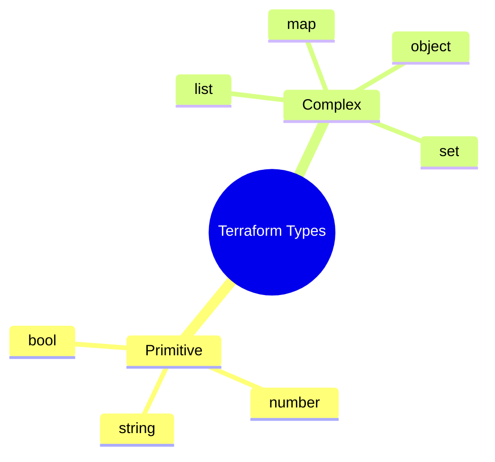

In the previous chapter, we hardcoded values like `ami-0c55b159cbfafe1f0`. In a professional **MERN-stack** workflow, this is a bad practice. What if you want to deploy the same app to a different region or use a larger server for production?

**Variables** allow you to parameterize your code, while **Outputs** allow you to extract information from your infrastructure after it is built.

## 1. Input Variables (The Inputs)

Think of variables as the "Arguments" of a function. Instead of hardcoding values, you define a variable and pass the value when you run Terraform.

### Definition Syntax
We typically store variables in a separate file named `variables.tf`.

```hcl title="variables.tf"
variable "instance_type" {
  description = "The size of the EC2 instance"
  type        = string
  default     = "t2.micro" # Optional: provides a fallback
}

variable "server_port" {
  description = "The port the server will use for HTTP requests"
  type        = number
  default     = 80
}
```

### Using Variables in Code

To use a variable, use the `var.<NAME>` syntax in your `main.tf`:

```hcl title="main.tf"
resource "aws_instance" "app_server" {
  ami           = "ami-0c55b159cbfafe1f0"
  instance_type = var.instance_type # Using the variable here

  tags = {
    Name = "CodeHarborHub-Server"
  }
}
```

## 2. Output Values (The Results)

Outputs are like the "Return" value of a function. After Terraform finishes building your cloud, you might need to know the **Public IP** of your server or the **URL** of your database.

### Definition Syntax

We typically store these in `outputs.tf`.

```hcl title="outputs.tf"
output "server_public_ip" {
  description = "The public IP address of the web server"
  value       = aws_instance.app_server.public_ip
}
```

When you run `terraform apply`, Terraform will print these values to your terminal at the very end.

## Ways to Assign Variable Values

Terraform provides multiple ways to set your variables. At **CodeHarborHub**, we use these in order of priority:

| Method | Best For... | Example |
| :--- | :--- | :--- |
| **Variable Files (`.tfvars`)** | Environment-specific settings. | `terraform apply -var-file="prod.tfvars"` |
| **Command Line Flags** | Quick testing/one-off changes. | `terraform apply -var="instance_type=t2.large"` |
| **Environment Variables** | CI/CD pipelines (GitHub Actions). | `export TF_VAR_instance_type=t2.small` |
| **Default Values** | Sensible defaults for beginners. | Defined inside `variables.tf`. |

## Variable Types & Validation

Terraform is a "Strongly Typed" language. This prevents errors before they ever reach the cloud.



### Pro Tip: Validation

You can even add rules to ensure developers don't use expensive servers by accident!

```hcl title="variables.tf"
variable "instance_type" {
  type = string
  validation {
    condition     = contains(["t2.micro", "t3.micro"], var.instance_type)
    error_message = "At CodeHarborHub, we only allow free-tier instances (t2/t3.micro)."
  }
}
```

## Practical Workflow: The `.tfvars` file

To keep your code clean, create a file named `terraform.tfvars`:

```hcl title="terraform.tfvars"
# Values assigned here override the defaults in variables.tf
instance_type = "t2.micro"
server_port   = 8080
```

When you run `terraform apply`, Terraform automatically loads `terraform.tfvars` and applies those values.

## Learning Challenge

1.  Take your `main.tf` from the last lesson.
2.  Create a `variables.tf` and move the `bucket_name` into a variable.
3.  Create an `outputs.tf` to display the **ARN** (Amazon Resource Name) of the bucket.
4.  Run `terraform apply` and watch the output appear in your terminal\!