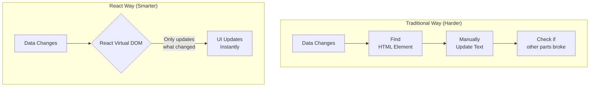
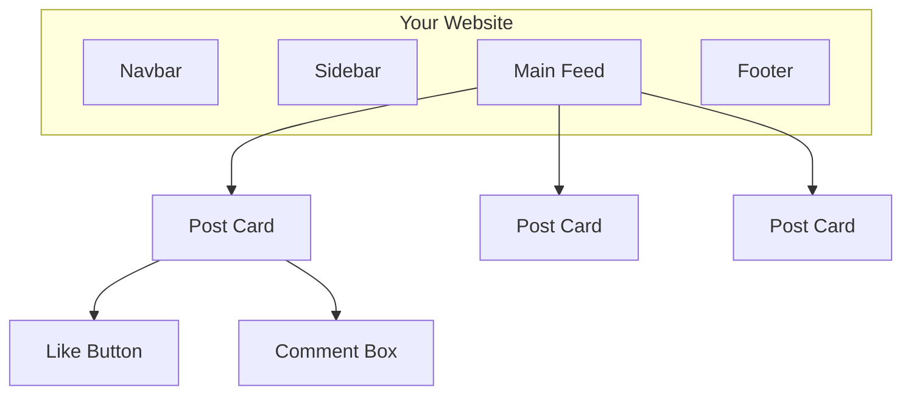
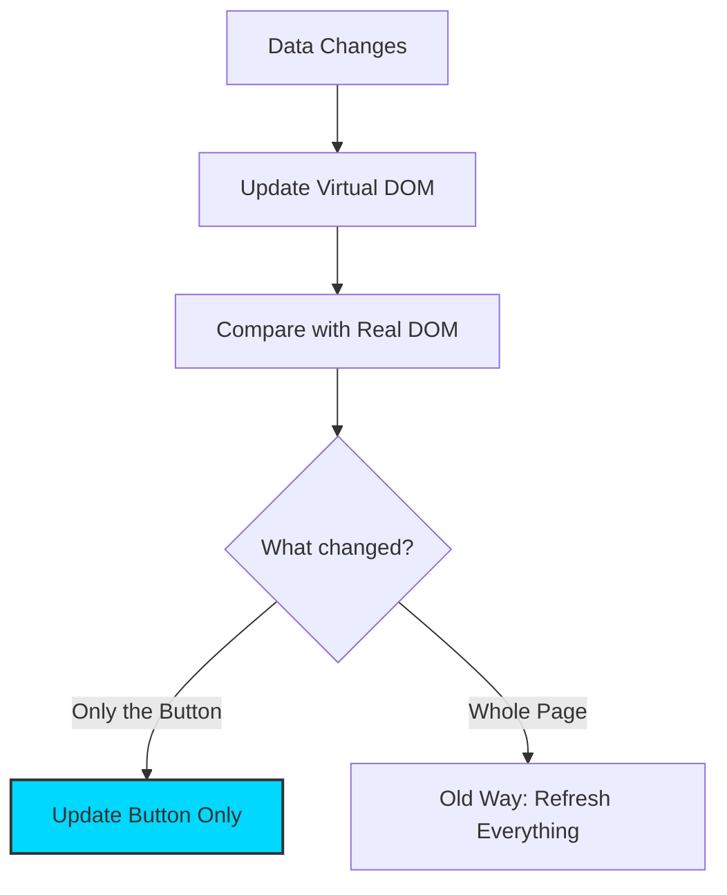

Welcome to the **React** era! If you've already learned HTML, CSS, and JavaScript, you might be wondering: *"Why do I need a library? Can't I just use plain JavaScript?"*

The answer is: **Efficiency.**

In plain JavaScript, if you wanted to update a user's notification count, you would have to manually find the element, change the text, and make sure everything else on the page didn't break. In React, you just change the **Data**, and React magically updates the **UI** for you.

:::note
If HTML is the **Skeleton** and JavaScript is the **Brain**, then **React** is the **Architect**. 

React is a JavaScript library created by Facebook to make building user interfaces (UIs) easier, faster, and more organized. Instead of telling the browser every tiny step to take, you just describe what you want the screen to look like.
:::

## The Mental Shift: How React Thinks

React acts like a **Smart Assistant**. Instead of you giving "Step-by-Step" instructions (Imperative), you just describe what you want the final result to look like (Declarative).

### The Visualization: Traditional vs. React

## The "Big Three" Features

Why did React win the "Web Library Wars"? Because of these three superpowers:

### 1. Components (The LEGO Mindset)

In React, you don't build "Pages." You build **Components**. A Navbar is a component. A Button is a component. You build them once and reuse them everywhere.

* **Benefit:** Fix a bug in the "Button" component, and it's fixed across your entire website instantly!

:::info 🧱 The Lego Mindset: Components

The biggest shift in React is thinking in **Components**.

Instead of one giant `index.html` file, you build small, independent pieces of code. You can reuse these pieces anywhere, just like LEGO bricks.

:::

### 2. The Virtual DOM (The Fast Copy)

React keeps a lightweight "Ghost Copy" of your website in its memory.

* When something changes, React compares the "Ghost Copy" with the "Real Page."
* It finds the **exact** spot that changed and only updates that tiny piece.
* **Analogy:** If you get a haircut, React doesn't replace your whole body; it just updates your hair!

:::info The Virtual DOM (in other way)
React keeps a "hidden copy" of your website in its memory. This is called the **Virtual DOM**. 

When something changes, React follows these steps:
1. It updates the **Virtual DOM** (which is lightning fast).
2. It compares the Virtual DOM to the **Real DOM** (the one the user sees).
3. It **only** changes the tiny piece that is different.

:::

### 3. Declarative UI (The Menu)

React is like a restaurant. You look at the menu and say, *"I want a Burger."* You don't go into the kitchen and tell the chef how to flip the patty. You describe the **State** (the burger), and React serves it.

## When should you use React?

You don't need React for a simple one-page resume. But you **definitely** need it for:

* **Social Media:** (Like/Comment counts updating live).
* **Dashboards:** (Graphs and data changing in real-time).
* **E-commerce:** (Adding items to a cart without refreshing the page).

## Why Beginners Love React

1. **Speed:** Your apps feel "snappy" because they don't refresh the whole page.
2. **Reusability:** Write a `Button` component once, use it 100 times.
3. **Job Demand:** Almost every modern tech company uses React. Learning this opens doors to professional careers.

:::tip Vocabulary Check
**SPA (Single Page Application):** A website that feels like a desktop app because it never refreshes the page while you click around. React is the king of SPAs!
:::

## Quick Knowledge Check

| Feature | Plain JS (Vanilla) | React.js |
| --- | --- | --- |
| **Updates** | Slow (Re-renders whole sections) | Fast (Only updates changed parts) |
| **Logic** | Manual (You do everything) | Automated (React handles the DOM) |
| **Code** | Can get messy (Spaghetti) | Organized (Components) |

## Summary Checklist

* [x] I understand that React is for building **User Interfaces (UI)**.
* [x] I know that **Components** are reusable building blocks.
* [x] I understand the **Virtual DOM** makes websites feel fast.
* [x] I'm ready to stop writing "Pages" and start building "Components."

:::tip Fun Fact / info
* React is a free and open-source JavaScript library for building user interfaces (UIs), particularly for single-page applications. It is developed and maintained by Meta (formerly Facebook) and a large community of developers and companies.
* React was created by **Jordan Walke**, a software engineer at Facebook. It was first used on Facebook’s Newsfeed in 2011 and later on Instagram!
:::