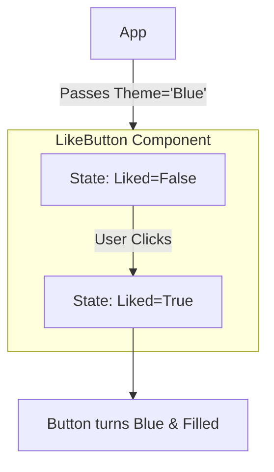

In React, data flows like water. To build interactive apps, you need to understand the two ways components handle data: **Props** and **State**.

## 1. Props (Properties)
**Props** are like "Arguments" for a function. They allow a parent component to pass information down to its children.

* **Analogy:** Think of a **User Profile Card**. The card is the component, but the *name*, *bio*, and *photo* are passed into it.
* **The Rule:** Props are **Read-Only**. A child component cannot change the props it receives; it can only display them.

```jsx title="App.js"
// The Child Component
function WelcomeMessage(props) {
  return <h1>Hello, {props.name}!</h1>;
}

// The Parent Component
function App() {
  return (
    <div>
      <WelcomeMessage name="Ajay" />
      <WelcomeMessage name="Sanya" />
    </div>
  );
}
```

## 2. State (The Component's Memory)

**State** is data that lives *inside* a component and can **change** over time. When state changes, React automatically re-renders the component to show the new data.

* **Analogy:** Think of a **Light Switch**. The switch is the component, and the "On/Off" status is its **State**.
* **The Rule:** State is **Private**. Only the component that owns the state can change it.

## The Comparison Table

| Feature | Props (The DNA) | State (The Mood) |
| --- | --- | --- |
| **Origin** | Passed from a Parent | Created inside the Component |
| **Changeable?** | No (Read-Only) | Yes (Using `setState`) |
| **Purpose** | To configure the component | To handle interactivity |

## Seeing them together: The "Like Button"

Imagine a "Like Button" on a social media post.

1. The **Color** of the button might be a **Prop** (passed by the theme).
2. Whether the button is **Clicked** or not is **State** (it changes when the user taps it).



## Live Interaction: Props in Action

Try changing the `name` or `color` in the code below to see how props update the UI!

```jsx live
function App() {
  // 1. Define the Child Component inside the App for the Live Editor
  const Greeting = (props) => {
    return (
      <div style={{ 
        padding: '20px', 
        border: `3px solid ${props.color}`,
        borderRadius: '12px',
        backgroundColor: '#fdfdfd',
        color: '#333',
        textAlign: 'center',
        marginBottom: '10px'
      }}>
        <h2 style={{ color: props.color }}>Welcome, {props.name}!</h2>
        <p>Your current theme color is: <strong>{props.color}</strong></p>
      </div>
    );
  };

  // 2. The Parent returns the final UI
  return (
    <section>
      <Greeting name="Developer" color="orange" />
      <Greeting name="CodeHarborHub Learner" color="purple" />
    </section>
  );
}
```

:::info 📝 Note on the Live Editor
In this tutorial's Live Code Block, we define the Greeting component inside the App function. This is necessary because the live playground needs everything in one scope to render properly.

> In a real-world React project, you would usually put `Greeting` and `App` in separate files. However, to make this **Live Playground** work, we have placed both components in one view so they can talk to each other instantly.

### Try it Yourself!
* Change `name="Future Coder"` to your own name.
* Change `color="crimson"` to `"gold"` or `"forestgreen"`.

```jsx title="App.js"
const Greeting = (props) => {
  return (
    <div style={{ 
      padding: '20px', 
      border: `3px solid ${props.color}`,
      borderRadius: '12px',
      backgroundColor: '#fdfdfd',
      color: '#333',
      textAlign: 'center',
      marginBottom: '10px'
    }}>
      <h2 style={{ color: props.color }}>Welcome, {props.name}!</h2>
      <p>Your current theme color is: <strong>{props.color}</strong></p>
    </div>
  );
};

function App() {
  return (
    <section>
      <Greeting name="Developer" color="orange" />
      <Greeting name="CodeHarborHub Learner" color="purple" />
    </section>
  );
}
```
:::

:::note 🌟 Best Practice (Real World)
In a real professional project (like a large app), you should never define a component inside another component. Instead:

Separate Files: Create a file called `Greeting.jsx`.

Export/Import: Export the Greeting and import it into your `App.jsx`.

Performance: Defining components outside ensures React doesn't "re-create" the child component every time the parent updates, making your app significantly faster!
:::

### Professional Best Practice: Import & Export

In a real-world project at **CodeHarborHub**, you wouldn't keep all your components in one file. That would get messy! Instead, we put each component in its own file and use `import` and `export`.

#### 1. The Child File (`Greeting.js`)

We create the component and "Export" it so other files can use it.

```jsx title="Greeting.js"
export default function Greeting(props) {
  return (
    <div style={{ border: `2px solid ${props.color}` }}>
      <h1>{props.name}</h1>
    </div>
  );
}

```

#### 2. The Parent File (`App.js`)

We "Import" the child component and use it in our UI.

```jsx title="App.js"
import Greeting from './Greeting'; // Importing the child

function App() {
  return (
    <section>
      <Greeting name="Ajay" color="orange" />
    </section>
  );
}
```

:::info Why use separate files?

1. **Readability:** Your `App.js` stays small and easy to read.
2. **Teamwork:** One developer can work on the `Navbar.js` while another works on the `Footer.js` without touching the same file.
3. **Organization:** Just like folders on your computer, separate files help you find your code faster as your project grows.
:::

## Summary Checklist

* [x] I know that **Props** are like inputs passed from a parent.
* [x] I understand that **Props** should never be changed by the child.
* [x] I know that **State** is used for data that changes (like counters or forms).
* [x] I understand that when **State** changes, React updates the screen.