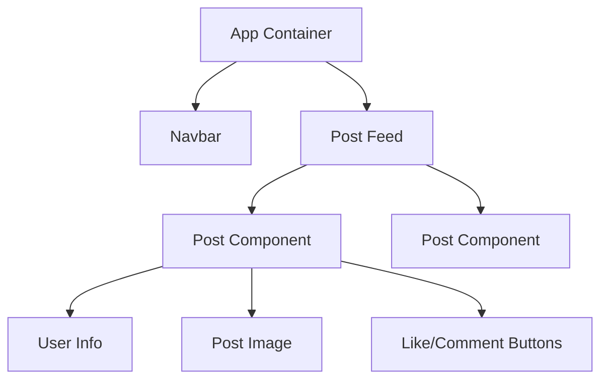

The secret to being a great React developer isn't knowing complex math, it's knowing how to **break things down**.

In traditional web development, we build pages (`home.html`, `about.html`). In React, we build **UI Pieces** (Components) and snap them together.

## The "X-Ray" Vision

Imagine you are looking at a simple Social Media post. If we look at it with "React X-Ray Vision," we see that it's actually made of several smaller pieces:



## What is a Component?

A Component is a self-contained "chunk" of code that handles its own **structure** (HTML), **style** (CSS), and **logic** (JS).

### The Anatomy of a Component

In React, a component is just a **JavaScript Function** that returns something that looks like HTML (we call this JSX).

For example `WelcomeMessage.js`

```jsx live
function WelcomeMessage() {
  return (
    <div className="welcome-card">
      <h1>Hello, CodeHarborHub!</h1>
      <p>Ready to build something awesome today?</p>
    </div>
  );
}

```

## Why is this a Superpower?

### 1. Reusability (Write Once, Use Everywhere)

Need a "Subscribe" button on the top, middle, and bottom of your page? Don't copy-paste the HTML. Just use your `<Button />` component three times.

:::note For Example

A button component in React is a reusable, interactive UI element created using the standard `<button>` HTML tag, but with its logic and behavior managed through React's functional components and state.

**Basic Custom Button Component**

You can create a simple, reusable Button component in a separate file (e.g., `src/components/Button.js`) as follows:

```jsx title="src/components/Button.js"
import React from 'react';
import './Button.css'; // Optional: for styling

const Button = ({ onClick, children, disabled, type = "button" }) => {
  return (
    <button
      type={type} // Can be "button", "submit", or "reset"
      onClick={onClick}
      disabled={disabled}
      className="custom-button" // Apply custom styles
    >
      {children}
    </button>
  );
};

export default Button;
```

**Usage in an App**

You can then import and use this component throughout your application:

```jsx title="src/App.js"
import React, { useState } from 'react';
import Button from './components/Button';

function App() {
  const [count, setCount] = useState(0);

  const handleClick = () => {
    setCount(count + 1);
  };

  return (
    <div>
      <p>Current count: {count}</p>
      <Button onClick={handleClick}>
        Increment
      </Button>
      <Button disabled>
        Disabled Button
      </Button>
      <Button type="submit">
        Submit Form
      </Button>
    </div>
  );
}

export default App;
```

**Key Features and Customization**

* **Props:** The component accepts props like onClick, children, disabled, and type to manage its behavior and content.
* **Styling:** Styles can be applied using standard CSS, CSS modules, or libraries like styled components or Tailwind CSS.
* **Icons and Loading States:** Advanced components often include support for icons, different sizes, and a loading state (e.g., displaying a spinner while an asynchronous action is pending).
* **Third-Party Libraries:** Many UI libraries provide feature-rich, pre-styled button components out of the box, such as Material UI, React Bootstrap, and Syncfusion. 

:::

### 2. Isolation (Don't Break the Whole House)

If your "Search Bar" component has a bug, the "Video Player" component will still work perfectly. They are independent of each other.

### 3. Maintenance (The "Single Source of Truth")

If you want to change the color of every button on your site, you only have to change it in **one file**: `Button.js`.

## Beginner Exercise: The Component Breakdown

Look at this list. Which of these should be their own components?

1. **A Navigation Bar?** *(Yes, it's used on every page)*
2. **A single word of text?** *(No, that's too small!)*
3. **A Product Card?** *(Yes, you'll have many of them on a shop page)*
4. **An Input Field with a Label?** *(Yes, it's a reusable form element)*

:::tip The Component Rule of Thumb

If a piece of your UI is **repeated** (like a card) or is **complex** (like a video player), it should be a **Component**.

:::

## Summary Checklist

* [x] I can visualize a website as a "Tree" of components.
* [x] I understand that components are just JS functions.
* [x] I know that "Nesting" means putting one component inside another.

:::info Did you know?
In a massive app like **Facebook**, there are over **50,000 components**! Because they are so well-organized, thousands of developers can work on them at the same time without stepping on each other's toes.
:::