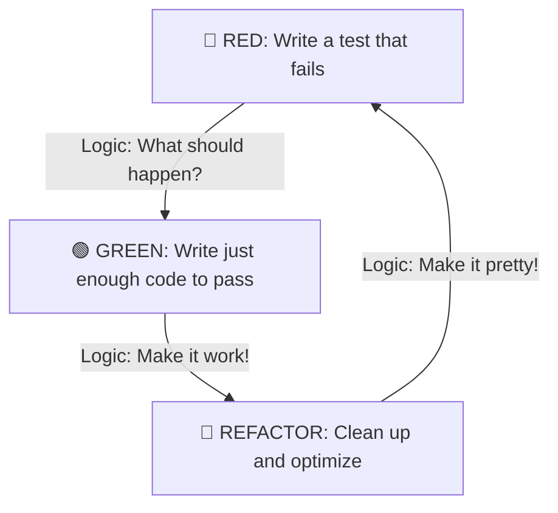

As a beginner, you probably spend a lot of time writing code, saving it, and then refreshing your browser to see if it works. This is called **Manual Testing**.

But what happens when your app grows? What if you change a button on the Home Page and it accidentally breaks the Checkout Page? You can't manually check every single page every time you make a change.

That is where **Automated Testing** comes in.

## Manual vs. Automated Testing

Think of it like a **Security System** for your code:

| Manual Testing | Automated Testing (Vitest) |
| :--- | :--- |
| You click buttons to see if they work. | A script clicks them for you in milliseconds. |
| Easy to forget a step. | Never forgets; checks everything every time. |
| Gets slower as the app grows. | Stays fast no matter how big the app gets. |
| You hope it works. | **You know it works.** |

## How Vitest Works

**Vitest** is a testing framework. It looks at your code, runs it with specific "scenarios," and checks if the output matches your expectations.

### The "Logic" of a Test

Every test follows a simple 3-step pattern called **AAA**:

1.  **Arrange:** Set up the data (e.g., `let x = 2; let y = 2;`).
2.  **Act:** Run the function you want to test (e.g., `add(x, y)`).
3.  **Assert:** Check if the result is what you expected (e.g., `expect result to be 4`).

## The Developer's Rhythm: Red, Green, Refactor

Professional developers use a workflow that ensures their code is always "bulletproof." 

1. **Red:** You write a test for a feature that doesn't exist yet. The test fails (Red).
2. **Green:** You write the simplest code possible to make the test pass (Green).
3. **Refactor:** You clean up your code, knowing the test will tell you immediately if you break something.

## Real-World Analogy: The Smoke Alarm

A test is like a **Smoke Alarm** in your house. Most of the time, it sits there quietly doing nothing. But the moment there is a "fire" (a bug) in your code, it screams at you so you can fix it before the whole house burns down.

## Summary Checklist

* [x] I understand that testing saves time in the long run.
* [x] I know the difference between manual and automated testing.
* [x] I understand the **Red-Green-Refactor** cycle.
* [x] I'm ready to build my own "Safety Net."

:::tip Did you know?
Companies like **Google** and **Amazon** run millions of automated tests every single day. They literally cannot ship code to users unless every single "Green Light" is on!
:::