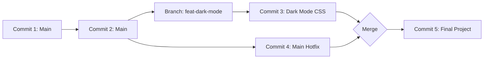

In a professional environment like **CodeHarborHub**, we never work directly on the "Live" code (the `main` branch). Instead, we use **Branches**.

A branch is essentially a **Parallel Universe**. You can build a new feature, experiment with a new design, or fix a bug in a separate space without affecting the main project.

## The Branching Workflow

Imagine you are building a website. The `main` branch is the version users see. You want to add a "Dark Mode."

1.  **Create a Branch:** You step into a parallel universe called `feat-dark-mode`.
2.  **Work:** You write your CSS and JS. The `main` branch remains untouched and stable.
3.  **Merge:** Once the dark mode is perfect, you bring those changes back into the `main` universe.

## Step 1: Creating and Switching

You can create a branch and move into it using these commands:

<Tabs>
<TabItem value="standard" label="The 2-Step Way" default>

```bash
# Create the branch
git branch feat-dark-mode

# Switch to the branch
git checkout feat-dark-mode
```

</TabItem>
<TabItem value="pro" label="The Pro Way (1-Step)">

```bash
# Create and switch immediately
git checkout -b feat-dark-mode
```

</TabItem>
</Tabs>

## Step 2: Merging Changes

Once your work in the branch is finished and committed, it’s time to merge it back to the `main` branch. Here’s how you do it:

**1. Switch back to the destination (Main):**

```bash
git checkout main
```

**2. Pull the changes in:**

```bash
git merge feat-dark-mode
```

**3. Cleanup (Optional):**
Since the feature is now part of `main`, you can delete the temporary branch:

```bash
git branch -d feat-dark-mode
```

## The Logic of Merging



## Handling Merge Conflicts

Sometimes, Git gets confused. If you changed line 10 in `main` and your friend changed line 10 in `feat-dark-mode`, Git won't know which one to keep. This is a **Merge Conflict**.

**How to fix it:**

1.  Open the file in **VS Code**.
2.  You will see markers: `<<<<<<< HEAD` (Your version) and `>>>>>>> branch-name` (Their version).
3.  Delete the version you don't want and remove the markers.
4.  `git add` the file and `git commit` to finish the merge.

## Industrial Best Practices

| Rule | Why? |
| :--- | :--- |
| **Descriptive Names** | Use `feat/login-ui` or `fix/header-logo` so others know what the branch is for. |
| **Keep Branches Small** | Don't build five features in one branch. One branch = One task. |
| **Pull Before Merge** | Always run `git pull origin main` before merging to ensure you have the latest team updates. |

:::info
Not sure what branch you are on? Run `git branch`. The one with the asterisk (`*`) and highlighted in green is your current "Parallel Universe."
:::