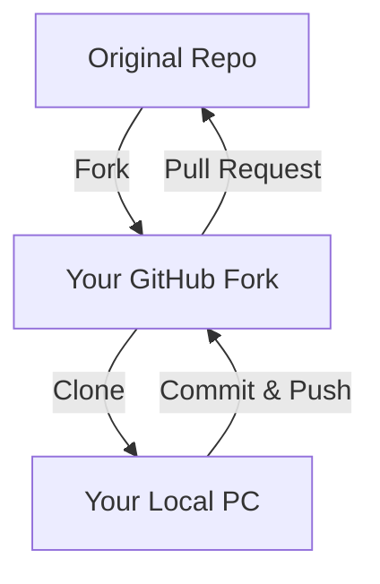

One of the best ways to learn at **CodeHarborHub** is to look at how others build software. GitHub makes it incredibly easy to take an existing project and bring it onto your own computer. To do this, we use two main concepts: **Forking** and **Cloning**.

## Forking vs. Cloning: The Big Difference

These two terms are often confused, but they serve very different purposes in the professional developer's workflow.

| Action | Where it happens | What it does | Use Case |
| :--- | :--- | :--- | :--- |
| **Forking** | On GitHub (Cloud) | Creates a **copy** of someone's repo under *your* account. | To contribute to Open Source or experiment with a project. |
| **Cloning** | On your PC (Local) | Downloads a repo from GitHub to your hard drive. | To start coding on a project locally. |

## 1. How to Fork a Repository

Forking is the first step to contributing to an open-source project like **CodeHarborHub**.

1.  Navigate to the repository you want to copy (e.g., `github.com/codeharborhub/mern-stack-app`).
2.  In the top-right corner, click the **Fork** button.
3.  GitHub will create a carbon copy of that project in your own profile (e.g., `github.com/your-username/mern-stack-app`).

:::info Why Fork?
You cannot "Push" code directly to a project you don't own. Forking gives you your own version where you have "Admin" rights to make any changes you want.
:::

## 2. How to Clone a Repository

Once you have a repository on GitHub (either your own or a fork), you need to "Clone" it to your computer to actually edit the files.

1.  On the GitHub repo page, click the green **`<>` Code** button.
2.  Copy the **HTTPS** URL.
3.  Open your terminal and run:

```bash
git clone https://github.com/your-username/your-repo-name.git
```

### What happens during a Clone?

  * Git creates a new folder on your computer.
  * It downloads every file and every folder.
  * **Crucially:** It downloads the entire history (all previous commits).
  * It automatically sets up the "Remote" (origin) so you can push/pull immediately.

## The Open Source Contribution Flow

This is the standard "Industrial Level" workflow for contributing to projects:



## Step 3: Keeping your Clone Updated

If the original project (the one you forked) gets updated with new features, your local clone will become outdated. At **CodeHarborHub**, we use the `upstream` command to keep things synced.

```bash
# 1. Connect to the original 'Source' repo
git remote add upstream https://github.com/codeharborhub/original-project.git

# 2. Pull the latest changes from the original source
git pull upstream main
```

## Common Scenarios

| Problem | Solution |
| :--- | :--- |
| **"I just want to play with the code locally."** | Just **Clone** the repo. |
| **"I want to fix a bug in CodeHarborHub."** | **Fork** it first, then **Clone** your fork. |
| **"I deleted my local folder by mistake!"** | No problem! Just **Clone** it again from GitHub. |

:::tip
You can clone a repository directly into **VS Code**! Open VS Code, press `Ctrl+Shift+P`, type "Git: Clone," and paste the URL. It handles the terminal work for you!

For example, if you want to clone the CodeHarborHub repository, you can use:

```bash
git clone [REPOSITORY_URL]
```
:::