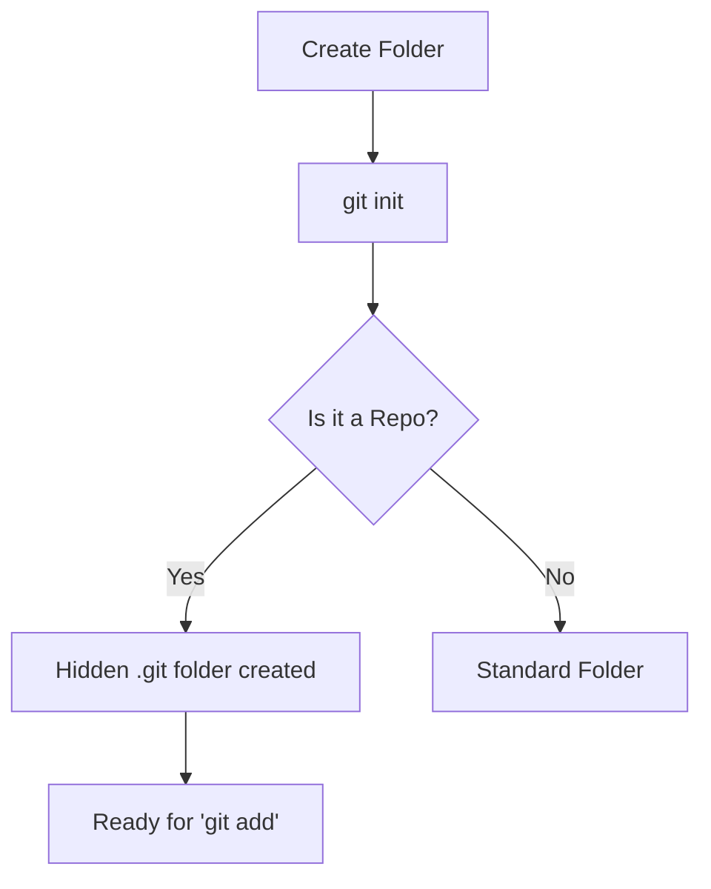

Every great project at **CodeHarborHub** starts with a single step: telling Git to start watching your files. This process is called **Initialization**.

The `git init` command transforms an ordinary directory (folder) into a GitHub-ready **Git Repository**.

:::info
Think of `git init` as the "Start Engine" button for your project. It revs up Git's engine and gets it ready to track every change you make to your code.
:::

## What does `git init` actually do?

When you run this command, Git creates a hidden folder named `.git` inside your project. This folder is the "Brain" of your project—it stores every version, every branch, and every configuration for that specific repository.

### The "Before and After"
* **Before `git init`:** Your folder is just a collection of files. If you delete a line of code, it’s gone forever.
* **After `git init`:** Your folder is a **Repository**. Git is now "listening" for changes, ready to save snapshots of your work.

## How to Use It

Follow these steps to start your first repository:

1.  **Open your Terminal** (or Git Bash on Windows).
2.  **Navigate** to your project folder:
    ```bash
    cd Desktop/my-web-project
    ```
3.  **Run the Initialization:**
    ```bash
    git init
    ```

**Expected Output:**

> `Initialized empty Git repository in C:/Users/Ajay/Desktop/my-web-project/.git/`

## The Repository Lifecycle



## Common Use Cases

| Scenario | What to do? |
| :--- | :--- |
| **New Project** | Create a folder → `git init`. |
| **Existing Code** | Go to the existing folder → `git init`. |
| **Mistake?** | If you initialized the wrong folder, simply delete the hidden `.git` folder to stop tracking. |

## Important Rules for Beginners

1.  **Don't Touch the `.git` Folder:** You will see this folder if you have "Hidden Items" turned on. **Never** delete or modify files inside it manually, or you might lose your entire project history!
2.  **Don't Nest Repositories:** Avoid running `git init` inside a folder that is *already* inside another Git repository. One project = One `.git` folder.
3.  **The "Main" Branch:** By default, Git creates a starting branch. In modern development, this is usually called `main` (though older versions might call it `master`). You can rename it later, but for now, just know that this is your "Main" branch where your stable code will live.

:::tip Did you know?
You only need to run `git init` **once** per project. Once the `.git` folder exists, Git will continue to track that folder forever until you delete it.
:::