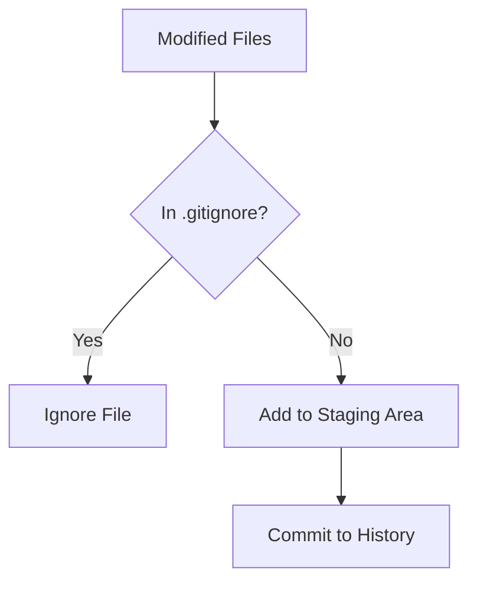

In every project, there are files you **never** want to save in your history or upload to GitHub. These might be secret passwords, large "junk" folders, or temporary system files.

At **CodeHarborHub**, we use a special file called `.gitignore` to tell Git: "Ignore these files. Pretend they don't exist."

## Why do we need it?

If you don't use a `.gitignore`, your repository will quickly become bloated and dangerous:

1.  **Security:** You might accidentally push your `DATABASE_PASSWORD` or `API_KEY` to the public.
2.  **Performance:** Folders like `node_modules` can contain thousands of files. Uploading them makes your `git push` slow and heavy.
3.  **Cleanliness:** System files like `.DS_Store` (Mac) or `Thumbs.db` (Windows) add "noise" to your project that other developers don't need.

## How to Create One

1.  In your project's **root folder**, create a new file.
2.  Name it exactly `.gitignore` (The dot at the beginning is mandatory).
3.  Inside the file, type the names of the files or folders you want to ignore.

### Example `.gitignore` for a MERN Stack Project:

```text
# Dependency folders (very heavy)
node_modules/

# Environment variables (contains secrets!)
.env
*.local

# Build output (generated files)
dist/
build/

# System files
.DS_Store
Thumbs.db
```

## How it Works

When you run `git add .`, Git checks your `.gitignore` file first. If a file matches a pattern in that list, Git simply skips it.



## Professional Use Cases

| Pattern | What it ignores | Use Case |
| :--- | :--- | :--- |
| `*.log` | All files ending in `.log`. | Hiding error logs. |
| `config/secrets.json` | A specific file path. | Protecting specific API keys. |
| `temp/` | The entire 'temp' folder. | Ignoring temporary cache. |
| `!important.log` | **Exceptions:** Ignore logs *except* this one. | Keeping one specific log file. |

## The "Already Tracked" Trap

:::danger Warning
If you have **already committed** a file and then add it to `.gitignore`, Git will **continue to track it.** 
:::

To fix this and tell Git to "stop watching" a file that was already committed:

```bash
# Remove from Git index, but keep the file on your computer
git rm --cached <filename>
```

## Pro Tip: Global Gitignore

Tired of adding `.DS_Store` to every single project? You can create a **Global Gitignore** that applies to every repository on your computer:

```bash
git config --global core.excludesfile ~/.gitignore_global
```

:::info
Then, create the `~/.gitignore_global` file and add your common patterns there. This way, you only have to write them once!

Don't write your `.gitignore` from scratch! Use [gitignore.io](https://www.toptal.com/developers/gitignore). Just type "Node", "React", and "Windows," and it will generate a professional file for you instantly.
:::