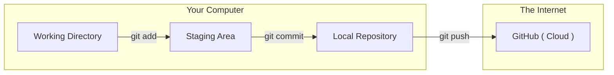

Until now, all your "Save Points" (Commits) have lived only on your laptop. If your computer crashes, your code is gone! To prevent this and to share our work with the **CodeHarborHub** community, we use **Remotes**.

A **Remote** is simply a version of your project that is hosted on the internet (usually on GitHub).

## Step 1: Adding a Remote

Think of this like "Pairing" your phone to a Bluetooth speaker. You are telling your local Git folder exactly where its "Cloud Home" is located.

1.  **Create a Repo** on GitHub (without initializing it with a README).
2.  **Copy the URL** (e.g., `https://github.com/user/repo.git`).
3.  **Run the command:**

```bash
git remote add origin https://github.com/your-username/your-repo-name.git
```

### What does "origin" mean?

In the developer world, `origin` is the standard nickname for your main GitHub repository. You could name it "cloud" or "github," but stick with `origin` to follow the industrial standard.

## Step 2: Pushing Your Changes

"Pushing" is the process of uploading your local commits to the remote server.

```bash
# Push your 'main' branch to the 'origin' remote
git push -u origin main
```

### What does the `-u` flag do?

The `-u` (upstream) flag "remembers" your preferences. After running this once, you can just type `git push` in the future, and Git will know exactly where to send the code.

## The Local-to-Cloud Workflow



## Common Push Scenarios

| Command | Use Case |
| :--- | :--- |
| **`git remote -v`** | Check which GitHub URL your project is currently linked to. |
| **`git push origin feature-name`** | Push a specific branch instead of the main one. |
| **`git push --force`** | **Dangerous:** Overwrites the cloud history. Avoid this at CodeHarborHub! |

## Troubleshooting: "Rejected" Pushes

Sometimes, GitHub will reject your push with an error. This usually happens because **someone else** pushed code while you were working.

**The Fix:** You must "Pull" their changes first, merge them, and then push again.

```bash
# 1. Get the latest code from GitHub
git pull origin main

# 2. Now you can safely push
git push origin main
```

## Industrial Level Best Practice

At **CodeHarborHub**, we never "Push to Main" directly when working in a team.

1.  Create a **Branch** (`git checkout -b feature-xyz`).
2.  Push the **Branch** (`git push origin feature-xyz`).
3.  Open a **Pull Request** on GitHub for a code review. This way, we maintain a clean and stable `main` branch while still collaborating effectively.

:::info
You can have multiple remotes! For example, you could have one remote named `origin` for GitHub and another named `heroku` to automatically deploy your app to a live server.
:::