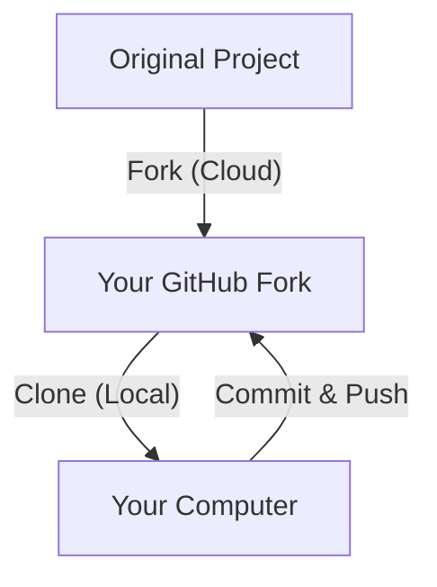

In the world of Open Source, you often find amazing projects that you want to improve or use as a starting point for your own work. However, you don't have permission to edit the original code directly. 

This is where **Forking** comes in. At **CodeHarborHub**, we consider forking the first step toward becoming a true Open Source contributor.

:::info
If you are new to GitHub, forking is the best way to get your own copy of a project that you can experiment with and eventually contribute back to the original author.
:::

## What is a Fork?

A **Fork** is a complete copy of a repository that is managed under **your** GitHub account instead of the original author's. It allows you to freely make changes without affecting the original project. You can then propose your changes to the original author through a **Pull Request**.

### The "Notebook" Analogy

Imagine your teacher has a master notebook with a great science experiment. 
* You can't write in the teacher's notebook.
* You **Fork** it by taking the notebook to a photocopier.
* Now you have your own copy. you can change the steps, add drawings, or fix typos without changing the teacher's master version.

## How to Fork a Project

Forking is a "one-click" process that happens entirely on the GitHub website.

1.  **Find the Project:** Navigate to the repository you want to fork (e.g., `github.com/codeharborhub/git-tutorial`).
2.  **Locate the Button:** In the top-right corner of the page, click the **Fork** button.
3.  **Configure (Optional):** GitHub will ask if you want to copy just the `main` branch or all branches. For beginners, "main branch only" is usually best.
4.  **Create:** Click **Create Fork**.

## Why do we Fork? (Use Cases)

| Use Case | Description |
| :--- | :--- |
| **Contributing** | You found a bug in a project and want to fix it. You fork the repo, fix the bug in your copy, and then ask the owner to pull your fix. |
| **Experimentation** | You want to try a new feature but don't want to break the original project's stable code. |
| **Starting Point** | You found a "Boilerplate" or "Template" project that you want to use as the foundation for your own new app. |

## Forking vs. Cloning

It is very common for beginners to confuse these two. Here is the professional breakdown:

  * **Forking** happens on the **GitHub Server**. It creates a copy on the cloud.
  * **Cloning** happens on **Your Machine**. It downloads the code so you can work offline.

## Keeping Your Fork Up-to-Date

One challenge with forking is that the original project keeps moving forward. If the original author adds a new feature, your fork won't have it automatically.

To sync your fork, you can use the **Sync Fork** button on the GitHub interface of your repository:

1.  Go to your forked repo on GitHub.
2.  Click **Sync fork**.
3.  Click **Update branch**.

:::tip
Forking is a "Public" action. Everyone can see that you forked a project, and it often shows up on your profile as a sign that you are active in the developer community!
:::