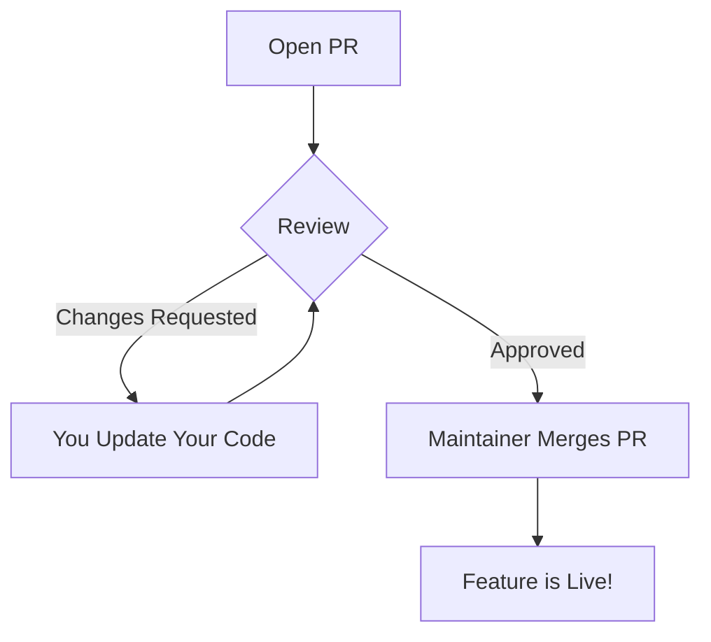

A **Pull Request** is the bridge between your personal work and a shared project. It is a formal way to tell a project maintainer: *"I have finished a feature or a bug fix. Please review my code and 'pull' it into the main project."*

At **CodeHarborHub**, PRs are where we learn from each other through code reviews and discussion.

:::info
If you are new to GitHub, creating a Pull Request is the best way to share your work with others and contribute to open-source projects. It allows you to get feedback and have your code reviewed by experienced developers.
:::

## The "Job Interview" Analogy

Think of a Pull Request like **Applying for a Job**:
1.  **The Resume (Commits):** You prepare your best work on your own time (your branch).
2.  **The Application (The PR):** You submit your work to the company (the original repo).
3.  **The Interview (Code Review):** The team looks at your work, asks questions, and might suggest improvements.
4.  **The Hire (Merge):** Your code is accepted and becomes part of the official project!

## Step-by-Step: Opening a PR

### 1. Push Your Branch

Before you can open a PR, you need to push your changes to GitHub. Make sure you are on the correct branch and run:

```bash
git push origin feat-new-feature
```

### 2. Start the Request

Go to the original repository on GitHub (not your fork). You should see a banner that says: "Your recently pushed branches: feat-new-feature". Click the green **Compare & pull request** button. If you don't see the banner, you can also click the **Pull Requests** tab and then click **New Pull Request**.

### 3. Fill Out the Details

This is the most important part of a professional PR. A good PR includes:

  * **A Clear Title:** `feat: add user profile picture upload`
  * **The "Why":** Explain what problem this code solves.
  * **The "How":** Briefly mention the technical changes you made.
  * **Screenshots:** If you changed the UI, add a "Before" and "After" image.

## The Lifecycle of a PR



## PR Etiquette for CodeHarborHub

To get your PR merged quickly, follow these "Industrial-Level" rules:

| Rule | Description |
| :--- | :--- |
| **Keep it Small** | It is easier to review 10 small PRs than 1 giant PR that changes 50 files. |
| **Test Your Code** | Make sure your code actually runs and doesn't break existing features before submitting. |
| **Be Polite** | Code review is a conversation. Be open to feedback and explain your choices calmly. |
| **Link Issues** | If your PR fixes a bug, write `Closes #12` in the description. GitHub will automatically close the bug report when the PR is merged. |

## Updating an Open PR

If a reviewer asks you to change something, you **don't** need to open a new PR.

1.  Make the changes on your computer.
2.  `git add` and `git commit` them.
3.  `git push` to the same branch.
4.  The PR on GitHub will **automatically update** with your new changes\!

:::tip
A **Draft Pull Request** is a great way to show people what you are working on before it's finished. It tells the team: "I'm working on this, but don't merge it yet!"
:::