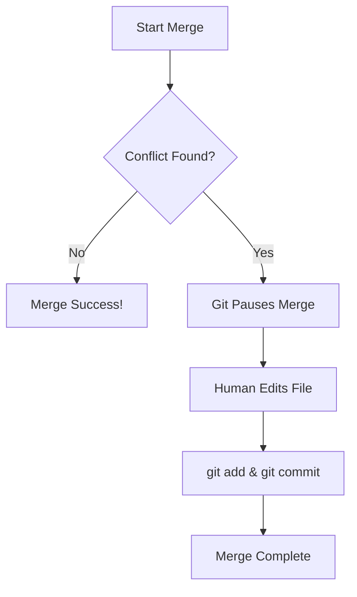

In a collaborative community like **CodeHarborHub**, a **Merge Conflict** is a common rite of passage. It happens when Git is unsure how to combine two different sets of changes. 

Instead of guessing and potentially breaking your code, Git stops and says: *"I need a human to decide which version is correct."*

:::danger
Merge conflicts can be intimidating at first, but they are a normal part of working with Git. With practice, you'll become a pro at resolving them quickly and confidently. Don't let the red flags scare you!
:::

## Why do Conflicts happen?

A conflict occurs when:
1. Two people edit the **same line** of the same file on different branches.
2. One person deletes a file that another person is currently editing.

When you try to merge or pull, Git doesn't know which version to keep, so it throws up a red flag and asks for your help.

## Identifying a Conflict

When you run `git merge` or `git pull`, and a conflict exists, your terminal will look like this:

```bash
Auto-merging index.html
CONFLICT (content): Merge conflict in index.html
Automatic merge failed; fix conflicts and then commit the result.
```

If you open the file, Git will have inserted **Conflict Markers** to show you the "Battle Zone":

```html title="index.html"
<<<<<<< HEAD
<h1>Welcome to CodeHarborHub</h1>
=======
<h1>Welcome to our Open Source Community</h1>
>>>>>>> feat-rebranding
```

  * **`<<<<<<< HEAD`**: This is your current version.
  * **`=======`**: The divider between the two versions.
  * **`>>>>>>> branch-name`**: The version you are trying to pull in.

## The Professional Resolution Workflow

At **CodeHarborHub**, we use **Visual Studio Code** because it makes resolving conflicts as easy as clicking a button.

### Step 1: Open the Conflicted File

In VS Code, the file name will turn **Red**, and the conflict area will be highlighted in blue and green.

### Step 2: Choose Your Version

Above the markers, VS Code gives you four "Magic Buttons":

1.  **Accept Current Change:** Keep your version, delete theirs.
2.  **Accept Incoming Change:** Delete your version, keep theirs.
3.  **Accept Both Changes:** Keep both (one after the other).
4.  **Compare Changes:** See them side-by-side to decide.

### Step 3: Finalize the Merge

Once you have chosen the correct code and deleted the `<<<<`, `====`, and `>>>>` markers:

1.  **Save** the file.
2.  **Stage** the fix:
    ```bash
    git add index.html
    ```
3.  **Commit** the resolution:
    ```bash
    git commit -m "fix: resolve merge conflict in index.html"
    ```

## Conflict Logic Flow



## Tips to Avoid Conflicts

While you can't avoid them forever, you can minimize them by following these **CodeHarborHub** standards:

  * **Pull Frequently:** Running `git pull` every hour ensures you are always working on the latest version of the code.
  * **Small Commits:** If you only change 2 lines, conflicts are easy to fix. If you change 200 lines, conflicts become a nightmare.
  * **Communicate:** If you are working on a specific file (like `App.js`), tell your team in Discord or Slack so they don't edit it at the same time.

:::danger Don't Panic!
If a conflict feels too overwhelming and you want to start over, you can always "Abuse the Escape Hatch" to return everything to normal:  
`git merge --abort`
:::