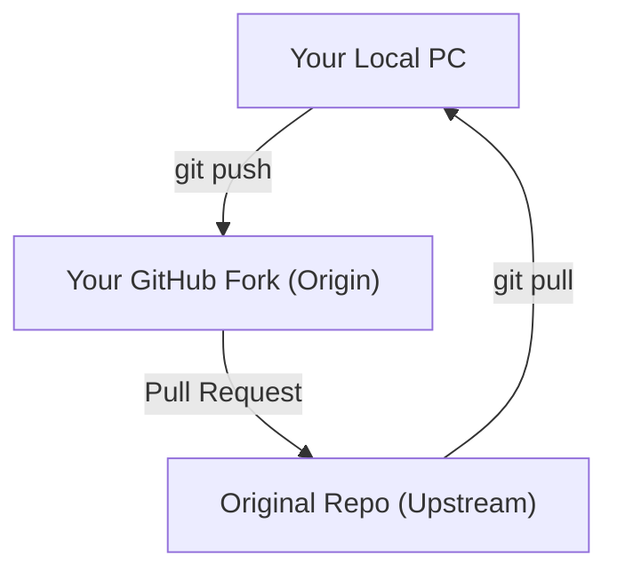
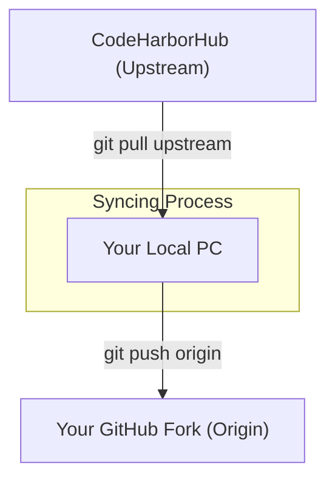

When you **Fork** a project like a CodeHarborHub repository, you create a "Snapshot" of that project at that exact moment. However, the original project keeps growing. New features are added, and bugs are fixed every day. 

To keep your copy from becoming outdated, you need to link it back to the "Source of Truth." In Git, we call this source the **Upstream**.

:::info
The Upstream is the original repository you forked from. It is the "Source of Truth" that your forked copy should stay in sync with. By connecting to the upstream, you can pull in the latest changes and ensure your work is built on the most recent version of the project.
:::

## Understanding the Two Remotes

Once you've forked and cloned, your project has two "Cloud" versions it can talk to:

1.  **Origin:** This is **your** fork on GitHub. You have permission to push code here.
2.  **Upstream:** This is the **original** project (e.g., CodeHarborHub). You can only pull code from here.



## Step 1: Setting the Upstream

By default, your clone only knows about `origin`. You need to manually tell it where the `upstream` is. You only do this **once** per project.

1.  Go to the **original** repository on GitHub (not your fork).
2.  Copy the URL.
3.  Run the following command in your terminal:

```bash
git remote add upstream https://github.com/codeharborhub/original-project.git
```

**Verify your connection:**

```bash
git remote -v
```

*You should see both `origin` and `upstream` in the list.*

## Step 2: Syncing Your Code

Whenever you want to bring the latest changes from the original project into your local machine, follow this professional workflow:

### The "Pull from Upstream" Method

```bash
# 1. Switch to your main branch
git checkout main

# 2. Pull the latest code from the original source
git pull upstream main

# 3. Update your GitHub fork (the origin) so they match
git push origin main
```

## The Sync Workflow



## Why is this important?

| Problem | The Upstream Solution |
| :--- | :--- |
| **Old Code** | You are writing code for a version of the app that is 2 months old. |
| **Merge Conflicts** | When you finally open a Pull Request, your code clashes with 50 other changes made by the team. |
| **Bugs** | You are trying to fix a bug that the main team already fixed last week. |
| **Wasted Time** | You spend hours debugging an issue that was already resolved in the latest version. |

## The GitHub "Easy Way" (Sync Fork Button)

GitHub now provides a button on your repository page called **"Sync Fork"**.

1.  Click **Sync Fork**.
2.  Click **Update Branch**.
3.  Then, run `git pull origin main` on your computer to bring those changes down.

**Note:** While the button is easy, professional engineers prefer the `upstream` terminal method because it gives them more control during complex merges.

:::tip
Always sync your fork **before** you start working on a new feature. This ensures you are building on the most recent, stable foundation provided by the **CodeHarborHub** team.
:::