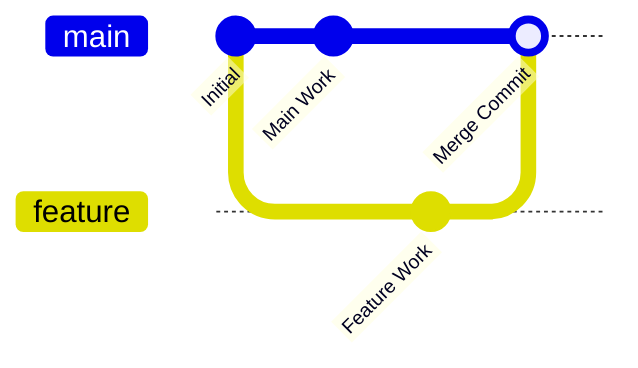
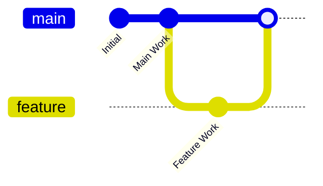
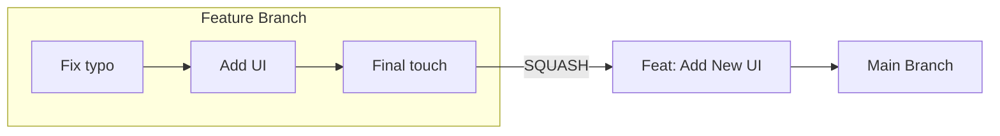

In a team environment, you often work on a **Feature Branch** while the **Main Branch** continues to receive updates from other developers. Eventually, you need to bring your code into the main project. 

There are three professional ways to do this, and each one tells a different "story" in your Git history.

:::info
The "Main Branch" is often called `main` or `master`, and the "Feature Branch" is whatever you named it (e.g., `feat-new-ui`).
:::

## 1. Git Merge (The Standard)
**Merge** takes the entire history of your feature branch and ties it together with the main branch using a "Merge Commit."

* **The Story:** "I worked on this feature over 3 days, and here is exactly when I finished it."
* **Best For:** Preserving a complete, chronological record of every action.



## 2. Git Rebase (The Clean Path)

**Rebase** takes your commits and "moves" them so they start from the very latest commit on the main branch. It effectively rewrites history to make it look like you started your work today.

  * **The Story:** "My work happened in a perfect, straight line."
  * **Best For:** Keeping a clean, easy-to-read history without "Merge Commits" cluttering the log.



*(Note: In the diagram, the 'Feature Work' appears as if it happened directly after 'Main Work'.)*

## 3. Git Squash (The Summary)

**Squash** takes all the tiny commits in your feature branch (e.g., "fixed typo", "added button", "fixed typo again") and crushes them into **one single, clean commit** before merging.

  * **The Story:** "I added this entire feature in one solid move."
  * **Best For:** Cleaning up "messy" development branches before they hit the professional production code.



## Comparison Table

| Feature | Merge | Rebase | Squash |
| :--- | :--- | :--- | :--- |
| **History Style** | Branching / Nonlinear | Linear (Straight line) | Simplified (One commit) |
| **Traceability** | High (Shows every move) | Medium (Clean but edited) | Low (Individual steps lost) |
| **Difficulty** | Easy | Advanced (Can be tricky) | Easy |
| **Usage** | Shared branches | Local/Feature branches | Pull Requests |

## How to execute them

<Tabs>
<TabItem value="merge" label="Merging" default>

If you want to merge your feature branch into main, you would do:

```bash
git checkout main
git merge feat-new-ui
```

</TabItem>
<TabItem value="rebase" label="Rebasing">

If you want to rebase your feature branch onto the latest main, you would do:

```bash
# While on your feature branch
git rebase main
```

</TabItem>
<TabItem value="squash" label="Squashing">

Usually done via GitHub during a Pull Request. You select **"Squash and merge"** from the green button dropdown.

</TabItem>
</Tabs>

## Industrial Best Practices at CodeHarborHub

1.  **Rebase Locally:** Rebase your feature branch against `main` before opening a Pull Request. This ensures your code is up-to-date and the history is clean.
2.  **Squash on Merge:** When a team lead merges your PR, they will often "Squash" it so the main history only shows "Feat: Add User Dashboard" instead of 50 tiny commits.
3.  **Never Rebase Public Branches:** Do not rebase a branch that other people are already working on. It will break their local history!

:::tip
If you get stuck during a complex rebase and everything feels broken, don't panic. You can always run `git rebase --abort` to return to the way things were before you started.
:::