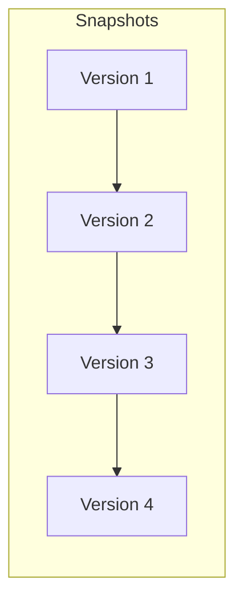

Imagine you are writing a 50-page research paper. You save it as `paper.docx`. Then you make changes and save it as `paper_final.docx`. Then your teacher gives feedback, and you save it as `paper_final_v2_ACTUAL_FINAL.docx`. 

Soon, your folder looks like a mess, and you can't remember what you changed in which version. 

In the software world, we use **Version Control Systems (VCS)** to solve this forever. At **CodeHarborHub**, we call it the **Developer's Time Machine**.

:::info Fun Fact
The first version control system was created in the 1970s, long before the internet as we know it today. It was called **SCCS (Source Code Control System)** and was used to manage changes to software code on mainframe computers.
:::

## The Core Purpose

A VCS is a software tool that helps software teams manage changes to source code over time. It keeps track of every single modification to the code in a special kind of database. If a mistake is made, developers can turn back the clock and compare earlier versions of the code to help fix the mistake while minimizing disruption to all team members.

### Why do we use it?

* **History:** You can see exactly who changed what line of code and why.
* **Undo Button:** If you introduce a bug, you can "roll back" to a version that worked in seconds.
* **Collaboration:** Multiple developers can work on the same file at the same time without overwriting each other's work.

## Centralized vs. Distributed VCS

Not all Version Control Systems work the same way. In the industry, we have moved from "Centralized" to "Distributed" systems.

<Tabs>
<TabItem value="cvcs" label="Centralized (The Old Way)" default>

There is one single server that contains all the versioned files. You "check out" a file, edit it, and send it back.
* **Risk:** If the server goes down, nobody can work or save their history.
* *Example:* SVN (Subversion).

</TabItem>
<TabItem value="dvcs" label="Distributed (The Modern Way)">

Every developer has a **full copy** of the entire project history on their own computer.
* **Benefit:** You can work offline. If the main server crashes, any developer's copy can be used to restore it.
* *Example:* **Git** (What we use at CodeHarborHub).

</TabItem>
</Tabs>

## The Git "Snapshots" Concept

Most systems think of changes as "List of file changes." **Git** (the most popular VCS) thinks of information more like a series of **Snapshots**.

Every time you "Commit" (save) your work, Git takes a picture of what all your files look like at that moment and stores a reference to that snapshot.

## Key Terms Every Beginner Must Know

| Term | Meaning in "Human" Language |
| :--- | :--- |
| **Repository (Repo)** | The project folder containing all your code and its history. |
| **Commit** | A "Save Point" in your timeline with a descriptive message. |
| **Branch** | A "Parallel Universe" where you can test new ideas safely. |
| **Merge** | Combining two parallel universes into one. |
| **Clone** | Downloading a project from the internet to your local PC. |

## Why CodeHarborHub Uses Git

We use Git because it is the **Industrial Standard**. Whether you want to work at Google, a small startup, or contribute to Open Source, Git is the language you will speak. It ensures that our community projects stay organized and that every contributor's work is protected.

:::tip Did you know?
Git was created by **Linus Torvalds** in 2005—the same genius who created the **Linux Kernel**. He needed a better way to manage thousands of developers working on Linux, so he built Git in just a few weeks\!
:::