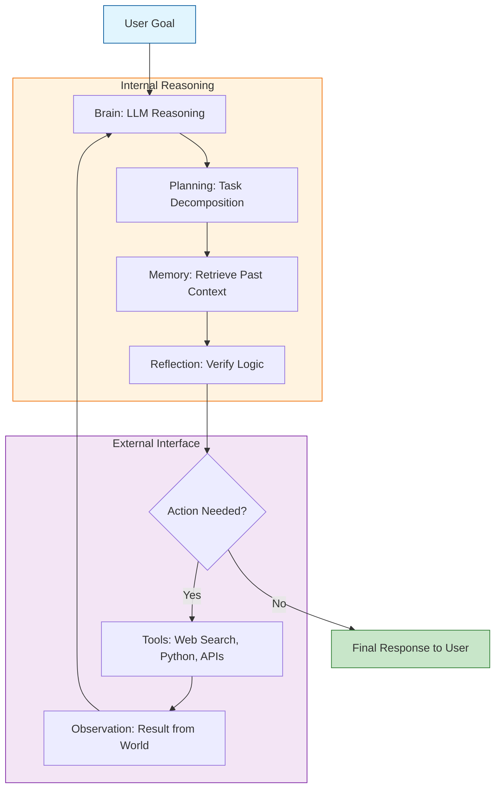

While a simple Large Language Model (LLM) is a statistical engine for predicting the next token, an **AI Agent Architecture** is a cognitive framework that wraps around the LLM to give it purpose, memory, and the ability to act. 

Building an agent is less about training a model and more about **system design**.

## 1. The Four-Layer Framework

Most modern AI agents (like those built with LangChain or AutoGPT) follow a standardized architecture composed of four main modules:

### A. The Brain (Reasoning Core)
The LLM serves as the central processing unit. It is responsible for parsing instructions, generating plans, and deciding which tools to use. 
* **Key Task:** Converting a vague user request into a structured set of logical steps.

### B. Planning Module
The agent must break down a complex goal (e.g., "Write a research paper") into smaller sub-tasks.
* **Chain of Thought (CoT):** Encouraging the model to "think step-by-step."
* **Reflection/Self-Criticism:** The agent looks at its own plan or output and corrects errors before finalizing.

### C. Memory Module
An agent needs to remember what it has done to avoid loops and maintain context.
* **Short-term Memory:** The immediate conversation history (context window).
* **Long-term Memory:** External storage (usually a **Vector Database**) where the agent can retrieve relevant documents or past experiences via RAG (Retrieval-Augmented Generation).

### D. Action/Tool Layer
This is the interface between the agent and the outside world.
* **Tools:** Set of APIs (Search, Calculator, Calendar) or code executors.
* **Output:** The agent generates a structured command (like JSON) that triggers a real-world action.

## 2. Advanced Architectural Flow

The following diagram illustrates how information flows through the agent's internal components during a single task.

## 3. Cognitive Architectures: ReAct

One of the most popular architectures for agents is the **ReAct** (Reason + Act) pattern. It forces the agent to document its "thoughts" before taking an action.

**Example Flow:**

1. **Thought:** "The user wants to know the weather in Tokyo. I need to find a weather API."
2. **Action:** `get_weather(city="Tokyo")`
3. **Observation:** "Tokyo: 22°C, Partly Cloudy."
4. **Thought:** "I have the information. I can now answer the user."

## 4. Memory Architectures: Short vs. Long Term

Managing memory is the biggest challenge in agent architecture.

| Memory Type | Implementation | Purpose |
| --- | --- | --- |
| **Short-term** | Context Window | Keeps track of the current conversation flow. |
| **Long-term** | Vector DB (Pinecone/Milvus) | Stores "memories" as embeddings for later retrieval. |
| **Procedural** | System Prompt | The "hard-coded" instructions on how the agent should behave. |

## 5. Multi-Agent Orchestration

In complex scenarios, a single agent's architecture might be insufficient. Instead, we use a **Manager-Worker** architecture:

1. **Manager Agent:** Orchestrates the goal and delegates sub-tasks.
2. **Worker Agents:** Specialized agents (e.g., a "Coder Agent," a "Reviewer Agent," and a "Researcher Agent").

## 6. Challenges in Agent Design

* **Infinite Loops:** The agent gets stuck repeating the same unsuccessful action.
* **Context Overflow:** Long-term memory retrieval provides too much irrelevant information, confusing the brain.
* **Reliability:** The LLM may hallucinate that a tool exists or format a tool call incorrectly.

## References

* **Original Paper:** [ReAct: Synergizing Reasoning and Acting in Language Models](https://arxiv.org/abs/2210.03629)
* **AutoGPT:** [An Experimental Open-Source Objective-Driven AI Agent](https://github.com/Significant-Gravitas/Auto-GPT)
* **LangChain:** [Conceptual Documentation on Agents](https://python.langchain.com/docs/modules/agents/)

---

**Now that you understand the internal architecture, how do these agents actually execute code or call APIs?**