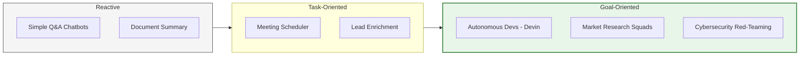

By 2026, the shift from "Chatbots" to **Agents** has reached a critical tipping point. While chatbots are optimized for **conversation**, Agents are designed for **operation**. They don't just provide information; they execute multi-step workflows across diverse software ecosystems.

## 1. Software Engineering & DevOps
This is the most mature domain for agentic AI. Agents have evolved from "coding assistants" to "digital coworkers" capable of managing the entire Software Development Life Cycle (SDLC).

* **Autonomous Engineering:** Agents like **Devin** or **GitHub Copilot Workspace** can ingest a Jira ticket, clone a repository, identify the bug, write a fix, and submit a Pull Request—all while running unit tests to ensure no regressions occur.
* **Self-Healing Infrastructure:** SRE (Site Reliability Engineering) agents monitor server logs in real-time. If they detect a memory leak or a DDoS attack, they can autonomously restart services, scale resources, or update firewall rules.
* **Automated QA:** Agents can browse a web application like a human, identifying edge cases and writing complex Selenium or Playwright tests without manual intervention.

## 2. Customer Service: The "Level 3" Revolution
We are moving beyond rigid FAQ bots toward **Agentic Support**—systems that possess the authority and tools to actually solve user problems.

* **End-to-End Resolution:** Instead of explaining *how* to change a flight, the agent connects to the Global Distribution System (GDS), checks availability, processes the payment, and **issues the new ticket**.
* **Proactive Retention:** Agents monitor customer behavior. If a high-value user hasn't logged in for weeks, the agent can reach out with a personalized, goal-oriented incentive to prevent churn.
* **Sentiment-Driven Escalation:** Agents analyze tone and frustration levels. If a situation becomes too complex, they autonomously escalate to a human manager with a concise summary of the case.

## 3. Finance and Trading
In high-stakes environments, utility-based agents excel at optimizing trade-offs between risk, speed, and reward.

* **Autonomous Fraud Investigation:** Unlike static rule-based systems, agents act as "investigators," correlating data across internal ledgers, social media, and dark web monitors to flag and pause suspicious transactions.
* **Hyper-Personalized Wealth Management:** Agents create investment strategies by analyzing global market trends alongside an individual's specific tax constraints and life goals (e.g., "Adjust my portfolio to pay for a house in 3 years").
* **Real-time Compliance:** Agents act as constant auditors, scanning thousands of communications and trades to ensure adherence to SEC, GDPR, or MiFID II regulations.

## 4. Healthcare Administration & Research
Agents are being deployed to solve the "Administrative Burden" that leads to physician burnout and slow drug discovery.

* **Autonomous Documentation:** During a consultation, an agent "listens" to the dialogue and autonomously drafts the clinical notes, updates the Electronic Health Record (EHR), and flags potential drug-drug interactions.
* **Patient Triage:** Agents interact with patients before they see a doctor, collecting symptoms and prioritizing cases based on urgency using clinical protocols.
* **AI-Driven Lab Discovery:** Research agents (like those used at **Genentech**) manage complex lab workflows, searching through millions of publications to identify promising molecular structures for testing.

## 5. Enterprise Operations: The "Glue" Agent
Agents act as a bridge between disconnected SaaS tools (Salesforce, Slack, Gmail, Jira) to automate complex business processes.

| Use Case | Agent Task | Common Tools Used |
| :--- | :--- | :--- |
| **Sales Ops** | Lead enrichment and personalized outreach. | LinkedIn API, CRM, Gmail |
| **HR Tech** | Screening resumes and scheduling interviews. | PDF Parser, Google Calendar |
| **Supply Chain** | Monitoring inventory and reordering parts. | ERP Systems, Email, Web Search |

## 6. Mapping the Spectrum of Autonomy

The following diagram illustrates where different use cases sit on the spectrum of "Simple Reactivity" to "Fully Autonomous Missions."



## 7. The "Agentic Shift" in Industry

| Industry | Before AI Agents (Chatbots) | After AI Agents (Operators) |
| --- | --- | --- |
| **Finance** | Manual fraud review. | Agents investigate and file reports autonomously. |
| **Healthcare** | Doctors manually summarizing notes. | Agents transcribe, code for billing, and alert for risks. |
| **E-commerce** | Static recommendation engines. | Personal agents that find, negotiate, and buy products. |

## 8. Implementation: A "Research Agent" Workflow

Using a framework like **CrewAI** or **LangGraph**, a multi-agent "Research Squad" is structured like this:

```python
research_crew = Crew(
    agents=[web_searcher, data_analyst, technical_writer],
    tasks=[
        Task(description="Search for 2026 AI hardware trends", agent=web_searcher),
        Task(description="Analyze specs and price-to-performance", agent=data_analyst),
        Task(description="Write a whitepaper for stakeholders", agent=technical_writer)
    ],
    process=Process.sequential # Data flows from one expert to the next
)

```

:::tip The Personal Agent
Your flight is cancelled. Your personal agent detects this via email, rebooks a new flight, reschedules your 2 PM meeting, and notifies your hotel—all before you've even checked your phone.
:::

## References

* **Salesforce:** [Agentforce Use Cases](https://www.salesforce.com/agentforce/use-cases/)
* **Cognition AI:** [Devin - The First AI Software Engineer](https://www.cognition.ai/blog/introducing-devin)
* **Stanford:** [Generative Agents: Interactive Simulacra of Human Behavior](https://arxiv.org/abs/2304.03442)

---

**Use cases show us what is possible. However, as we give agents the power to move money and handle patient data, we must discuss the guardrails. How do we ensure these autonomous systems remain safe?**