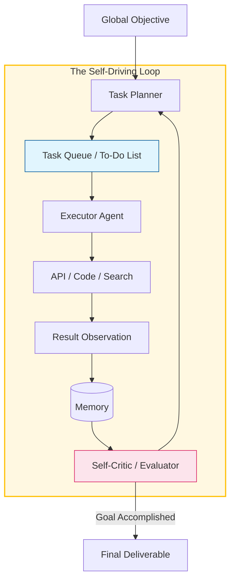

An **Autonomous Task Agent** is a system capable of completing open-ended objectives with minimal human intervention. Unlike a chatbot that responds to a single prompt, an autonomous agent takes a **goal** (e.g., "Research and write a comprehensive market report on EV trends"), creates its own tasks, executes them, and continues until the goal is met.

## 1. Defining Autonomy

What separates an autonomous agent from a standard script or chatbot? It is the ability to handle **uncertainty** and **novelty**.

* **Self-Directed Planning:** The agent decides *how* to solve the problem.
* **Recursive Loops:** The agent can spawn new sub-tasks based on the results of previous ones.
* **Termination Logic:** The agent knows when the objective has been achieved and stops itself.

## 2. The Core Execution Loop: "The Agentic Cycle"

The most famous autonomous agents, like **AutoGPT** and **BabyAGI**, operate on a loop that mimics human task management.

1.  **Objective Input:** The human provides a high-level goal.
2.  **Task Creation:** The agent generates a list of steps.
3.  **Prioritization:** The agent reorders tasks based on importance and dependencies.
4.  **Execution:** The agent performs the top task (using tools).
5.  **Memory Storage:** Results are saved to long-term memory.
6.  **Refinement:** The agent looks at the results and updates the task list.

## 3. Architecture of Autonomy

This diagram shows how an autonomous agent manages its own "To-Do List" without human guidance.

## 4. Landmark Autonomous Projects

| Project | Key Innovation | Best Use Case |
| --- | --- | --- |
| **AutoGPT** | Recursive reasoning and file system access. | General purpose automation and research. |
| **BabyAGI** | Simplified task prioritization loop. | Managing complex, multi-step project tasks. |
| **AgentGPT** | Browser-based UI for autonomous agents. | Accessible, low-code agent deployment. |
| **Devin** | Software engineering autonomy. | Writing code, fixing bugs, and deploying apps. |

## 5. The Risks of "Going Autonomous"

High autonomy comes with high unpredictability. Developers must manage several specific risks:

* **Task Drifting:** The agent gets distracted by a sub-task and loses sight of the primary goal.
* **Infinite Loops:** The agent tries the same unsuccessful action repeatedly, burning through API credits.
* **Hallucinated Success:** The agent believes it has finished the task when it has actually failed or produced a superficial result.
* **Security:** An autonomous agent with "write" access to a file system or database can cause unintended damage if its logic fails.

## 6. Implementation Strategy: Guardrails

To make autonomous agents safe for production, we implement **Guardrails**:

* **Token Caps:** Limiting the maximum number of loops an agent can perform.
* **Human-in-the-Loop (HITL):** Requiring human approval for high-risk actions (e.g., spending money or deleting files).
* **Structured Output:** Forcing the agent to output its reasoning in a specific schema (JSON) to ensure logical consistency.

## References

* **AutoGPT GitHub:** [Significant Gravitas - AutoGPT](https://github.com/Significant-Gravitas/Auto-GPT)
* **Yohei Nakajima:** [Task-driven Autonomous Agent (BabyAGI)](https://github.com/yoheinakajima/babyagi)
* **OpenAI:** [Building Autonomous Agents with GPT-4](https://openai.com/blog/gpt-4-api-general-availability)

---

**Autonomous agents work best when they focus on a single mission. But what happens when you need multiple specialists to work together as a team?**