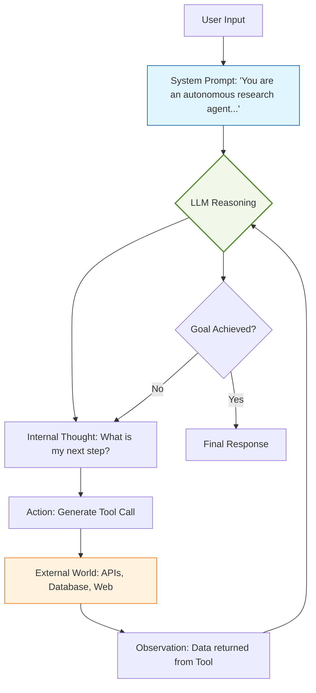

An **LLM-Powered Agent** is a system where a Large Language Model (like GPT-4, Claude 3.5, or Llama 3) serves as the core controller. In this setup, the LLM is not just generating text; it is performing **high-level cognitive tasks**: reasoning about instructions, planning multi-step trajectories, and deciding when to stop.

## 1. The LLM as a "Reasoning Engine"

In a standard RAG or Chatbot setup, the LLM is a **Knowledge Retriever**. In an Agentic setup, the LLM is a **Decision Maker**. 

To move from "model" to "agent," the LLM must handle three critical cognitive functions:
1.  **Instruction Following:** Understanding complex, often ambiguous, human goals.
2.  **Context Management:** Utilizing the "system prompt" to maintain a persona and operational boundaries.
3.  **Self-Correction:** Evaluating its own intermediate outputs and adjusting the plan if a tool returns an error.

## 2. Prompting Frameworks for Agents

The way we prompt the LLM determines how effectively it acts as an agent. Several key frameworks have emerged:

### A. Chain of Thought (CoT)
By asking the model to "think step-by-step," we force the LLM to decompose a complex problem into smaller logical units. This significantly reduces hallucinations in multi-step tasks.

### B. ReAct (Reason + Act)
The LLM generates a "Thought" followed by an "Action" command. It then pauses and waits for an "Observation" (input from a tool) before generating the next "Thought."

### C. Tree of Thoughts (ToT)
The agent explores multiple reasoning paths simultaneously, evaluating the "prospects" of each path and backtracking if one leads to a dead end.

## 3. The Agentic Workflow (Mermaid)

This diagram visualizes how the LLM interacts with external inputs to drive the agent's progress toward a goal.



## 4. Why LLMs are suited for Agency

Not all models can power an agent. High-performing LLM-powered agents rely on specific model capabilities:

* **Large Context Windows:** To store long histories of previous actions and observations.
* **Function Calling Support:** Models fine-tuned to output structured data (like JSON) that external software can execute.
* **Zero-Shot Generalization:** The ability to use a tool correctly even if the agent hasn't seen that specific task during training.

## 5. Limitations of LLM-Powered Agents

Despite their power, these agents face significant hurdles:

* **Context Drift:** As the "Reasoning-Action" loop continues, the LLM may lose track of the original goal.
* **Reliability:** If the LLM produces a single malformed JSON string, the entire agentic loop may crash.
* **Cost/Latency:** Multi-step reasoning requires multiple LLM calls, increasing both the time to respond and the cost per task.

## 6. Implementation Sketch (Pseudo-Code)

A conceptual loop for an LLM-powered agent:

```python
def agent_loop(user_goal):
    history = [system_prompt, user_goal]
    
    while True:
        # 1. Ask the LLM for the next step
        response = llm.generate(history)
        
        # 2. Check if the LLM wants to provide a final answer
        if response.is_final_answer:
            return response.text
        
        # 3. Otherwise, the LLM wants to use a tool
        tool_output = execute_tool(response.tool_name, response.args)
        
        # 4. Feed the observation back into the history
        history.append(f"Observation: {tool_output}")

```

## References

* **OpenAI:** [Function Calling Documentation](https://platform.openai.com/docs/guides/function-calling)
* **Anthropic:** [Computer Use with Claude 3.5 Sonnet](https://www.anthropic.com/news/3-5-models-and-computer-use)
* **arXiv:** [A Survey on Large Language Model based Autonomous Agents](https://arxiv.org/abs/2308.11432)

---

**The LLM provides the logic, but an agent is nothing without its "senses" and "hands." How does an LLM interact with the real world?**