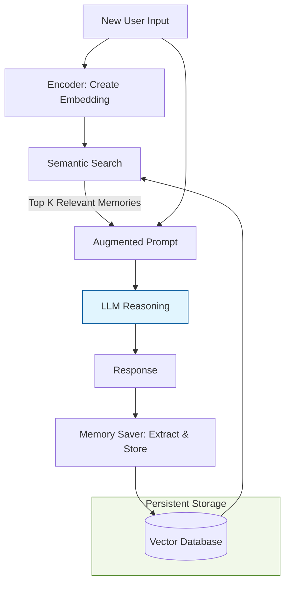

Without memory, an AI agent is essentially a "stateless" function—it treats every new prompt as if it's the first time it has ever spoken to you. To become true collaborators, agents need **Memory**: the ability to store, recall, and synthesize information from previous interactions.

## 1. The Memory Hierarchy

AI memory is structured similarly to human cognition, divided into temporal and functional layers.

| Type | Duration | Technical Implementation | Analogous To |
| :--- | :--- | :--- | :--- |
| **Short-term** | Session-only | Context Window / RAM | Working Memory |
| **Long-term** | Permanent | Vector DB / Knowledge Graph | Hard Drive / Experiences |

### A. Short-Term (Working) Memory
This is the information the agent can "see" right now in its context window. It includes the last few messages and current task variables.
* **Limit:** Restricted by the model's token limit (e.g., 128k tokens).
* **Reset:** Usually cleared when a new session or "thread" starts.

### B. Long-Term (Persistent) Memory
This allows agents to remember you across days or weeks. It is often subdivided into:
* **Episodic Memory:** Recalling specific past events ("Last Tuesday, we discussed the marketing budget").
* **Semantic Memory:** Recalling general facts or learned concepts ("The user prefers Python over Java").

## 2. Memory Architecture: How it Works

Modern agents use a **Retrieval-Augmented Generation (RAG)** pattern for memory. Instead of stuffing everything into the prompt, the agent selectively "pulls" only the relevant memories.



## 3. Context Window vs. Vector Databases

There is a constant trade-off between keeping history in the prompt (fast/accurate) versus an external database (infinite/scalable).

| Feature | Context Window (Short-term) | Vector DB (Long-term) |
| --- | --- | --- |
| **Speed** | Instant | 30-100ms (Search overhead) |
| **Capacity** | Small (Tokens) | Massive (Gigabytes) |
| **Cost** | High (Tokens = $$) | Low (Storage is cheap) |
| **Reliability** | 100% Recall | Search may miss relevant data |

## 4. Advanced Memory Techniques

To prevent "Memory Bloat" (where the agent gets confused by too much old data), developers use these strategies:

1. **Summarization:** Periodically, the agent compresses old chat history into a concise paragraph, saving tokens while preserving the core "gist."
2. **Entity Memory:** The agent maintains a "profile" of entities it knows (e.g., people, projects, preferences) rather than just raw text logs.
3. **Reflective Memory:** The agent "thinks" about its experiences during downtime to derive new insights or consolidate conflicting information.

## 5. Implementation: Simple Vector Memory

In frameworks like **LangGraph** or **CrewAI**, memory is often managed by a "Checkpointer" or a dedicated Memory tool.

```python
# Conceptual Memory Retrieval
def get_context(user_id, current_query):
    # 1. Search Long-term memory for past preferences
    past_memories = vector_db.search(user_id, current_query, limit=3)
    
    # 2. Combine with Short-term conversation history
    full_prompt = f"""
    Context from past: {past_memories}
    Current History: {session_history}
    User Request: {current_query}
    """
    return llm.generate(full_prompt)

```

## 6. Challenges in Agentic Memory

* **The Forgetting Problem:** How do you decide what to delete? (Recency vs. Importance).
* **Privacy:** Ensuring "User A" doesn't accidentally retrieve "User B's" memories.
* **Inconsistency:** What if a user changes their mind? The agent must resolve the conflict between an old memory ("I love coffee") and a new one ("I'm quitting caffeine").

## References

* **LangChain Docs:** [Memory Types and Implementation](https://python.langchain.com/docs/modules/memory/)
* **Mem0:** [The Memory Layer for AI Agents](https://mem0.ai/)
* **Pinecone:** [Vector Databases for Long-term AI Memory](https://www.pinecone.io/learn/vector-database/)

---

<LiteYouTubeEmbed
  id="52xTxeqT4ws"
  params="autoplay=1&autohide=1&showinfo=0&rel=0"
  title="How memory makes AI agents more effective"
  poster="maxresdefault"
  webp
/>

<br />

**Memory turns a chatbot into a personal assistant. But what happens when one agent isn't enough? How do multiple agents work together to solve massive problems?**