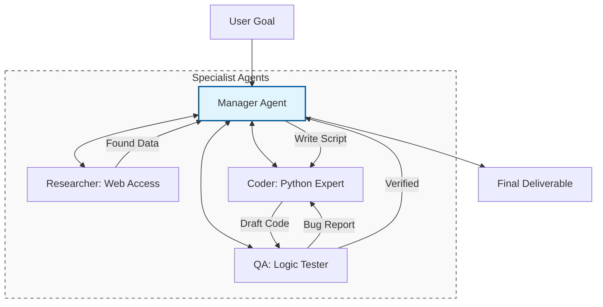

In the world of AI Agents, a single agent is like a "Generalist." While capable, it can become overwhelmed by highly complex tasks. **Multi-Agent Systems (MAS)** solve this by using a "Team of Specialists." 

In an MAS, different agents are assigned specific roles (e.g., a Coder, a Reviewer, and a Project Manager) and work together through communication and coordination to achieve a common goal.

## 1. Why Use Multiple Agents?

Moving from a single agent to a multi-agent system provides several key advantages:

* **Role Specialization:** You can prompt different agents with different personas, making them "experts" in their specific domain.
* **Error Correction through Debate:** One agent can generate an output, while another agent critiques it, leading to higher quality results.
* **Parallelism:** Multiple agents can work on different sub-tasks simultaneously.
* **Scalability:** Complex problems can be broken down into a hierarchy of manageable steps.

## 2. Common Multi-Agent Architectures

How agents interact is defined by the **Orchestration Pattern**:

### A. Sequential (Waterfall)
Agent A finishes its task and passes the result to Agent B.
* *Example:* Researcher → Writer → Proofreader.

### B. Manager-Worker (Hub and Spoke)
A "Manager Agent" receives the goal, decomposes it into tasks, and assigns them to "Worker Agents." The Manager reviews the results before finalizing.
* *Example:* A Project Manager delegating code tasks to various developer agents.

### C. Joint Collaboration (Round Robin)
Agents engage in a group chat or a shared whiteboard space, contributing as needed until the task is complete.
* *Example:* A brainstorm session between a "Creative Agent" and a "Logical Agent."

## 3. Communication Logic

This diagram illustrates a **Manager-Worker** architecture where the Manager acts as the central orchestrator.



## 4. Popular Multi-Agent Frameworks

Building these systems from scratch is difficult, so several frameworks have emerged to handle the "handshaking" between agents:

1. **Microsoft AutoGen:** Focused on conversational multi-agent systems. Agents can be "human-in-the-loop" or fully autonomous.
2. **CrewAI:** Uses a "Role-Playing" approach where you define specific roles, goals, and backstories for each agent.
3. **LangGraph (LangChain):** Provides fine-grained control over cycles and state management in multi-agent graphs.
4. **OpenAI Swarm:** An experimental, lightweight framework for orchestrating many small, specialized agents.

## 5. Challenges in Multi-Agent Systems

Coordinating a team of AIs introduces new technical hurdles:

* **Agent Chatter:** Agents might get stuck in an "endless loop" of talking to each other without making progress.
* **Context Fragmentation:** Important information might get lost as it is passed from one agent to another.
* **High Latency/Cost:** Every agent-to-agent interaction requires an LLM call, which can become expensive and slow.
* **Consensus Issues:** Agents might disagree on a strategy, requiring a "tie-breaking" logic in the manager.

## 6. Implementation Sketch: CrewAI Example

In **CrewAI**, you define the "Crew" by assigning agents and tasks.

```python
from crewai import Agent, Task, Crew

# 1. Define Agents
researcher = Agent(role='Researcher', goal='Find 2026 AI trends', backstory='Expert Analyst')
writer = Agent(role='Writer', goal='Write a blog post', backstory='Tech Journalist')

# 2. Define Tasks
task1 = Task(description='Search for AI trends', agent=researcher)
task2 = Task(description='Summarize trends into a post', agent=writer)

# 3. Form the Crew
my_crew = Crew(agents=[researcher, writer], tasks=[task1, task2])
result = my_crew.start()

```

## References

* **Microsoft Research:** [AutoGen: Enabling Next-Gen LLM Applications](https://microsoft.github.io/autogen/)
* **CrewAI:** [Multi-agent Orchestration Framework](https://www.crewai.com/)
* **arXiv:** [CAMEL: Communicative Agents for 'Mind' Exploration](https://arxiv.org/abs/2303.17760)

---

**Multi-agent systems represent the peak of current AI agency. But with great power comes great responsibility. How do we ensure these autonomous teams act safely?**