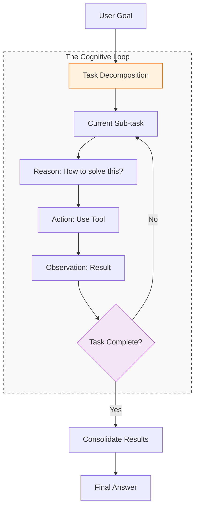

If tools are the hands of an agent, **Planning and Reasoning** are its frontal cortex. Without these, an agent would simply react to inputs. With them, an agent can look at a high-level goal—like "Plan a 3-day trip to Tokyo"—and strategically decompose it into actionable sub-tasks.

## 1. Task Decomposition

The first step in any agentic workflow is breaking a large goal into smaller, manageable steps. This is known as **Task Decomposition**.

* **Linear Planning:** The agent identifies a sequence (Step 1 → Step 2 → Step 3).
* **Hierarchical Planning:** The agent creates a "Master Plan" with high-level objectives, which are then broken down into "Sub-plans" by specialized sub-routines.

## 2. Key Reasoning Frameworks

To move through a plan successfully, agents use specific cognitive frameworks to structure their "thoughts."

### A. Chain of Thought (CoT)
CoT encourages the LLM to generate intermediate reasoning steps. By "thinking aloud," the model is less likely to jump to a premature (and often incorrect) conclusion.
* **Prompting Technique:** Adding "Let's think step by step" to the instructions.

### B. ReAct (Reason + Act)
ReAct combines reasoning and acting in an interleaved manner. The agent writes a **Thought**, performs an **Action**, observes the **Result**, and then writes a new **Thought** based on that result.

### C. Tree of Thoughts (ToT)
For complex problems requiring trial and error, ToT allows the agent to explore multiple reasoning branches simultaneously. If one branch reaches a dead end, the agent "backtracks" and tries a different path.

## 3. Self-Reflection and Error Correction

An intelligent agent doesn't just execute; it evaluates. **Self-Reflection** is the process where an agent looks at its own output to find flaws.

1.  **Self-Criticism:** "Does this plan actually solve the user's request?"
2.  **Environment Feedback:** If a tool returns an error, the agent reasons: "The API failed because the date format was wrong. I will try again with YYYY-MM-DD."
3.  **Human-in-the-Loop:** Pausing to ask the user for clarification when the reasoning becomes too uncertain.

## 4. The Planning Workflow

The following diagram illustrates how the Planning module sits between the User Input and the Execution Layer.



## 5. Challenges in Agent Reasoning

* **Hallucination in Planning:** The agent might plan to use a tool that doesn't exist or assume a fact that is false.
* **Infinite Loops:** The agent tries the same failing action repeatedly without changing its strategy.
* **Context Window Fatigue:** As the plan grows longer, the agent may forget the initial constraints of the goal.

## 6. Implementation Sketch (Plan-and-Execute)

In high-level frameworks like LangGraph, the "Plan-and-Execute" pattern is often implemented by separating the **Planner** from the **Executor**.

```python
# 1. Planner Agent creates the list of steps
plan = planner.generate("Research the impact of AI on SEO in 2025")

# 2. Executor Agent iterates through steps
for task in plan.steps:
    result = executor.run(task)
    # 3. Re-planner evaluates if the plan needs to change
    plan = replanner.update(plan, task, result)
    if plan.is_finished:
        break

```

## References

* **Google Research:** [Chain-of-Thought Prompting Elicits Reasoning in LLMs](https://arxiv.org/abs/2201.11903)
* **Princeton/Google:** [ReAct: Synergizing Reasoning and Acting](https://react-lm.github.io/)
* **OpenAI:** [Reasoning with o1 series models](https://openai.com/index/learning-to-reason-with-llms/)

---

**Planning gives the agent a roadmap, but memory allows it to remember where it has already been. How do agents store long-term experiences?**