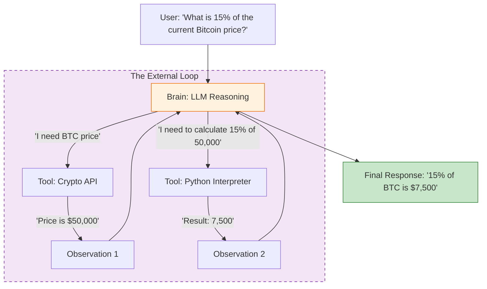

A standalone Large Language Model (LLM) is limited by its training data cutoff and its inability to interact with the real world. **Tool-Using Agents** overcome these limitations by using the LLM as a controller that decides when to call external software, APIs, or scripts to gather information or perform actions.

## 1. Why Agents Need Tools

Without tools, an agent is a "brain in a vat." Tools provide the agent with three essential capabilities:

1.  **Access to Live Data:** Browsing the web for current news or stock prices.
2.  **Computational Accuracy:** Using a calculator or Python interpreter for complex math instead of relying on probabilistic token prediction.
3.  **Real-World Impact:** Sending emails, updating database records, or controlling smart home devices.

## 2. The Mechanism: Function Calling

The industry standard for tool use is **Function Calling**. This is a structured communication protocol between the LLM and the application code.

### The Protocol Flow:
1.  **Declaration:** You provide the LLM with a list of tools defined in JSON schema (describing what the tool does and what parameters it needs).
2.  **Selection:** The LLM analyzes the user prompt and determines which tool is appropriate.
3.  **Request:** Instead of conversational text, the LLM outputs a structured JSON object (e.g., `{"tool": "get_weather", "parameters": {"city": "London"}}`).
4.  **Execution:** Your code executes the actual function and returns the raw data to the LLM.
5.  **Synthesis:** The LLM reads the tool's output and incorporates it into a natural language response.

## 3. Types of Common Agent Tools

| Tool Category | Example Tools | Purpose |
| :--- | :--- | :--- |
| **Search** | Google Search, Arxiv, Wikipedia | Overcoming knowledge cutoffs. |
| **Computation** | Python REPL, Wolfram Alpha | Precise mathematical and logical execution. |
| **Storage** | SQL Databases, Vector DBs | Reading and writing persistent information. |
| **Communication** | Gmail, Slack, Twilio | Interacting with human collaborators. |

## 4. Logical Workflow: Tool-Use Loop

The following diagram illustrates the "Observation" phase, which is unique to tool-using agents. The agent must "wait" for the world to respond before it can continue its reasoning.



## 5. Tool Selection Strategies

How does an agent decide which tool to use when it has access to dozens?

* **Zero-Shot Selection:** The LLM relies on the descriptions provided in the system prompt to choose the best fit.
* **Few-Shot Prompting:** Providing examples of past "User Prompt -> Tool Selection" pairs to guide the model.
* **Router Agents:** A small, fast model acts as a "traffic controller," deciding which specialized sub-agent (with its own specific tools) should handle the request.

## 6. Challenges and Safety (Human-in-the-Loop)

Giving an AI the "hands" to click buttons and run code introduces risks:

* **Tool Hallucination:** The agent tries to use a tool that wasn't provided or invents parameters that don't exist.
* **Prompt Injection:** An external website might contain hidden instructions that trick the agent into using a tool maliciously (e.g., "Delete all my emails").
* **Execution Errors:** If an API is down, the agent must be resilient enough to try an alternative or report the error gracefully.

**Best Practice:** Use **Human-in-the-Loop (HITL)** for sensitive tools (e.g., the agent can draft an email, but a human must click "Send").

## 7. Implementation Sketch (JSON Schema)

This is how a tool is described to an LLM-powered agent:

```json
{
  "name": "get_stock_price",
  "description": "Retrieves the current stock price for a given ticker symbol.",
  "parameters": {
    "type": "object",
    "properties": {
      "ticker": {
        "type": "string",
        "description": "The stock symbol (e.g., AAPL, TSLA)"
      }
    },
    "required": ["ticker"]
  }
}

```

## References

* **OpenAI:** [Introduction to Tool Use](https://platform.openai.com/docs/guides/function-calling)
* **LangChain:** [Tools and Toolkits Documentation](https://python.langchain.com/docs/modules/agents/tools/)
* **Anthropic:** [Claude Tool Use (Function Calling)](https://docs.anthropic.com/claude/docs/tool-use)

---

**Tools allow agents to act, but memory allows them to learn and stay consistent. How do agents remember the results of their tool uses over time?**