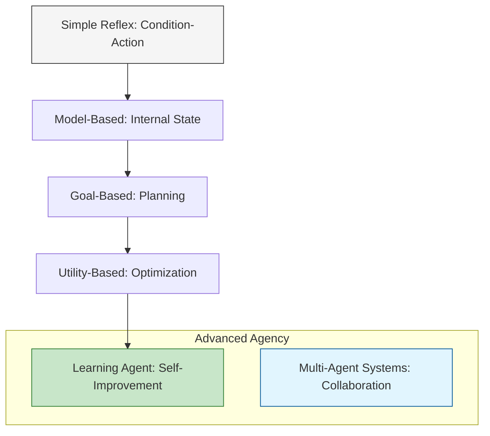

Not all AI agents are created equal. They vary significantly in their "intelligence" levels and the logic they use to make decisions. In classical AI theory (popularized by Russell & Norvig), agents are categorized based on their degree of perceived intelligence and capability.

## 1. Simple Reflex Agents
These are the most basic type of agents. They take actions based **only** on the current perception, ignoring the rest of the perceptual history. They follow "Condition-Action" rules.

* **Logic:** If [Condition], then [Action].
* **Limitation:** They only work if the environment is fully observable. They have no "memory."
* **Example:** A thermostat that turns on the AC only when the temperature exceeds 25°C.

## 2. Model-Based Reflex Agents
These agents maintain an internal **state** (a "model" of the world) that allows them to track parts of the environment they cannot see right now. This helps them handle partially observable environments.

* **Logic:** What is the world like now? + How does the world evolve?
* **Key Feature:** Internal memory of previous states.
* **Example:** A self-driving car that "remembers" a pedestrian is behind a parked truck, even if the camera can no longer see them.

## 3. Goal-Based Agents
Goal-based agents expand on the model-based approach by having a **destination** or a specific goal. They don't just react to the world; they act to achieve a future state.

* **Logic:** Will this action get me closer to my goal?
* **Key Feature:** Proactive planning and searching.
* **Example:** A GPS navigation system that plans the shortest route to your destination, rerouting if it detects traffic.

## 4. Utility-Based Agents
While goal-based agents care *if* they reach the goal, utility-based agents care about *how well* they reach it. They use a "Utility Function" to measure "happiness" or "efficiency."

* **Logic:** Which action provides the highest "utility" (speed, safety, cost-efficiency)?
* **Key Feature:** Optimization and trade-off analysis.
* **Example:** A flight booking agent that doesn't just find a flight (goal), but finds the cheapest flight with the fewest layovers (high utility).

## 5. Learning Agents
Learning agents are capable of improving their performance over time. They operate in initially unknown environments and become more competent through experience.

They are divided into four conceptual components:
1.  **Learning Element:** Makes improvements based on feedback.
2.  **Performance Element:** Chooses external actions.
3.  **Critic:** Tells the learning element how well the agent is doing.
4.  **Problem Generator:** Suggests new actions (exploration) to gain more knowledge.

## 6. Multi-Agent Systems (MAS)
In modern AI, we often see multiple agents working together. These systems are classified by the relationship between the agents:

| Type | Relationship | Example |
| :--- | :--- | :--- |
| **Cooperative** | Agents share information to solve a common goal. | A swarm of drones performing a light show. |
| **Competitive** | Agents work against each other to win. | AlphaGo playing against a human; Trading bots in a market. |
| **Negotiation-Based** | Agents bargain to reach a mutually beneficial state. | Resource allocation in smart power grids. |

## 7. Logical Evolution: Hierarchy of Agency

The following diagram illustrates how agents move from simple reactivity to complex autonomous learning.

## 8. Summary Table

| Agent Type | Uses Memory? | Uses Goals? | Optimizes? | Learns? |
| --- | :---: | :---: | :---: | :---: |
| **Simple Reflex** | ❌ | ❌ | ❌ | ❌ |
| **Model-Based** | ✅ | ❌ | ❌ | ❌ |
| **Goal-Based** | ✅ | ✅ | ❌ | ❌ |
| **Utility-Based** | ✅ | ✅ | ✅ | ❌ |
| **Learning Agent** | ✅ | ✅ | ✅ | ✅ |

## References

* **Textbook:** *Artificial Intelligence: A Modern Approach* by Stuart Russell and Peter Norvig.
* **OpenAI:** [Research on Multi-Agent Hide and Seek](https://openai.com/research/emergent-tool-use)
* **DeepMind:** [Reinforcement Learning and Learning Agents](https://www.deepmind.com/learning-resources)

---

**Understanding the types of agents is the theory. In practice, how do these agents actually "reach out" and touch the digital world?**