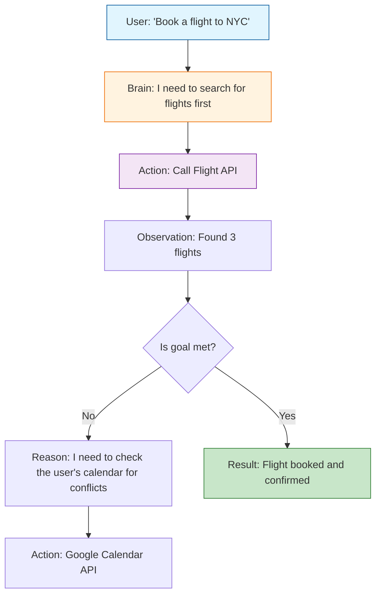

An **AI Agent** is an autonomous or semi-autonomous system that perceives its environment, reasons about how to achieve a specific goal, and takes actions using available tools.

While a standard Large Language Model (LLM) is like a "brain in a box" that waits for a prompt to generate text, an **AI Agent** is like a "brain with hands." It doesn't just talk; it **does**.

## 1. The Core Architecture: The Agentic Loop

An agent operates in a continuous cycle often referred to as the **Perception-Reasoning-Action** loop.

1.  **Perceive:** The agent receives a goal (e.g., "Research the latest stock prices for NVIDIA and email a summary").
2.  **Plan:** It breaks the goal into sub-tasks (1. Search web, 2. Extract data, 3. Format email).
3.  **Act:** It uses a **Tool** (like a Web Search API).
4.  **Observe:** It looks at the tool output and decides if it needs to do more.

## 2. Key Components of an Agent

To function effectively, an agent requires four primary modules:

| Component | Responsibility | Analogous to... |
| :--- | :--- | :--- |
| **Brain (LLM)** | Reasoning, planning, and decision-making. | The Prefrontal Cortex |
| **Planning** | Breaking down complex goals into manageable steps. | Strategic Thinking |
| **Memory** | Short-term (Current context) and Long-term (Vector Databases). | Hippocampus |
| **Tools/Action** | Interfaces to interact with the world (APIs, Code Interpreters). | Hands and Senses |

## 3. Agents vs. Chatbots: What's the Difference?

| Feature | Standard Chatbot | AI Agent |
| :--- | :--- | :--- |
| **Initiative** | Reactive (Wait for prompt) | Proactive (Takes steps to reach goal) |
| **Connectivity** | Static knowledge | Dynamic (Can browse, use apps, run code) |
| **Multi-step** | Single turn | Multi-step reasoning and self-correction |
| **Goal-oriented** | Provide an answer | Accomplish a mission |

## 4. Logical Workflow: Agentic Reasoning

The following diagram illustrates how an agent handles a complex request using a **ReAct** (Reason + Act) pattern.

## 5. Types of AI Agents

1. **Simple Reflex Agents:** Act only on the basis of the current perception (e.g., a simple chatbot).
2. **Goal-Based Agents:** Take actions specifically to reach a defined destination (e.g., AutoGPT).
3. **Utility-Based Agents:** Not only reach a goal but try to find the "best" or "most efficient" way to do it.
4. **Multi-Agent Systems (MAS):** Multiple agents working together, often with specialized roles (e.g., one agent writes code, another tests it).

## 6. Popular Agent Frameworks

If you want to build agents today, these are the most common starting points:

* **LangChain:** The "Swiss Army Knife" for connecting LLMs to tools.
* **AutoGPT / BabyAGI:** Early experiments in fully autonomous goal-seeking.
* **Microsoft AutoGen:** A framework for multi-agent conversations.
* **CrewAI:** Orchestrating role-playing autonomous agents to work as a team.

## References

* **Original Paper:** [ReAct: Synergizing Reasoning and Acting in Language Models](https://arxiv.org/abs/2210.03629)
* **Lilian Weng Blog:** [LLM Powered Autonomous Agents](https://lilianweng.github.io/posts/2023-06-23-agent/)
* **DeepLearning.ai:** [AI Agents Specialization](https://www.deeplearning.ai/short-courses/ai-agents-in-langgraph/)

---

**Agents are powerful because they can use tools. But how exactly does an LLM know which tool to pick and how to use it?**