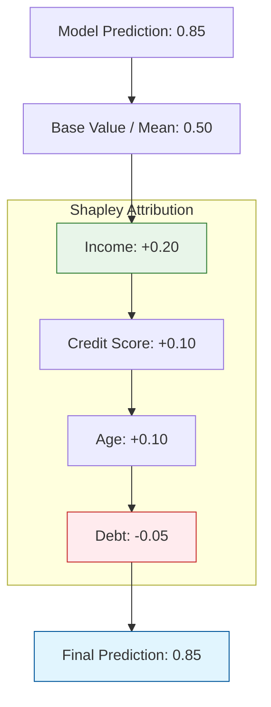

When using complex models like XGBoost, Random Forests, or Neural Networks, we often need to know: *"Why did the model deny this specific loan?"* or *"What features are driving the predictions for all users?"* **LIME** and **SHAP** are the industry standards for answering these questions.

## 1. LIME (Local Interpretable Model-Agnostic Explanations)

LIME works on the principle that while a model may be incredibly complex globally, it can be approximated by a simple, linear model **locally** around a specific data point.

### How LIME Works:
1.  **Select a point:** Choose the specific instance you want to explain.
2.  **Perturb the data:** Create new "fake" samples by slightly varying the features of that point.
3.  **Get predictions:** Run these fake samples through the "black box" model.
4.  **Weight the samples:** Give more weight to samples that are closer to the original point.
5.  **Train a surrogate:** Train a simple Linear Regression model on this weighted, perturbed dataset.
6.  **Explain:** The coefficients of the linear model act as the explanation.

## 2. SHAP (SHapley Additive exPlanations)

SHAP is based on **Shapley Values** from cooperative game theory. It treats every feature of a model as a "player" in a game where the "payout" is the model's prediction.

### The Core Concept:
SHAP calculates the contribution of each feature by comparing what the model predicts **with** the feature versus **without** it, across all possible combinations of features.

**The result is "Additive":**

$$
f(x) = \text{base\_value} + \sum \text{shap\_values}
$$

* **Base Value:** The average prediction of the model across the training set.
* **SHAP Value:** The amount a specific feature pushed the prediction higher or lower than the average.

## 3. LIME vs. SHAP: The Comparison

| Feature | LIME | SHAP |
| :--- | :--- | :--- |
| **Foundation** | Local Linear Surrogates | Game Theory (Shapley Values) |
| **Consistency** | Can be unstable (results vary on perturbation) | Mathematically consistent and fair |
| **Speed** | Very Fast | Can be slow (computationally expensive) |
| **Scope** | Strictly Local | Both Local and Global |

## 4. Visualization Logic

The following diagram illustrates the flow of SHAP from the model output down to the feature-level contribution.



## 5. Global Interpretation with SHAP

One of SHAP's greatest strengths is the **Summary Plot**. By aggregating the SHAP values of all points in a dataset, we can see:

1. Which features are the most important.
2. How the *value* of a feature (high vs. low) impacts the output.

## 6. Implementation Sketch (Python)

Both LIME and SHAP have robust Python libraries.

```python
import shap
import lime
import lime.lime_tabular

# --- SHAP Example ---
explainer = shap.TreeExplainer(my_model)
shap_values = explainer.shap_values(X_test)

# Visualize the first prediction's explanation
shap.initjs()
shap.force_plot(explainer.expected_value, shap_values[0,:], X_test.iloc[0,:])

# --- LIME Example ---
explainer_lime = lime.lime_tabular.LimeTabularExplainer(
    X_train.values, feature_names=X_train.columns, class_names=['Negative', 'Positive']
)
exp = explainer_lime.explain_instance(X_test.values[0], my_model.predict_proba)
exp.show_in_notebook()

```

## References

* **SHAP GitHub:** [Official Repository and Documentation](https://github.com/slundberg/shap)
* **LIME Paper:** ["Why Should I Trust You?": Explaining the Predictions of Any Classifier](https://arxiv.org/abs/1602.04938)
* **Distill.pub:** [Interpretable Machine Learning Guide](https://christophm.github.io/interpretable-ml-book/shap.html)

---

**LIME and SHAP help us understand "Tabular" and "Text" data. But what if we are using CNNs for images? How do we know which pixels the model is looking at?**