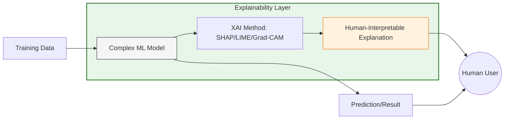

As Machine Learning models become more complex (like Deep Neural Networks and Transformers), they often become **"Black Boxes."** We can see the input and the output, but we don't truly understand *why* the model made a specific decision.

**Explainable AI (XAI)** is a set of processes and methods that allows human users to comprehend and trust the results and output created by machine learning algorithms.

## 1. Why do we need XAI?

In many industries, a simple "prediction" isn't enough. We need justification for the following reasons:

* **Trust and Accountability:** If a medical AI diagnoses a patient, the doctor needs to know which features (symptoms) led to that conclusion.
* **Bias Detection:** XAI helps uncover if a model is making decisions based on protected attributes like race, gender, or age.
* **Regulatory Compliance:** Laws like the **GDPR** include a "right to explanation," meaning users can demand to know how an automated decision was made about them.
* **Model Debugging:** Understanding why a model failed is the first step toward fixing it.

## 2. The Interpretability vs. Accuracy Trade-off

There is generally an inverse relationship between how well a model performs and how easy it is to explain.

| Model Type | Interpretability | Accuracy (Complex Data) |
| :--- | :--- | :--- |
| **Linear Regression** | High (Coefficients) | Low |
| **Decision Trees** | High (Visual paths) | Medium |
| **Random Forests** | Medium | High |
| **Deep Learning** | Low (Black Box) | Very High |

## 3. Key Concepts in XAI

To navigate the world of explainability, we must distinguish between different scopes and methods:

### A. Intrinsic vs. Post-hoc
* **Intrinsic (Ante-hoc):** Models that are simple enough to be self-explanatory (e.g., a small Decision Tree).
* **Post-hoc:** Methods applied *after* a complex model is trained to extract explanations (e.g., SHAP, LIME).

### B. Global vs. Local Explanations
* **Global Explainability:** Understanding the *entire* logic of the model. "What features are most important for all predictions?"
* **Local Explainability:** Understanding a *single* specific prediction. "Why was *this* specific loan application rejected?"

## 4. Logical Framework of XAI (Mermaid)

The following diagram illustrates how XAI bridges the gap between the Machine Learning model and the Human User.

## 5. Standard XAI Techniques

We will cover these in detail in the following chapters:

1. **Feature Importance:** Ranking which variables had the biggest impact on the model.
2. **Partial Dependence Plots (PDP):** Showing how a feature affects the outcome while holding others constant.
3. **LIME:** Approximating a complex model locally with a simpler, interpretable one.
4. **SHAP:** Using game theory to fairly attribute the "payout" (prediction) to each "player" (feature).

## 6. Evaluation Criteria for Explanations

What makes an explanation "good"?

* **Fidelity:** How accurately does the explanation represent what the model actually did?
* **Understandability:** Is the explanation simple enough for a non-technical user?
* **Robustness:** Does the explanation stay consistent for similar inputs?

## References

* **DARPA:** [Explainable Artificial Intelligence (XAI) Program](https://www.darpa.mil/program/explainable-artificial-intelligence)
* **Book:** [Interpretable Machine Learning by Christoph Molnar](https://christophm.github.io/interpretable-ml-book/)

---

**Now that we understand the "why," let's look at one of the most popular methods for explaining individual predictions.**