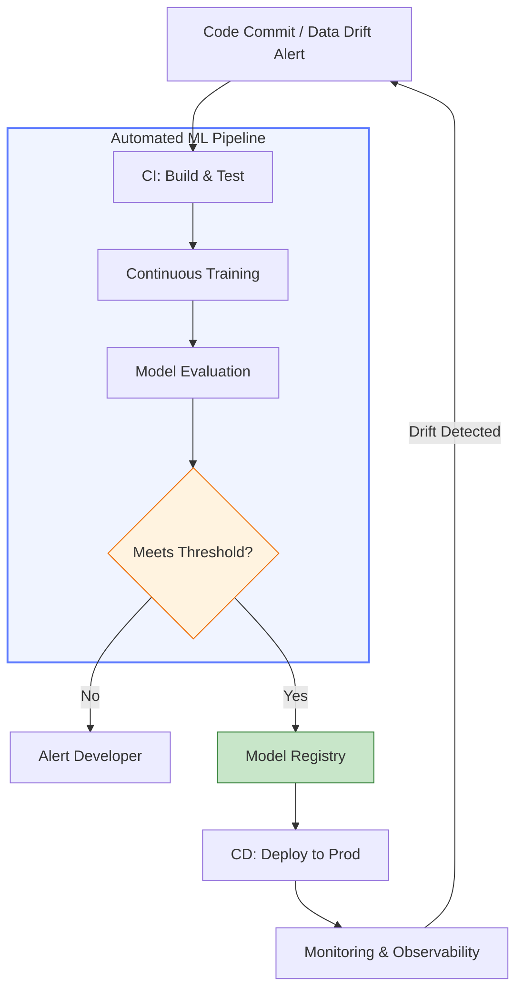

In traditional software, we have **CI** (Continuous Integration) and **CD** (Continuous Delivery). However, Machine Learning introduces a third dimension: **Data**. Because data changes over time, we need a third pillar: **CT** (Continuous Training).

## 1. The Three Pillars of MLOps Automation

To build a robust ML system, we must automate three distinct cycles:

### Continuous Integration (CI)
Beyond testing code, ML CI involves testing **data schemas** and **models**.
* **Code Testing:** Unit tests for feature engineering logic.
* **Data Testing:** Validating that incoming data matches expected distributions.
* **Model Validation:** Ensuring the model architecture compiles and training runs without memory leaks.

### Continuous Delivery (CD)
This is the automation of deploying the model as a service.
* **Artifact Packaging:** Wrapping the model in a [Docker container](./model-deployment#2-the-containerization-standard-docker).
* **Integration Testing:** Ensuring the API endpoint responds correctly to requests.
* **Deployment:** Moving the model to a staging or production environment using [Canary or Blue-Green strategies](./model-deployment#3-deployment-strategies).

### Continuous Training (CT)
This is unique to ML. It is a property of an ML system that automatically retrains and serves the model based on new data or [Model Drift](./monitoring#1-why-models-decay).

## 2. The MLOps Maturity Levels

Google defines the evolution of CI/CD in ML through three levels of maturity:

1.  **Level 0 (Manual):** Every step (data prep, training, deployment) is done manually in notebooks.
2.  **Level 1 (Automated Training):** The pipeline is automated. Whenever new data arrives, the training and validation happen automatically (CT).
3.  **Level 2 (CI/CD Pipeline Automation):** The entire workflow—from code commits to model monitoring—is a fully automated CI/CD pipeline.

## 3. The Automated Workflow

The following diagram illustrates how a code change or a "Drift" alert triggers a sequence of automated events.



## 4. Key Components of the Pipeline

* **Feature Store:** A centralized repository where features are stored and shared, ensuring that the same feature logic is used in both training and serving.
* **Model Registry:** A "version control" for models. It stores trained models, their metadata (hyperparameters, accuracy), and their environment dependencies.
* **Metadata Store:** Records every execution of the pipeline, allowing you to trace a specific model version back to the exact dataset and code used to create it.

## 5. Tools of the Trade

Depending on your cloud provider, the tools for CI/CD/CT vary:

| Component | Open Source | AWS | Google Cloud |
| --- | --- | --- | --- |
| **Orchestration** | Kubeflow / Airflow | Step Functions | Vertex AI Pipelines |
| **CI/CD** | GitHub Actions / GitLab | CodePipeline | Cloud Build |
| **Tracking** | MLflow | SageMaker Experiments | Vertex AI Metadata |
| **Storage** | DVC (Data Version Control) | S3 | GCS |

## 6. Implementation: A GitHub Actions Snippet

A simple CI task to check if a model's accuracy meets a threshold before allowing a "Push" to production.

```yaml
name: Model Training CI
on: [push]

jobs:
  train-and-validate:
    runs-on: ubuntu-latest
    steps:
      - name: Checkout code
        uses: actions/checkout@v2
        
      - name: Set up Python
        uses: actions/setup-python@v2
        
      - name: Install dependencies
        run: pip install -r requirements.txt
        
      - name: Run Training & Evaluation
        run: python train.py  # Script generates 'metrics.json'
        
      - name: Check Accuracy Threshold
        run: |
          ACCURACY=$(jq '.accuracy' metrics.json)
          if (( $(echo "$ACCURACY < 0.85" | bc -l) )); then
            echo "Accuracy too low ($ACCURACY). Deployment failed."
            exit 1
          fi

```

## References

* **Google Cloud:** [MLOps: Continuous delivery and automation pipelines](https://cloud.google.com/architecture/mlops-continuous-delivery-and-automation-pipelines-in-machine-learning)
* **ThoughtWorks:** [Continuous Delivery for Machine Learning (CD4ML)](https://martinfowler.com/articles/cd4ml.html)
* **MLflow:** [Introduction to Model Registry](https://www.mlflow.org/docs/latest/model-registry.html)

---

**With CI/CD/CT, your model is now a living, breathing part of your infrastructure. But how do we ensure it remains ethical and unbiased throughout these cycles?**