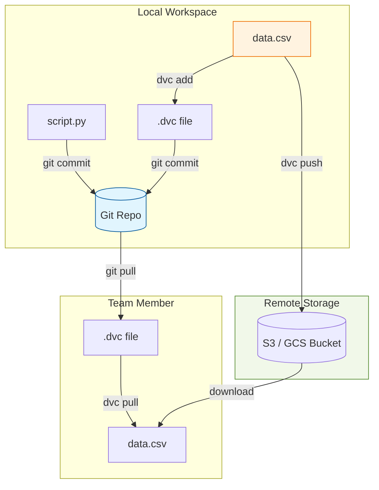

In traditional software development, versioning code with **Git** is enough to recreate any state of an application. In Machine Learning, code is only half the story. The resulting model depends on both the **Code** and the **Data**.

If you retrain your model today and get different results than yesterday, you need to know exactly which version of the dataset was used. **Data Versioning** provides the "undo button" for your data.

## 1. Why Git Isn't Enough for Data

Git is designed to track small text files. It struggles with the large binary files (CSV, Parquet, Images, Audio) typically used in ML for several reasons:

* **Storage Limits:** Storing gigabytes of data in a Git repository slows down operations significantly.
* **Diffing:** Git cannot efficiently show differences between two 5GB binary files.
* **Cost:** Hosting large blobs in GitHub or GitLab is expensive and inefficient.

**Data Versioning tools** solve this by tracking "pointers" (metadata) in Git, while storing the actual data in external storage (S3, GCS, Azure Blob).

## 2. The Core Concept: Metadata vs. Storage

Data versioning works by creating a **hash** (unique ID) of your data files. 

1.  **The Data:** Stored in a scalable cloud bucket (e.g., AWS S3).
2.  **The Metafile:** A tiny text file containing the hash and file path. This file **is** committed to Git.

<br />


## 3. Workflow Logic

The following diagram illustrates how DVC (Data Version Control) interacts with Git and remote storage to maintain synchronization.



## 4. Popular Data Versioning Tools

| Tool | Focus | Best For |
| --- | --- | --- |
| **DVC (Data Version Control)** | Open-source, Git-like CLI. | Teams already comfortable with Git. |
| **Pachyderm** | Data lineage and pipelining. | Complex data pipelines on Kubernetes. |
| **LakeFS** | Git-like branches for Data Lakes. | Teams using S3/GCS as their primary data source. |
| **W&B Artifacts** | Integrated with experiment tracking. | Visualizing data lineage alongside model training. |

## 5. Implementation with DVC

DVC is the most popular tool because it integrates seamlessly with your existing Git workflow.

```bash
# 1. Initialize DVC in your project
dvc init

# 2. Add a large dataset (this creates data.csv.dvc)
dvc add data/train_images.zip

# 3. Track the metadata in Git
git add data/train_images.zip.dvc .gitignore
git commit -m "Add raw training images version 1.0"

# 4. Push the actual data to a remote (S3, GCS, etc.)
dvc remote add -d myremote s3://my-bucket/data
dvc push

# 5. Switching versions
git checkout v2.0-experiment
dvc checkout # This physically swaps the data files in your folder

```

## 6. The Benefits of Versioning Data

* **Reproducibility:** You can recreate the exact environment of a model trained 6 months ago.
* **Compliance & Auditing:** In regulated industries (finance/healthcare), you must be able to show exactly what data was used to train a model to explain its decisions.
* **Collaboration:** Multiple researchers can work on different versions of the data without overwriting each other's work.
* **Data Lineage:** Tracking the "ancestry" of a dataset—knowing that `clean_data.csv` was generated from `raw_data.csv` using `clean.py`.

## References

* **DVC Documentation:** [Get Started with DVC](https://dvc.org/doc/start)
* **LakeFS:** [Git for Data Lakes](https://lakefs.io/)

---

**Data versioning is the foundation of a reproducible pipeline. Now that we can track our data and code, how do we track the experiments and hyperparameter results?**