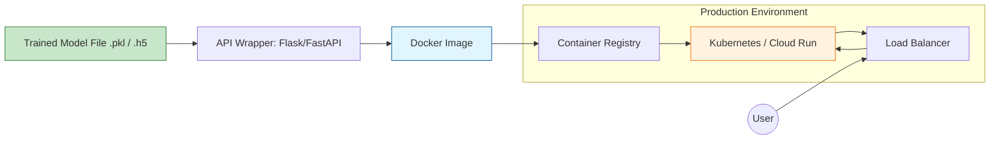

**Model Deployment** is the process of integrating a machine learning model into an existing production environment where it can take in data and return predictions. It is the final stage of the ML pipeline, but it is also the beginning of the model's "life" where it provides actual value.

## 1. Deployment Modes

Before choosing a tool, you must decide how the users will consume the predictions.

| Mode | Description | Example |
| :--- | :--- | :--- |
| **Request-Response (Real-time)** | The model lives behind an API. Predictions are returned instantly (low latency). | **Fraud Detection** during a credit card swipe. |
| **Batch Scoring** | The model runs on a large set of data at scheduled intervals (e.g., every night). | **Recommendation Emails** sent to users once a day. |
| **Streaming** | The model consumes data from a queue (like Kafka) and outputs predictions continuously. | **Log Monitoring** for cybersecurity threats. |

## 2. The Containerization Standard: Docker

In MLOps, we don't just deploy code; we deploy the **environment**. To avoid the "it works on my machine" problem, we use **Docker**.

A Docker container packages the model file, the Python runtime, and all dependencies (NumPy, Scikit-Learn, etc.) into a single image that runs identically on any server.

## 3. Deployment Strategies

Deploying a model isn't just about "overwriting" the old one. We use strategies to minimize risk.

* **Blue-Green Deployment:** You have two identical environments. You route traffic to "Green" (new model). If it fails, you instantly flip back to "Blue" (old model).
* **Canary Deployment:** You route 5% of traffic to the new model. If the metrics look good, you slowly increase it to 100%.
* **A/B Testing:** You run two models simultaneously and compare their real-world performance (e.g., which one leads to more clicks?).

## 4. Logical Workflow: The Deployment Pipeline

The following diagram illustrates the path from a trained model to a live API endpoint.



## 5. Model Serving Frameworks

While you can write your own API using **FastAPI**, dedicated "Model Serving" tools handle scaling and versioning better:

1. **TensorFlow Serving:** Highly optimized for TF models.
2. **TorchServe:** The official serving library for PyTorch.
3. **KServe (formerly KFServing):** A serverless way to deploy models on Kubernetes.
4. **BentoML:** A framework that simplifies the packaging and deployment of any Python model.

## 6. Implementation Sketch (FastAPI + Uvicorn)

This is a minimal example of serving a Scikit-Learn model as a REST API.

```python
from fastapi import FastAPI
import joblib
import pydantic

app = FastAPI()

# 1. Load the pre-trained model
model = joblib.load("model_v1.pkl")

# 2. Define the input schema
class InputData(pydantic.BaseModel):
    feature_1: float
    feature_2: float

# 3. Create the prediction endpoint
@app.post("/predict")
def predict(data: InputData):
    prediction = model.predict([[data.feature_1, data.feature_2]])
    return {"prediction": int(prediction[0])}

# Run with: uvicorn main:app --reload

```

## 7. Post-Deployment: Monitoring

Once a model is live, its performance will likely decrease over time (**Model Drift**). We must monitor:

* **Latency:** How long does a prediction take?
* **Data Drift:** Is the incoming data different from the training data?
* **Concept Drift:** Has the relationship between features and the target changed?

## References

* **Google Cloud:** [Practices for MLOps and CI/CD](https://cloud.google.com/architecture/mlops-continuous-delivery-and-automation-pipelines-in-machine-learning)
* **FastAPI:** [Official Documentation](https://fastapi.tiangolo.com/)
* **MLOps.community:** [Deployment Patterns](https://mlops.community/)

---

**Deployment is just the beginning. How do we ensure our model stays accurate as the world changes?**