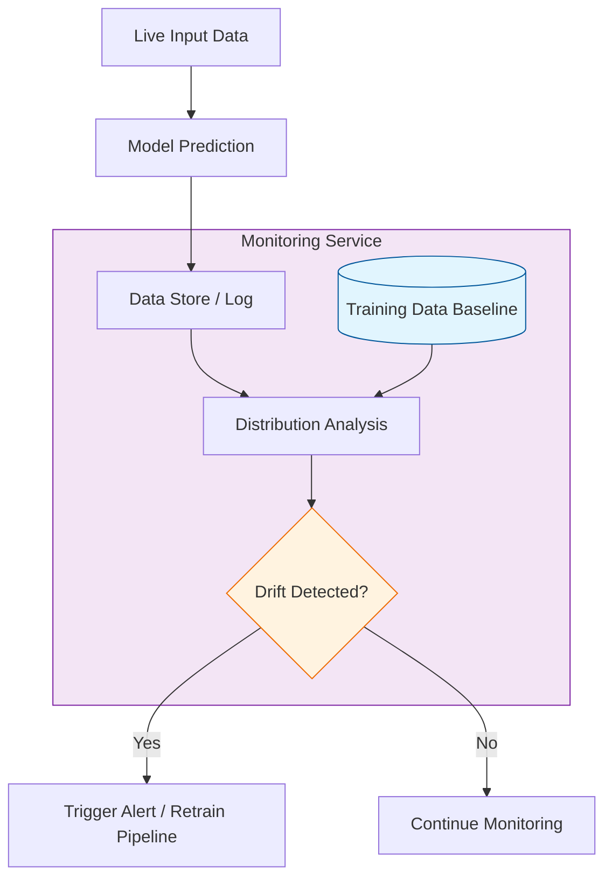

In traditional software, monitoring focuses on system health (CPU, RAM, Uptime). In **MLOps**, we must monitor the **Data** and the **Model Logic**. A model's code might be bug-free, but its predictions can still become "rotten" because the world around it changes.

## 1. Why Models "Decay"

Unlike software that stays the same until a new version is pushed, ML models degrade silently. This is usually caused by two types of "Drift":

### A. Data Drift (Feature Drift)
This happens when the statistical properties of the **input data** change.
* **Example:** A facial recognition model trained on people in their 20s starts failing as the user base ages.
* **Metric:** Population Stability Index (PSI) or Kullback-Leibler (KL) Divergence.

### B. Concept Drift
This happens when the **relationship** between the input and the target changes.
* **Example:** A house price prediction model built before a housing market crash. The houses (inputs) are the same, but the prices (targets) follow new rules.

## 2. The Monitoring Pyramid

Effective MLOps monitoring covers three distinct layers:

| Layer | What to Monitor | Tools |
| :--- | :--- | :--- |
| **System Health** | Latency, Throughput, CPU/GPU usage, Memory leaks. | Prometheus, Grafana |
| **Data Quality** | Missing values, Schema changes, Outliers, Feature distributions. | Great Expectations, Evidently AI |
| **Model Performance** | Accuracy, Precision, Recall, F1-Score (requires "Ground Truth"). | MLflow, Weights & Biases |

## 3. Detecting Drift

The following diagram illustrates the feedback loop required to detect and act upon model decay.



## 4. Ground Truth & Latency

Monitoring performance (Accuracy/F1) is difficult because you often don't get the "correct answer" (Ground Truth) immediately.

* **Immediate Feedback:** In an Ad-click model, you know within seconds if the user clicked.
* **Delayed Feedback:** In a Loan Default model, you might not know the "Ground Truth" for years.

**Strategy:** When ground truth is delayed, rely heavily on **Data Drift** detection as a proxy for performance.

## 5. Implementation: Drift Detection with Evidently AI

[Evidently AI](https://www.evidentlyai.com/) is a popular open-source tool for generating reports on data drift.

```python
from evidently.report import Report
from evidently.metric_preset import DataDriftPreset

# 1. Create a drift report
report = Report(metrics=[
    DataDriftPreset(),
])

# 2. Compare reference data (training) vs. current data (production)
report.run(reference_data=training_df, current_data=production_df)

# 3. Export as HTML or JSON for automated alerts
report.save_html("drift_report.html")

```

## 6. Closing the Loop: Automated Retraining

When monitoring detects significant drift, the system should trigger a **Retraining Pipeline**:

1. Fetch the newly labeled data.
2. Run the training script on the new dataset.
3. Validate that the new model outperforms the current one.
4. Deploy the new version via [Canary Deployment](./model-deployment#3-deployment-strategies).

## References

* **Evidently AI:** [Data Drift Detection Guide](https://docs.evidentlyai.com/)

---

**Monitoring is the "safety net" of AI. But how do we build the entire pipeline so that training, testing, and deployment happen automatically?**