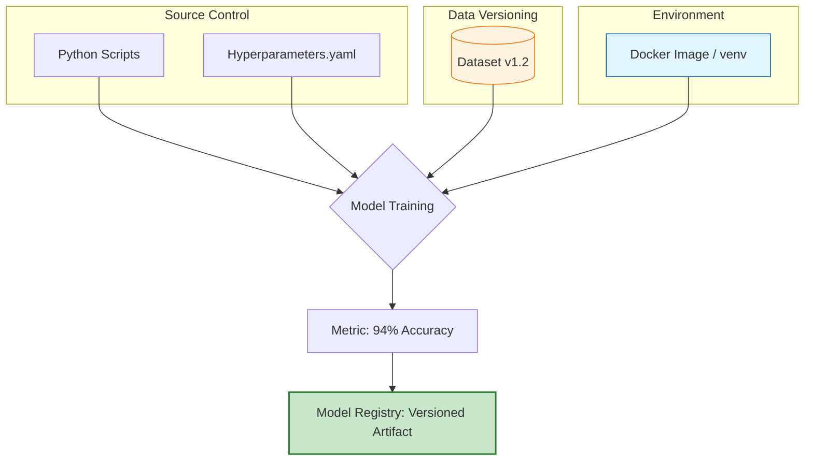

In traditional science, a result is only valid if another scientist can follow the same steps and achieve the same outcome. In Machine Learning, **Reproducibility** is notoriously difficult because a model's output is sensitive to tiny changes in data, code, random seeds, and even the hardware drivers used.

If you cannot reproduce a model, you cannot reliably debug it, audit it for bias, or deploy it with confidence.

## 1. The Four Pillars of Reproducibility

To achieve 100% reproducibility, you must lock down four specific dimensions of your project:

| Pillar | What it covers | Primary Tool |
| :--- | :--- | :--- |
| **Code** | The exact logic, preprocessing, and model architecture. | **Git** |
| **Data** | The specific version of the dataset (including the split). | **DVC / LakeFS** |
| **Environment** | OS version, Python version, and library dependencies. | **Docker / Conda** |
| **Randomness** | Seed values for weight initialization and data shuffling. | **Code-level Seeds** |

## 2. Managing the "Random" Factor

Most ML algorithms involve stochastic (random) processes. To ensure the same result every time, you must set a **Global Seed**. Without this, your model weights will initialize differently every time you click "Run."

```python
import numpy as np
import torch
import random

def set_seed(seed=42):
    random.seed(seed)
    np.random.seed(seed)
    torch.manual_seed(seed)
    torch.cuda.manual_seed_all(seed)
    # Ensure deterministic behavior in GPU operations
    torch.backends.cudnn.deterministic = True
    torch.backends.cudnn.benchmark = False

set_seed(42)

```

## 3. The Reproducibility Workflow (Mermaid)

The following diagram illustrates how the four pillars converge into a "Reproducible Artifact" that can be shared across a team.



## 4. Environment Freezing

Dependency versions change constantly. A package like `scikit-learn` might update its default parameters between versions, changing your model's output.

**Bad practice:**

```text
pandas
scikit-learn

```

**Good practice (Frozen):**

```text
pandas==2.1.0
scikit-learn==1.3.2

```

Better yet, use a **Docker Container** to ensure that even the C++ libraries and OS-level drivers (like CUDA) remain identical.

## 5. Experiment Tracking: The "Lab Notebook"

Reproducibility is not just about the final model; it's about the journey. **Experiment Tracking** tools act as a digital lab notebook, recording every attempt, every hyperparameter tweak, and every failure.

* **MLflow:** Tracks parameters, metrics, and "artifacts" (the model files).
* **Weights & Biases (W&B):** Provides visual dashboards to compare different runs and identify exactly which change led to an improvement.

## 6. Checklist for Reproducible ML

Before considering a model "ready," ensure you can answer "Yes" to these:

1. [ ] Is the code committed to Git?
2. [ ] Is the data versioned (e.g., via DVC)?
3. [ ] Are all random seeds explicitly set?
4. [ ] Is there a `requirements.txt` or `Dockerfile`?
5. [ ] Are the hyperparameters logged in an experiment tracker?

## References

* **Papers with Code:** [The Reproducibility Checklist](https://www.cs.mcgill.ca/~jpineau/ReproducibilityChecklist.pdf)
* **MLflow:** [Running Reproducible Projects](https://mlflow.org/docs/latest/projects.html)

---

**Reproducibility allows you to trust your own results. But how do we scale this trust to an entire organization with thousands of features?**