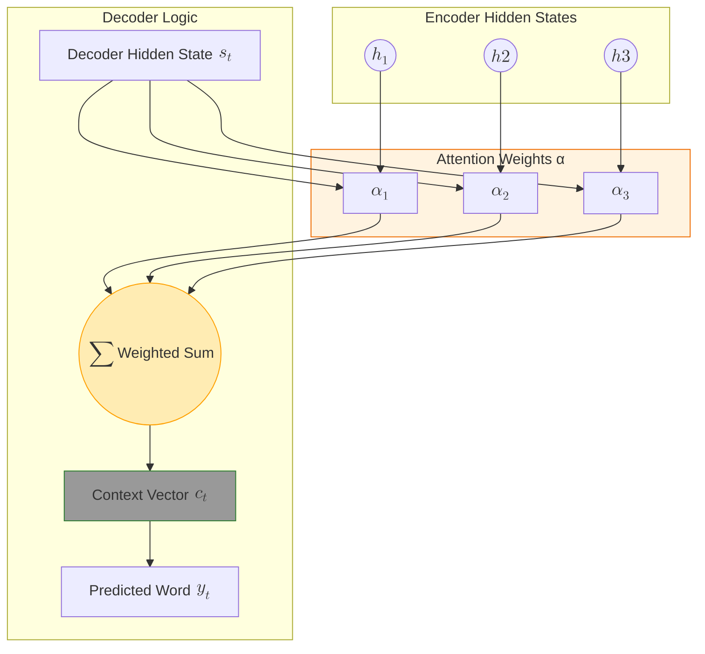

In traditional [Encoder-Decoder](../../deep-learning/rnn/rnn-basics) architectures, the encoder compresses the entire input sequence into a single fixed-length vector (the "context vector"). 

**The Problem:** This creates a **bottleneck**. If a sentence is 50 words long, it is nearly impossible to squeeze all that information into one small vector without losing critical details. **Attention** was designed to let the decoder "look back" at specific parts of the input sequence at every step of the output.

## 1. The Core Concept: Dynamic Focus

Imagine you are translating a sentence from English to French. When you are writing the third word of the French sentence, your eyes are likely focused on the third or fourth word of the English sentence. 

Attention mimics this behavior. Instead of using one static vector, the model calculates a **weighted average** of all the encoder's hidden states, giving more "attention" to the words that are relevant to the current word being generated.

## 2. How Attention Works (Step-by-Step)

For every word the decoder generates, the attention mechanism performs these steps:

1.  **Alignment Scores:** The model compares the current decoder hidden state with all previous encoder hidden states.
2.  **Softmax:** These scores are turned into probabilities (weights) that sum to 1.
3.  **Context Vector:** The encoder hidden states are multiplied by these weights to create a unique context vector for *this specific time step*.
4.  **Decoding:** The decoder uses this specific context vector to predict the next word.

## 3. Bahdanau vs. Luong Attention

There are two primary "classic" versions of attention used in RNN-based models:

| Feature | Bahdanau (Additive) | Luong (Multiplicative) |
| :--- | :--- | :--- |
| **Alignment** | Uses a learned alignment function. | Uses dot-product or general matrix multiplication. |
| **Complexity** | More computationally expensive. | Faster and more memory-efficient. |
| **Placement** | Calculated *before* the decoder's state. | Calculated *after* the decoder's state. |

## 4. Advanced Logic: The Attention Flow (Mermaid)

This diagram visualizes how the decoder selectively pulls information from the encoder hidden states ($h_1, h_2, h_3$) using weights ($\alpha$).



## 5. Global vs. Local Attention

* **Global Attention:** The model looks at *every* word in the input sequence to calculate the weights. This is highly accurate but slow for very long sequences.
* **Local Attention:** The model only looks at a small "window" of words around the current position. This is a compromise between efficiency and context.

## 6. Implementation Sketch (PyTorch-style)

Here is a simplified logic of how the alignment score (dot-product version) is calculated:

```python
import torch
import torch.nn.functional as F

def compute_attention(decoder_state, encoder_states):
    # decoder_state: [batch, hidden_dim]
    # encoder_states: [seq_len, batch, hidden_dim]
    
    # 1. Calculate dot product alignment scores
    # (Unsqueeze to align dimensions for matrix multiplication)
    scores = torch.matmul(encoder_states.transpose(0, 1), decoder_state.unsqueeze(2))
    
    # 2. Softmax to get weights [batch, seq_len, 1]
    weights = F.softmax(scores, dim=1)
    
    # 3. Multiply weights by encoder states to get context vector
    context = torch.sum(weights * encoder_states.transpose(0, 1), dim=1)
    
    return context, weights

```

## References

* **Bahdanau et al. (2014):** [Neural Machine Translation by Jointly Learning to Align and Translate](https://arxiv.org/abs/1409.0473)
* **Luong et al. (2015):** [Effective Approaches to Attention-based Neural Machine Translation](https://arxiv.org/abs/1508.04025)
* **Distill.pub:** [Visualizing Attention](https://distill.pub/2016/augmented-rnns/)

---

**Attention was a breakthrough for RNNs, but researchers soon realized: if attention is so good, do we even need the RNNs at all?**