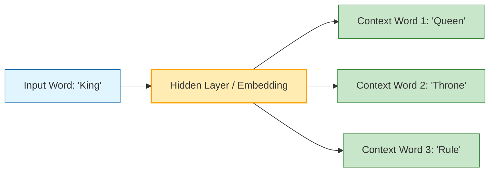

In previous steps like [Stemming](./stemming), we treated words as discrete symbols. However, a machine doesn't know that "Apple" is closer to "Orange" than it is to "Airplane." 

**Word Embeddings** solve this by representing words as **dense vectors** of real numbers in a high-dimensional space. The core philosophy is the **Distributional Hypothesis**: *"A word is characterized by the company it keeps."*

## 1. Why Not Use One-Hot Encoding?

Before embeddings, we used One-Hot Encoding (a vector of 0s with a single 1). 
* **The Problem:** It creates massive, sparse vectors (if you have 50,000 words, each vector is 50,000 long).
* **The Fatal Flaw:** All vectors are equidistant. The mathematical dot product between "King" and "Queen" is the same as "King" and "Potato" (zero), meaning the model sees no relationship between them.

## 2. The Vector Space: King - Man + Woman = Queen

The most famous property of embeddings is their ability to capture **analogies** through vector arithmetic. Because words with similar meanings are placed close together, the distance and direction between vectors represent semantic relationships.

* **Gender:** $\vec{King} - \vec{Man} + \vec{Woman} \approx \vec{Queen}$
* **Verb Tense:** $\vec{Walking} - \vec{Walk} + \vec{Swim} \approx \vec{Swimming}$
* **Capital Cities:** $\vec{Paris} - \vec{France} + \vec{Germany} \approx \vec{Berlin}$

## 3. Major Embedding Algorithms

### A. Word2Vec (Google)
Uses a shallow neural network to learn word associations. It has two architectures:
1.  **CBOW (Continuous Bag of Words):** Predicts a target word based on context words.
2.  **Skip-gram:** Predicts surrounding context words based on a single target word (better for rare words).

### B. GloVe (Stanford)
Short for "Global Vectors." Unlike Word2Vec, which iterates over local windows, GloVe looks at the **Global Co-occurrence Matrix** of the entire dataset.

### C. FastText (Facebook)
An extension of Word2Vec that treats each word as a bag of **character n-grams**. This allows it to generate embeddings for "Out of Vocabulary" (OOV) words by looking at their sub-parts.

## 4. Advanced Logic: Skip-gram Architecture (Mermaid)

The following diagram illustrates how the Skip-gram model uses a center word to predict its neighbors, thereby learning a dense representation in its hidden layer.



## 5. Measuring Similarity: Cosine Similarity

To find how similar two words are in an embedding space, we don't use Euclidean distance (which can be affected by the length of the vector). Instead, we use **Cosine Similarity**, which measures the angle between two vectors.

$$
\text{similarity} = \cos(\theta) = \frac{\mathbf{A} \cdot \mathbf{B}}{|\mathbf{A}| |\mathbf{B}|}
$$

* **1.0:** Vectors point in the same direction (Synonyms).
* **0.0:** Vectors are orthogonal (Unrelated).
* **-1.0:** Vectors point in opposite directions (Antonyms).

## 6. Implementation with Gensim

Gensim is the go-to Python library for using pre-trained embeddings or training your own.

```python
import gensim.downloader as api

# 1. Load pre-trained Word2Vec embeddings (Glove-wiki)
model = api.load("glove-wiki-gigaword-100")

# 2. Find most similar words
result = model.most_similar(positive=['king', 'woman'], negative=['man'], topn=1)
print(f"King - Man + Woman = {result[0][0]}") 
# Output: queen

# 3. Compute similarity score
score = model.similarity('apple', 'banana')
print(f"Similarity between apple and banana: {score:.4f}")

```

## References

* **Original Word2Vec Paper:** [Efficient Estimation of Word Representations in Vector Space](https://arxiv.org/abs/1301.3781)
* **Stanford NLP:** [GloVe: Global Vectors for Word Representation](https://nlp.stanford.edu/projects/glove/)
* **Gensim:** [Official Documentation and Tutorials](https://radimrehurek.com/gensim/auto_examples/index.html)

---

**Static embeddings like Word2Vec are great, but they have a flaw: the word "Bank" has the same vector whether it's a river bank or a financial bank. How do we make embeddings context-aware?**