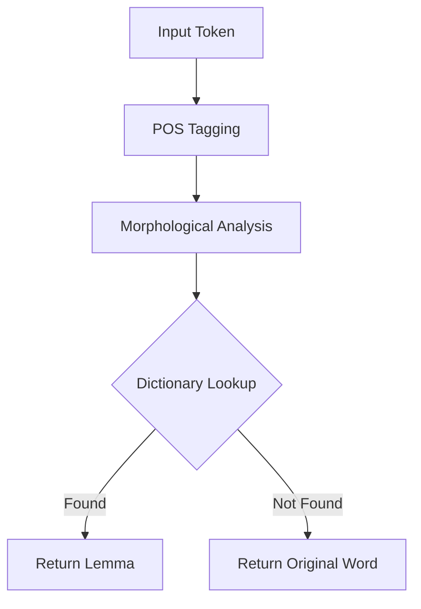

**Lemmatization** is the process of grouping together the inflected forms of a word so they can be analyzed as a single item, identified by the word's **Lemma**. 

Unlike [Stemming](./stemming), which simply chops off suffixes, lemmatization uses a vocabulary and morphological analysis to return the dictionary form of a word.

## 1. Lemmatization vs. Stemming

The primary difference lies in **Intelligence**. While a stemmer operates on a single word without context, a lemmatizer considers the word's meaning and its **Part of Speech (POS)** tag.

| Word | Stemming (Porter) | Lemmatization (WordNet) |
| :--- | :--- | :--- |
| **Studies** | studi | study |
| **Studying** | studi | study |
| **Was** | wa | be |
| **Mice** | mice | mouse |
| **Better** | better | good (if context is adjective) |

## 2. The Importance of Part of Speech (POS)

A lemmatizer’s behavior changes depending on whether a word is a noun, verb, or adjective. 

For example, the word **"saw"**:
1.  **If Verb:** Lemma is **"see"** (e.g., "I saw the movie").
2.  **If Noun:** Lemma is **"saw"** (e.g., "The carpenter used a saw").

Most modern lemmatizers (like those in spaCy) automatically detect the POS tag to provide the correct lemma.

## 3. The Lemmatization Pipeline (Mermaid)

The following diagram shows how a lemmatizer uses linguistic resources to find the base form.



## 4. Implementation with spaCy

While NLTK requires you to manually pass POS tags, **spaCy** performs lemmatization as part of its default pipeline, making it much more accurate.

```python
import spacy

# 1. Load the English language model
nlp = spacy.load("en_core_web_sm")

text = "The mice were running better than the cats."

# 2. Process the text
doc = nlp(text)

# 3. Extract Lemmas
lemmas = [token.lemma_ for token in doc]

print(f"Original: {[token.text for token in doc]}")
print(f"Lemmas:   {lemmas}")
# Output: ['the', 'mouse', 'be', 'run', 'well', 'than', 'the', 'cat', '.']

```

## 5. When to Choose Lemmatization?

* **Chatbots & QA Systems:** Where understanding the precise meaning and dictionary form is vital for retrieving information.
* **Topic Modeling:** To ensure that "organizing" and "organization" are grouped together correctly without losing the root meaning to over-stemming.
* **High-Accuracy NLP:** Whenever computational resources allow for a slightly slower preprocessing step in exchange for significantly better data quality.

## References

* **spaCy Documentation:** [Lemmatization and Morphology](https://spacy.io/usage/linguistic-features#lemmatization)
* **WordNet:** [A Lexical Database for English](https://wordnet.princeton.edu/)
* **NLTK:** [WordNet Lemmatizer Tutorial](https://www.nltk.org/api/nltk.stem.wordnet.html)

---

**Lemmatization provides us with clean, dictionary-base words. But how do we turn these words into high-dimensional vectors that a model can actually "understand"?**