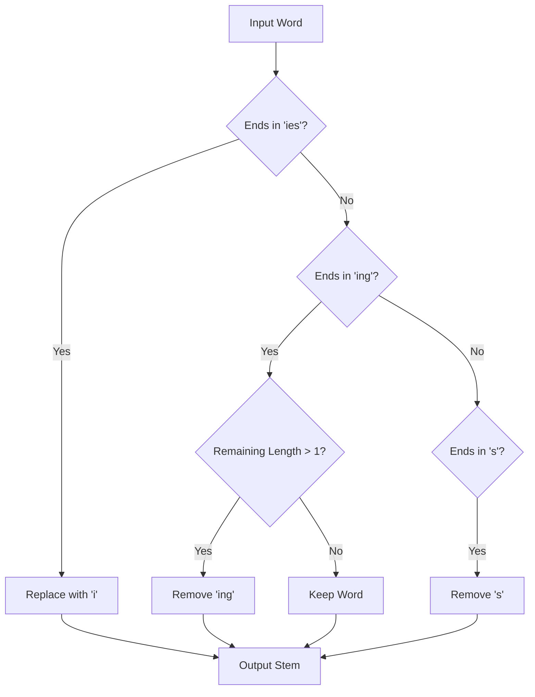

**Stemming** is a text-normalization technique used in Natural Language Processing to reduce a word to its "stem" or root form. The goal is to ensure that different grammatical variations of the same word (like "running," "runs," and "ran") are treated as the same item by a search engine or machine learning model.

## 1. How Stemming Works

Stemming is primarily a **heuristic-based** process. It uses crude rule-based algorithms to chop off the ends of words (suffixes) in the hope of reaching the base form. 

Unlike [Lemmatization](./lemmatization), stemming does not use a dictionary and does not care about the context or the part of speech (POS). 

### Example:
* **Input:** "Universal", "University", "Universe"
* **Stem:** "Univers"

## 2. Popular Stemming Algorithms

There are several algorithms used to perform stemming, ranging from aggressive to conservative:

| Algorithm | Characteristics | Use Case |
| :--- | :--- | :--- |
| **Porter Stemmer** | The oldest and most common. Uses 5 phases of word reduction. | General purpose NLP, fast and reliable. |
| **Snowball Stemmer** | An improvement over Porter; supports multiple languages (also called Porter2). | Multi-lingual applications. |
| **Lancaster Stemmer** | Very aggressive. Often results in stems that are not real words. | When extreme compression/normalization is needed. |

## 3. The Pitfalls of Stemming

Because stemming follows rigid rules without "understanding" the language, it often makes two types of errors:

### A. Over-stemming
This occurs when two words are reduced to the same stem even though they have different meanings.
* **Example:** "Organization" and "Organs" both being reduced to **"organ"**.

### B. Under-stemming
This occurs when two words that *should* result in the same stem do not.
* **Example:** "Alumnus" and "Alumni" might remain distinct because the rules don't recognize the Latin plural change.

## 4. Logical Workflow (Mermaid)

The following diagram illustrates the decision-making process of a typical rule-based stemmer like the Porter Stemmer.



## 5. Implementation with NLTK

The Natural Language Toolkit (NLTK) is the most popular library for stemming in Python.

```python
from nltk.stem import PorterStemmer, SnowballStemmer

# 1. Initialize the Porter Stemmer
porter = PorterStemmer()

words = ["connection", "connected", "connecting", "connections"]

# 2. Apply Stemming
stemmed_words = [porter.stem(w) for w in words]

print(f"Original: {words}")
print(f"Stemmed:  {stemmed_words}")
# Output: ['connect', 'connect', 'connect', 'connect']

# 3. Using Snowball (Porter2) for better results
snowball = SnowballStemmer(language='english')
print(snowball.stem("generously")) # Output: generous

```

## 6. When to use Stemming?

* **Information Retrieval:** Search engines use stemming to ensure that searching for "fishing" brings up results for "fish."
* **Sentiment Analysis:** When the specific tense of a verb doesn't change the underlying emotion.
* **Speed:** When you have a massive corpus and [Lemmatization](./lemmatization) is too computationally expensive.

## References

* **NLTK Documentation:** [Stemming Package](https://www.nltk.org/api/nltk.stem.html)
* **Stanford NLP:** [Stemming and Lemmatization](https://nlp.stanford.edu/IR-book/html/htmledition/stemming-and-lemmatization-1.html)

---

**Stemming is fast but "dumb." If you need your base words to be actual dictionary words and you care about the grammar, you need a more sophisticated approach.**