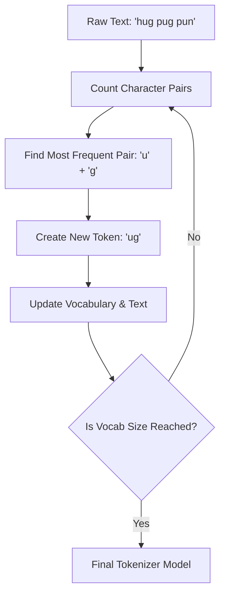

Before a machine learning model can "read" text, the raw strings must be broken down into smaller units called **Tokens**. Tokenization is the process of segmenting a sequence of characters into meaningful pieces, which are then mapped to integers (input IDs).

## 1. Levels of Tokenization

There is a constant trade-off between the size of the vocabulary and the amount of information each token carries.

### A. Word-level Tokenization
The simplest form, where text is split based on whitespace or punctuation.
* **Pros:** Easy to understand; preserves word meaning.
* **Cons:** Massive vocabulary size; cannot handle "Out of Vocabulary" (OOV) words (e.g., if it knows "run," it might not know "running").

### B. Character-level Tokenization
Every single character (a, b, c, 1, 2, !) is a token.
* **Pros:** Very small vocabulary; no OOV words.
* **Cons:** Tokens lose individual meaning; sequences become extremely long, making it hard for the model to learn relationships.

### C. Subword-level Tokenization (The Modern Standard)
Used by models like GPT and BERT. It breaks down common words into single tokens but splits rare words into meaningful chunks (e.g., "unfriendly" $\rightarrow$ "un", "friend", "ly").

## 2. Modern Subword Algorithms

To balance vocabulary size and meaning, modern NLP uses three main algorithms:

| Algorithm | Used In | How it works |
| :--- | :--- | :--- |
| **Byte-Pair Encoding (BPE)** | GPT-2, GPT-3, RoBERTa | Iteratively merges the most frequent pair of characters/tokens into a new token. |
| **WordPiece** | BERT, DistilBERT | Similar to BPE but merges pairs that maximize the likelihood of the training data. |
| **SentencePiece** | T5, Llama | Treats whitespace as a character, allowing for language-independent tokenization. |

## 3. The Tokenization Pipeline

Tokenization is not just "splitting" text. It involves a multi-step pipeline:

1.  **Normalization:** Cleaning the text (lowercasing, removing accents, stripping extra whitespace).
2.  **Pre-tokenization:** Initial splitting (usually by whitespace).
3.  **Model Tokenization:** Applying the subword algorithm (e.g., BPE) to create the final list.
4.  **Post-Processing:** Adding special tokens like `[CLS]` (start), `[SEP]` (separator), or `<|endoftext|>`.

## 4. Advanced Logic: BPE Workflow (Mermaid)

The following diagram illustrates how Byte-Pair Encoding (BPE) builds a vocabulary by merging frequent character pairs.



## 5. Implementation with Hugging Face `tokenizers`

The `transformers` library provides an extremely fast implementation of these pipelines.

```python
from transformers import AutoTokenizer

# Load the tokenizer for a specific model (e.g., BERT)
tokenizer = AutoTokenizer.from_pretrained("bert-base-uncased")

text = "Tokenization is essential for NLP."

# 1. Convert text to tokens
tokens = tokenizer.tokenize(text)
print(f"Tokens: {tokens}")
# Output: ['token', '##ization', 'is', 'essential', 'for', 'nlp', '.']

# 2. Convert tokens to Input IDs (Integers)
input_ids = tokenizer.convert_tokens_to_ids(tokens)
print(f"IDs: {input_ids}")

# 3. Full Encoding (includes special tokens and attention masks)
encoded_input = tokenizer(text, padding=True, truncation=True, return_tensors="pt")

```

## 6. Challenges in Tokenization

* **Language Specificity:** Languages like Chinese or Japanese don't use spaces between words, making basic splitters useless.
* **Specialized Text:** Code, mathematical formulas, or medical jargon require custom-trained tokenizers to maintain performance.
* **Token Limits:** Most Transformers have a limit (e.g., 512 or 8192 tokens). If tokenization is too granular, long documents will be cut off.

## References

* **Hugging Face Course:** [The Tokenization Summary](https://huggingface.co/learn/nlp-course/chapter2/4)
* **OpenAI:** [Tiktoken - A fast BPE tokenizer for GPT models](https://github.com/openai/tiktoken)
* **Google Research:** [SentencePiece GitHub](https://github.com/google/sentencepiece)

---

**Now that we have turned text into numbers, how does the model understand the *meaning* and *relationship* between these numbers?**