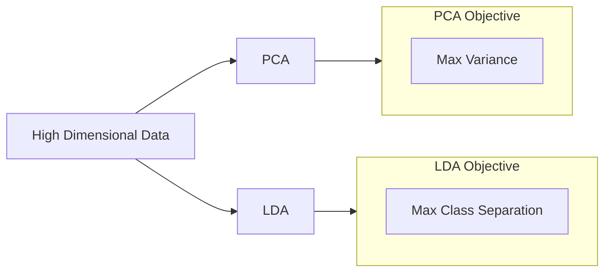

In Machine Learning, more data isn't always better. The **Curse of Dimensionality** refers to the phenomenon where, as the number of features (dimensions) increases, the volume of the space increases so fast that the available data becomes sparse. This leads to overfitting and massive computational costs.

Dimensionality Reduction aims to project high-dimensional data into a lower-dimensional space while retaining as much meaningful information as possible.

## 1. Why Reduce Dimensions?

1.  **Visualization:** We cannot visualize data in 10 dimensions. Reducing it to 2D or 3D allows us to see clusters and patterns.
2.  **Performance:** Fewer features mean faster training and lower memory usage.
3.  **Noise Reduction:** By removing "redundant" features, we help the model focus on the most important signals.
4.  **Multicollinearity:** It helps handle features that are highly correlated with each other.

## 2. Principal Component Analysis (PCA)

PCA is an **unsupervised** technique that finds the directions (Principal Components) where the variance of the data is maximized.

* **Principal Component 1 (PC1):** The direction that captures the most spread in the data.
* **Principal Component 2 (PC2):** The direction perpendicular to PC1 that captures the next most spread.

**Key Concept: Explained Variance**
In PCA, we often look at the "Scree Plot" to decide how many dimensions to keep. We typically aim to keep enough components to explain **95%** of the total variance.

$$
Var(PC_1) > Var(PC_2) > ... > Var(PC_n)
$$

## 3. Linear Discriminant Analysis (LDA)

While PCA cares about *variance*, LDA is a **supervised** technique that cares about **separability**. 

* **Goal:** Project data onto a new axis that maximizes the distance between the means of different classes and minimizes the variance within each class.
* **Usage:** Often used as a preprocessing step for classification tasks.

## 4. PCA vs. LDA: A Comparison

| Feature | PCA | LDA |
| :--- | :--- | :--- |
| **Type** | Unsupervised (Ignores labels) | Supervised (Uses labels) |
| **Objective** | Maximize variance | Maximize class separability |
| **Application** | Feature compression, visualization | Preprocessing for classification |
| **Limit** | Max components = Total features | Max components = Number of classes - 1 |



## 5. Implementation with Scikit-Learn

```python
from sklearn.decomposition import PCA
from sklearn.discriminant_analysis import LinearDiscriminantAnalysis as LDA

# 1. PCA: Reducing to 2 dimensions
pca = PCA(n_components=2)
X_pca = pca.fit_transform(X_scaled)
print(f"Explained Variance: {pca.explained_variance_ratio_}")

# 2. LDA: Reducing based on target 'y'
lda = LDA(n_components=1)
X_lda = lda.fit_transform(X_scaled, y)

```

:::warning Critical Note
Always perform **Feature Scaling** (Standardization) before applying PCA. Because PCA maximizes variance, a feature with a large scale (like 'Salary') will dominate the components even if it isn't the most important.
:::

## 6. Other Notable Techniques

* **t-SNE (t-Distributed Stochastic Neighbor Embedding):** Excellent for 2D/3D visualization of non-linear clusters.
* **UMAP (Uniform Manifold Approximation and Projection):** Faster and often preserves more global structure than t-SNE.
* **Autoencoders:** A type of Neural Network used to learn "bottleneck" representations of data.

## References for More Details

* **[StatQuest - PCA Clearly Explained](https://www.youtube.com/watch?v=FgakZw6K1QQ):** Visual learners wanting to understand the intuition behind the math.

* **[Scikit-Learn - Decomposition Module](https://scikit-learn.org/stable/modules/decomposition.html):** Technical documentation on PCA, Factor Analysis, and Dictionary Learning.

---

**You have now completed the Data Engineering and Preprocessing journey! You have learned how to collect data, clean it, engineer features, and compress them. You are finally ready to build and train your first Machine Learning model.**