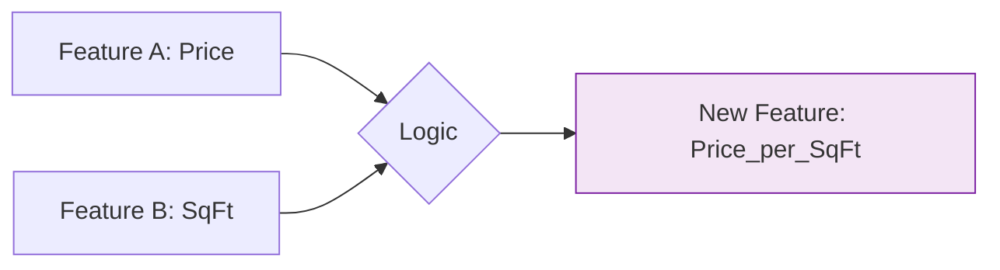

:::note
"Coming up with features is difficult, time-consuming, requires expert knowledge. 'Applied machine learning' is basically feature engineering." — **Andrew Ng**
:::

Feature engineering is the process of using domain knowledge to extract new variables from raw data that help machine learning algorithms learn faster and predict more accurately.

## 1. Transforming Numerical Features

Numerical data often needs to be reshaped to satisfy the mathematical assumptions of algorithms like Linear Regression or Neural Networks.

### A. Scaling (Normalization & Standardization)
Most models are sensitive to the magnitude of numbers. If one feature is "Salary" ($50,000$) and another is "Age" ($25$), the model might think Salary is $2,000$ times more important simply because the numbers are larger.

* **Standardization (Z-score):** Centers data at $\mu = 0$ with $\sigma = 1$.
* **Normalization (Min-Max):** Rescales data to a fixed range, usually $[0, 1]$.

### B. Binning (Discretization)
Sometimes the exact value isn't as important as the "group" it belongs to.
* **Example:** Converting "Age" into "Child," "Teen," "Adult," and "Senior."
* **Why?** It can help handle outliers and capture non-linear relationships.

## 2. Encoding Categorical Features

Machine Learning models are mathematical equations; they cannot multiply a weight by "London" or "Paris." We must convert text into numbers.

### A. One-Hot Encoding
Creates a new binary column ($0$ or $1$) for every unique category.
* **Best for:** Nominal data (no inherent order, like "Color" or "City").

### B. Ordinal Encoding
Assigns an integer to each category based on rank.
* **Best for:** Ordinal data (where order matters, like "Low," "Medium," "High").

## 3. Creating New Features (Feature Construction)

This is where domain expertise shines. You combine existing columns to create a more powerful "signal."

* **Interaction Features:** If you have `Width` and `Length`, creating `Area = Width * Length` might be more predictive for housing prices.
* **Ratios:** In finance, `Debt-to-Income Ratio` is often more useful than having `Debt` and `Income` as separate features.
* **Polynomial Features:** Creating $x^2$ or $x^3$ to capture curved relationships in the data.

## 4. Handling DateTime Features

Raw timestamps (e.g., `2023-10-27 14:30:00`) are useless to a model. We must extract the cyclical patterns:

* **Time of Day:** Morning, Afternoon, Evening, Night.
* **Day of Week:** Is it a weekend? (Useful for retail/traffic prediction).
* **Seasonality:** Month or Quarter (Useful for sales forecasting).

## 5. Text Feature Engineering (NLP Basics)

To turn "Natural Language" into features, we use techniques like:

1. **Bag of Words (BoW):** Counting the frequency of each word.
2. **TF-IDF:** Weighting words by how unique they are to a specific document.
3. **Word Embeddings:** Converting words into dense vectors that capture meaning (e.g., Word2Vec).

## 6. Feature Selection: "Less is More"

Having too many features leads to the **Curse of Dimensionality**, causing the model to overfit on noise.

* **Filter Methods:** Using statistical tests (like Correlation) to drop irrelevant features.
* **Wrapper Methods:** Training the model on different subsets of features to find the best combo (e.g., Recursive Feature Elimination).
* **Embedded Methods:** Models that perform feature selection during training (e.g., LASSO Regression uses  regularization to zero out useless weights).

## 7. The Golden Rules of Feature Engineering

1. **Don't Leak Information:** Never use the `Target` variable to create a feature (this is called Data Leakage).
2. **Think Cyclically:** For time or angles, use circular transforms () so the model knows  is close to .
3. **Visualize First:** Use scatter plots to see if a feature actually correlates with your target before spending hours engineering it.

## References for More Details

* **[Feature Engineering for Machine Learning (Alice Zheng)](https://www.oreilly.com/library/view/feature-engineering-for/9781491953235/):** Deep mathematical intuition.

* **[Scikit-Learn Preprocessing Module](https://scikit-learn.org/stable/modules/preprocessing.html):** Practical code implementation for scaling and encoding.

---

**Now that your features are engineered and ready, we need to ensure the data is mathematically balanced so no single feature dominates the learning process.**