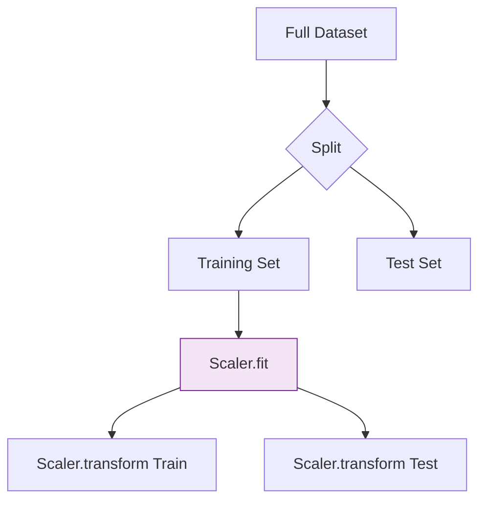

Imagine you are training a model to predict house prices. You have two features:
1.  **Number of Bedrooms:** Range 1–5
2.  **Square Footage:** Range 500–5000

Because 500 is much larger than 5, a model might "think" square footage is 100 times more important than bedrooms. **Feature Scaling** levels the playing field so that the model treats all features fairly based on their information, not their magnitude.

## 1. Why do we scale?

Scaling is mandatory for specific types of algorithms:
* **Distance-Based Algorithms:** KNN, K-Means, and SVM rely on Euclidean distance. Larger scales distort these distances.
* **Gradient Descent-Based Algorithms:** Neural Networks and Logistic Regression converge (find the answer) much faster when the "loss landscape" is spherical rather than elongated.
* **Principal Component Analysis (PCA):** Features with higher variance will dominate the principal components.

## 2. Standardization (Z-Score Normalization)

Standardization transforms data so that it has a **mean of 0** and a **standard deviation of 1**.

**Formula:**

$$
z = \frac{x - \mu}{\sigma}
$$

* **$\mu$:** Mean of the feature.
* **$\sigma$:** Standard deviation of the feature.

**When to use:** Use this when your data follows a **Gaussian (Normal) Distribution**. It is robust to outliers compared to Min-Max scaling and is the default choice for most ML algorithms (SVM, Linear Regression).

## 3. Normalization (Min-Max Scaling)

Normalization rescales the data into a fixed range, usually **[0, 1]**.

**Formula:**

$$
x_{norm} = \frac{x - x_{min}}{x_{max} - x_{min}}
$$

**When to use:** Use this when you do **not** know the distribution of your data or when you know there are no significant outliers. It is highly used in **Image Processing** (scaling pixel values from 0–255 to 0–1) and **Neural Networks**.

:::warning
Min-Max scaling is very sensitive to outliers. A single outlier at 1,000,000 will "squash" all your normal data points into a tiny range near 0.
:::

## 4. Robust Scaling

If your dataset contains many outliers that you cannot remove, use the **Robust Scaler**. Instead of using the mean and standard deviation, it uses the **Median** and the **Interquartile Range (IQR)**.

**Formula:**

$$
x_{robust} = \frac{x - \text{median}}{Q_3 - Q_1}
$$


## 5. Comparison Table

| Method | Range | Distribution | Outlier Sensitivity |
| :--- | :--- | :--- | :--- |
| **Standardization** | $\approx$ [-3, 3] | Becomes $\mu=0, \sigma=1$ | Low (Robust) |
| **Normalization** | [0, 1] or [-1, 1] | Squashed into range | **High** |
| **Robust Scaling** | Varies | Median centered at 0 | **Very Low** |

## 6. Implementation with Scikit-Learn

```python
from sklearn.preprocessing import StandardScaler, MinMaxScaler

data = [[100, 0.001], [8, 0.05], [50, 0.005], [88, 0.07]]

# 1. Standardization
std_scaler = StandardScaler()
std_data = std_scaler.fit_transform(data)

# 2. Normalization
min_max = MinMaxScaler()
norm_data = min_max.fit_transform(data)

```

## 7. The Golden Rule: Fit on Train, Transform on Test

One of the most common mistakes in Data Engineering is "Data Leakage." When scaling, you must:

1. **Fit** the scaler only on the **Training Set**.
2. **Transform** the **Test Set** using the parameters () learned from the Training Set.



## References for More Details

* **[Scikit-Learn Preprocessing](https://scikit-learn.org/stable/modules/preprocessing.html#standardization-or-mean-removal-and-variance-scaling):** Implementation details and alternative scalers (MaxAbsScaler).

* **[About Feature Scaling (Article)](https://sebastianraschka.com/Articles/2014_about_feature_scaling.html):** A deep mathematical dive into why scaling matters for specific algorithms.


---

**Now that your features are cleaned, engineered, and scaled, you have a high-quality dataset. But before you train a model, you need to ensure you haven't given it too much information or too little.**