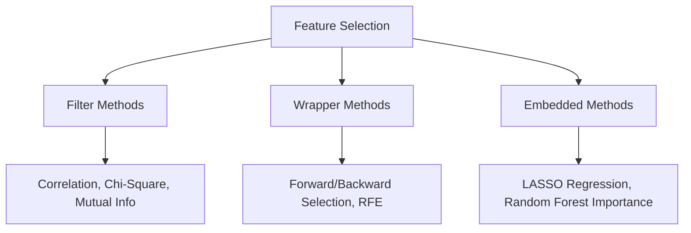

**Feature Selection** is the process of reducing the number of input variables when developing a predictive model. Unlike [Dimensionality Reduction](./dimensionality-reduction), which transforms features into a new space, Feature Selection keeps the original features but removes the ones that are redundant or irrelevant.

## 1. Why Select Features?

1.  **Reduce Overfitting:** Less redundant data means fewer opportunities to make decisions based on noise.
2.  **Improve Accuracy:** Removing misleading features can improve the model's predictive power.
3.  **Reduce Training Time:** Fewer data points mean faster algorithms.
4.  **Enhanced Interpretability:** It is easier to explain a model with 5 key drivers than one with 500.

## 2. The Three Families of Selection

We categorize selection techniques into three main strategies:



### A. Filter Methods (Statistical)

These methods act as a "filter" before the training begins. They look at the intrinsic properties of the features (like their relationship with the target) using statistical tests.

* **Correlation Coefficient:** Used to find linear relationships between features and targets.
* **Chi-Square:** Used for categorical features.
* **Mutual Information:** Measures how much information the presence of a feature contributes to the target.

### B. Wrapper Methods (Iterative)

These methods treat the selection process as a search problem. They train a model on different subsets of features and "wrap" the selection around the model's performance.

* **Forward Selection:** Start with 0 features and add them one by one.
* **Recursive Feature Elimination (RFE):** Start with all features and prune the least important ones iteratively.


### C. Embedded Methods (Integrated)

These algorithms have feature selection built directly into their training process.

* **LASSO (L1 Regularization):** Adds a penalty to the model that forces the coefficients of useless features to become exactly zero.
* **Tree-based Importance:** Algorithms like Random Forest or XGBoost naturally calculate which features were used most often to split the data.


## 3. Comparison Table

| Method | Speed | Risk of Overfitting | Model Agnostic? |
| --- | --- | --- | --- |
| **Filter** | ⚡ Very Fast | Low | Yes |
| **Wrapper** | 🐢 Very Slow | **High** | Yes |
| **Embedded** | 🏎️ Fast | Moderate | No (Model-specific) |

## 4. Implementation Example (RFE)

Using Scikit-Learn to perform Recursive Feature Elimination with a Logistic Regression model:

```python
from sklearn.feature_selection import RFE
from sklearn.linear_model import LogisticRegression

# Define the model
model = LogisticRegression()

# Select top 5 features
rfe = RFE(estimator=model, n_features_to_select=5)
fit = rfe.fit(X, y)

# Print results
print(f"Num Features: {fit.n_features_}")
print(f"Selected Features: {X.columns[fit.support_]}")

```

## 5. Identifying Multicollinearity

One of the most important parts of feature selection is identifying features that are highly correlated with *each other* (not just the target). If `Feature A` and `Feature B` are 99% identical, you should drop one.

We often use the **Variance Inflation Factor (VIF)** to detect this. A VIF score  or  usually indicates that a feature is redundant.

## References for More Details

* **[Scikit-Learn Feature Selection Module](https://scikit-learn.org/stable/modules/feature_selection.html):** Exploring `SelectKBest` and `VarianceThreshold`.
* **[Feature Selection Strategies (Article)](https://machinelearningmastery.com/feature-selection-with-real-and-categorical-data/):** Deciding which statistical test to use based on your data type.

---

**Congratulations!** You have learned the entire Preprocessing Pipeline. From handling missing data to selecting the perfect features, your data is now "Model-Ready."