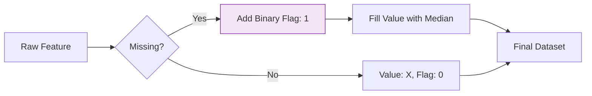

Data in the real world is rarely complete. Whether it's a sensor that went offline, a survey respondent who skipped a question, or a database merge that failed, you will encounter missing values. How you handle them can drastically change your model's performance.

## 1. Why is Data Missing?

Before fixing the data, you must understand the "mechanism" of the missingness. Statistics classifies this into three categories:

1.  **MCAR (Missing Completely at Random):** The missingness has no relationship with any data. (e.g., A random equipment malfunction).
2.  **MAR (Missing at Random):** The missingness is related to other *observed* data. (e.g., Men are less likely to disclose their weight, but we know their gender).
3.  **MNAR (Missing Not at Random):** The missingness is related to the missing value itself. (e.g., People with very high debt are less likely to report their debt levels).

## 2. Detecting Missing Values

Using Pandas, the first step is always to quantify the problem.

```python
import pandas as pd

# Load data
df = pd.read_csv('data.csv')

# Count missing values per column
print(df.isnull().sum())

# Visualize missingness (highly recommended for large datasets)
import seaborn as sns
sns.heatmap(df.isnull(), cbar=False, yticklabels=False, cmap='viridis')

```

## 3. Strategy 1: Deletion

The simplest approach, but often the most dangerous.

### A. Listwise Deletion (Drop Rows)

Remove any row that has at least one missing value.

* **When to use:** When the dataset is massive and missing values are rare ().
* **Risk:** You might throw away valuable information or introduce bias if the data isn't MCAR.

### B. Dropping Columns

Remove an entire feature if it has too many missing values (e.g., ).

* **When to use:** When the feature is not critical for the target prediction.

## 4. Strategy 2: Imputation

Imputation is the process of "filling in" the holes with estimated values.

### A. Statistical Imputation

Replacing missing values with a central tendency measure.

* **Mean:** Good for normally distributed numerical data.
* **Median:** Better for skewed data (robust to outliers).
* **Mode:** Used for categorical data.

### B. Constant Value Imputation

Filling with a specific value like `0`, `"Unknown"`, or `-999`.

* **Note:** This tells the model that the data was missing, which itself can be a feature.

### C. Advanced: Predictive Imputation

Using other features to predict the missing value.

* **K-Nearest Neighbors (KNN):** Finds the "most similar" rows and averages their values.
* **MICE (Multivariate Imputation by Chained Equations):** A sophisticated iterative process that models each feature as a function of others.

```python
from sklearn.impute import SimpleImputer, KNNImputer

# Simple Mean Imputation
imputer = SimpleImputer(strategy='mean')
df['Age'] = imputer.fit_transform(df[['Age']])

# KNN Imputation
knn_imputer = KNNImputer(n_neighbors=5)
df_filled = knn_imputer.fit_transform(df)

```

## 5. Summary Table: Which Strategy to Pick?

| Scenario | Best Action |
| --- | --- |
| **Randomly missing, very few rows** | Drop Rows (`dropna`) |
| **Numerical, Normal distribution** | Mean Imputation |
| **Numerical, Many outliers** | Median Imputation |
| **Categorical data** | Mode or "Unknown" category |
| **Critical feature, complex relationships** | KNN or MICE Imputation |

## 6. The "Missingness Indicator" Trick

Sometimes, the fact that data is missing is a signal in itself. You can create a new binary column:

* `is_age_missing = 1` if Age is null, `0` otherwise.
This allows the model to learn if "not reporting age" correlates with the target.



## References for More Details

* **[Scikit-Learn Imputation Guide](https://scikit-learn.org/stable/modules/impute.html):** Technical implementation of KNN and Iterative Imputers.


* **[Feature Engineering for ML (Book)](https://www.oreilly.com/library/view/feature-engineering-for/9781491953235/):** Deep diving into why missing data affects model coefficients.

---

Fixing missing data is the first step in cleaning. Next, we need to ensure that the numbers themselves are on a scale that our algorithms can actually understand.