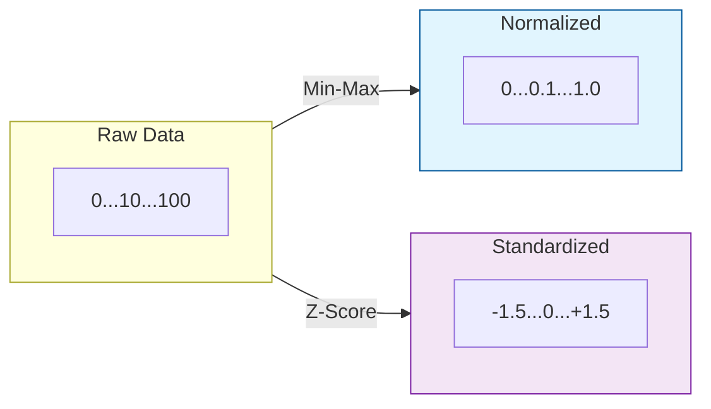

In Machine Learning, **Normalization** is the process of rescaling numeric variables to a strictly defined range most commonly $[0, 1]$ or $[-1, 1]$. Unlike standardization, which is about centered distributions, normalization is about **boundaries**.

## 1. When is Normalization Essential?

Normalization is preferred over standardization in specific scenarios:

* **Image Processing:** Pixel intensities are naturally bounded between 0 and 255. Normalizing them to $[0, 1]$ is standard practice for Convolutional Neural Networks (CNNs).
* **Neural Networks:** Activation functions like *Sigmoid* or *Tanh* are most sensitive in small ranges around zero.
* **Algorithms with No Distribution Assumption:** When you don't know if your data is Gaussian (Normal), normalization is a safer, non-parametric starting point.

## 2. Min-Max Scaling

This is the most common form of normalization. It shifts and rescales the data so that the minimum value becomes 0 and the maximum value becomes 1.

**The Formula:**

$$
x' = \frac{x - \text{min}(x)}{\text{max}(x) - \text{min}(x)}
$$

* **Pros:** Preserves the relative distances between values.
* **Cons:** Extremely sensitive to **outliers**. If you have one value at 10,000 and the rest at 10, the "normal" data will be squashed into a tiny range (e.g., $0.0001$).

## 3. MaxAbs Scaling

MaxAbs scaling divides each value by the maximum absolute value in the feature. This scales the data to the range **$[-1, 1]$**.

**The Formula:**

$$
x' = \frac{x}{|\text{max}(x)|}
$$

* **Best Use Case:** Sparse data (data with many zeros). It does not "shift" the data (it doesn't subtract the mean or min), so it **preserves sparsity**.
* **Common in:** Text analytics and TF-IDF vectors.

## 4. Robust Normalization (Quantile Scaling)

If your data has significant outliers, Min-Max scaling will fail. A "Robust" approach uses the Interquartile Range (IQR).

**The Formula:**

$$
x' = \frac{x - Q_1(x)}{Q_3(x) - Q_1(x)}
$$

## 5. Comparison: Normalization vs. Standardization

| Feature | Normalization (Min-Max) | Standardization (Z-Score) |
| :--- | :--- | :--- |
| **Range** | Fixed $[0, 1]$ or $[-1, 1]$ | Not bounded (usually $[-3, 3]$) |
| **Mean/Sigma** | Varies | Mean = 0, Std Dev = 1 |
| **Outliers** | Highly Affected | Less Affected |
| **Best For** | Neural Networks, Images | Linear Reg, SVM, PCA |

## 6. Practical Implementation

Using `scikit-learn`, we can apply these transformations efficiently.

```python
from sklearn.preprocessing import MinMaxScaler, MaxAbsScaler

# Sample Data: Age and Salary
data = [[25, 50000], [30, 80000], [45, 120000]]

# Min-Max Scaling to [0, 1]
min_max = MinMaxScaler()
normalized_data = min_max.fit_transform(data)

# MaxAbs Scaling (Preserves Zeros)
max_abs = MaxAbsScaler()
sparse_friendly_data = max_abs.fit_transform(data)

```

## 7. Mathematical Visualisation



## References for More Details

* **[Scikit-Learn Normalization Guide](https://scikit-learn.org/stable/modules/preprocessing.html#normalization):** Understanding `Normalizer` vs `MinMaxScaler`.

* **[Google Machine Learning Crash Course](https://developers.google.com/machine-learning/data-prep/transform/normalization):** Visualizing how normalization helps loss functions converge.

---

**Normalization handles the scale of your numbers, but what if you have too many features? Excess features can confuse a model and lead to "The Curse of Dimensionality."**
